# Session 21: DevOps Capstone (TaskBoard, Python)

TaskBoard is a small project-management app: a React + Vite frontend served by nginx, a FastAPI
backend, and PostgreSQL behind SQLAlchemy and Alembic. This folder takes it from a laptop to a
monitored Kubernetes cluster: tests, Docker images, a Trivy gate, Terraform, Helm, Ingress, HPA,
Prometheus and Grafana, plus two troubleshooting labs.

The source is the `session21-python` folder of
[Nency-Ravaliya/devops-heros](https://github.com/Nency-Ravaliya/devops-heros/tree/main/session21-python).
The course's step-by-step guide is in [INSTRUCTIONS.md](INSTRUCTIONS.md) and the rubric is in
[GRADING.md](GRADING.md). Every screenshot in `screenshots/` was taken automatically with
Playwright. Browser pages were driven directly. Terminal output was rendered to an image from
the exact command and its output.

Environment: macOS, Docker Desktop, kind v1.37 (one control-plane node, one worker). No AWS
credentials are configured on this machine, so the EKS step was validated but not applied. A local
kind cluster stands in for EKS (see [What was not run](#what-was-not-run)).

## Fixes made to the reference project

Running the project exactly as shipped hit eight problems. Each one was fixed in place:

| # | Problem | Fix |
|---|---|---|
| 1 | `pytest` failed (`no such table: tasks`). `TestClient` was built outside a `with` block, so the startup hook that creates tables never ran. | `tests/conftest.py` fixture enters the client as a context manager and drops tables afterwards. Tests expanded from 3 to 12, covering every endpoint. |
| 2 | `docker compose up` crashed the backend. `depends_on` only waits for the Postgres *container*, not the database, and Alembic ran too early. | Added a `pg_isready` healthcheck and `condition: service_healthy`. |
| 3 | Creating a task saved it, but the modal never closed. The handler read `e.currentTarget` after an `await`, when React has already cleared it, and threw. | Capture the form element before the `await`. |
| 4 | Trivy failed the backend: 3 HIGH CVEs in Starlette 0.41.3, then 2 more in 0.49.x. | FastAPI 0.142.2, Starlette 1.7.0, prometheus-fastapi-instrumentator 8.1.0. Starlette 1.x removes `on_event`, so startup moved to a `lifespan` handler. |
| 5 | Trivy failed the frontend: 44 HIGH/CRITICAL CVEs in the `nginx:1.27-alpine` OS packages. | `RUN apk upgrade --no-cache` in the runtime stage. |
| 6 | The Ingress sent `/api` to Service `taskboard-backend:8080`. The chart actually creates `<release>-taskboard-backend` on port 8000. | Template the name with `taskboard.fullname` and use port 8000. |
| 7 | The frontend's nginx proxied to the hostname `backend`, which only exists in Compose, so nginx would fail to start in Kubernetes. | `nginx.conf` became `templates/default.conf.template` with `${BACKEND_URL}`. It defaults to `http://backend:8000` and the chart sets it to the real Service. |
| 8 | The backend went into CrashLoopBackOff on a fresh `helm install`. The Postgres PVC took minutes to provision while the backend ran migrations on start. | A `wait-for-postgres` init container. |

Smaller changes:
- Host ports in `docker-compose.yml` can be overridden. 3000 and 5432 were already in use here, so this run used `FRONTEND_PORT=3001 POSTGRES_PORT=5433`.
- The Terraform files were single-line blocks, which `terraform fmt` rejects. They were reformatted, and `terraform.tfvars.example` was added.
- `scripts/load-test.sh` hit `/api/health`, which doesn't exist. It now hits `/api/tasks`.
- Added `k8s/kind-cluster.yaml`, `helm/taskboard/values-kind.yaml` and `monitoring/grafana-dashboard.json`.

---

## M1: Application

```bash
FRONTEND_PORT=3001 POSTGRES_PORT=5433 docker compose up --build
```

| Dashboard (empty) | Create-task modal |
|---|---|
| 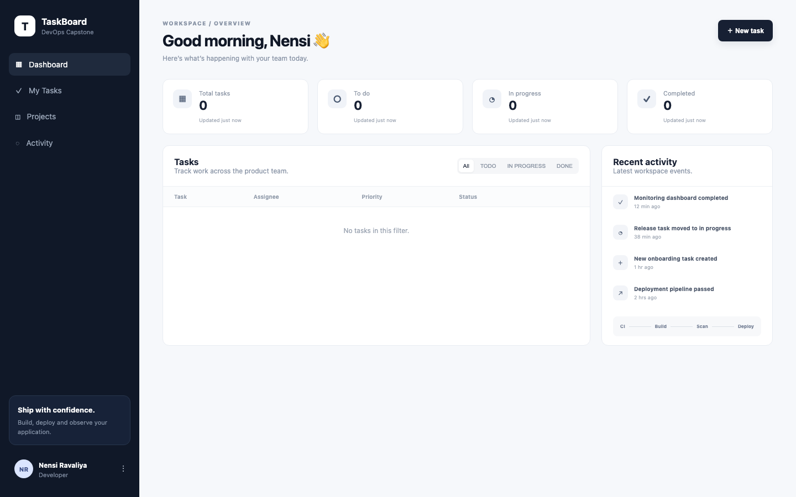 |  |

Four tasks were created through the modal. The ↻ button advanced their statuses, and the KPI cards
and table reflect the changes:

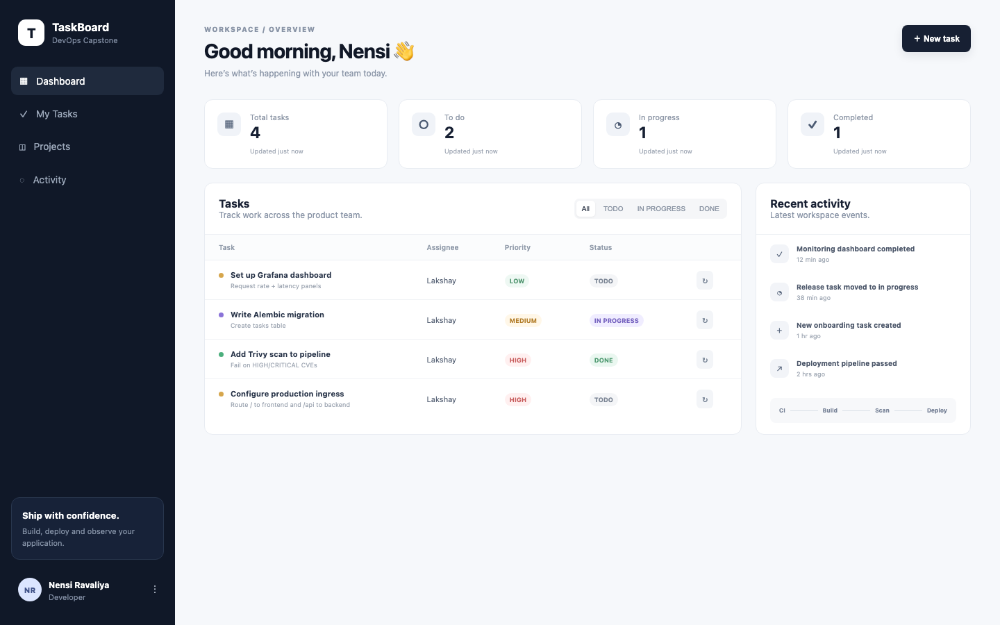

| DONE filter | Mobile width (414 px) |
|---|---|
| 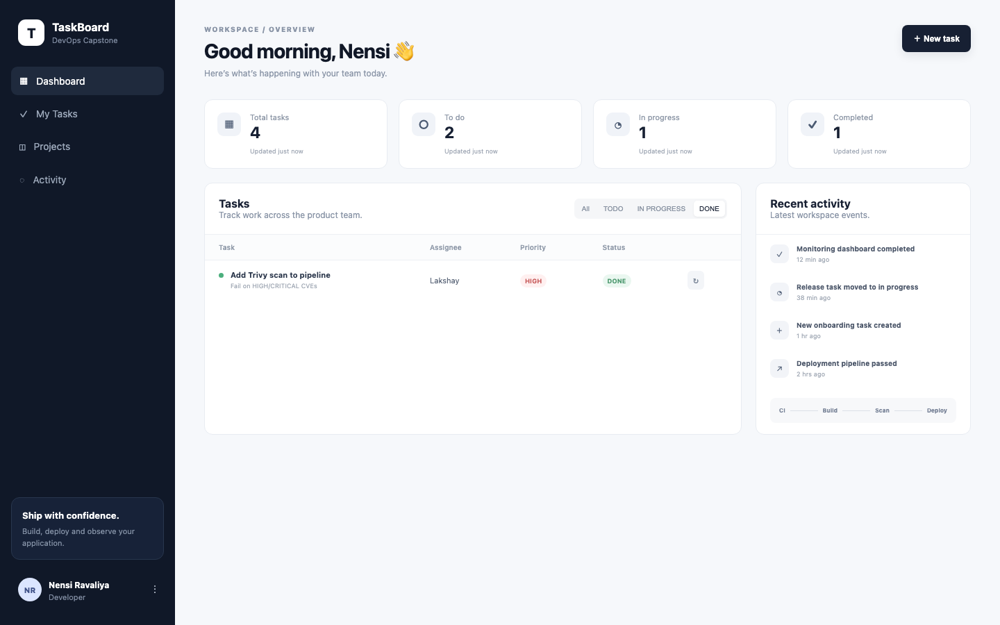 | 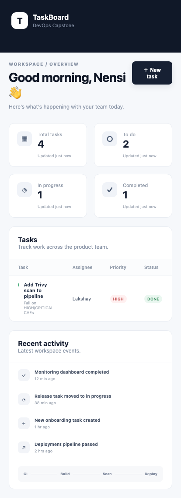 |

Full CRUD against the REST API, then the rows as Postgres stores them. The `alembic_version` table
shows that the schema came from the migration and not from `create_all`:

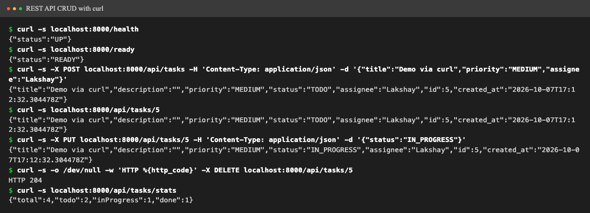
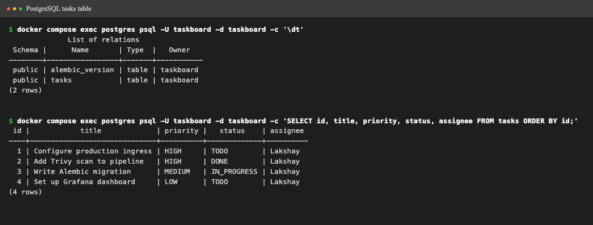

Swagger at `/docs`, with `GET /api/tasks` executed:

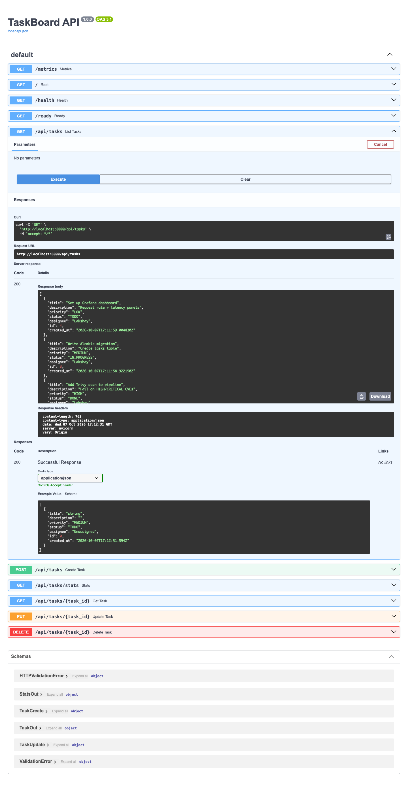

`/health` and `/ready` answer different questions. `/health` means the process is alive. `/ready`
means it can reach the database, because it runs a query first.

| /health | /ready |
|---|---|
| 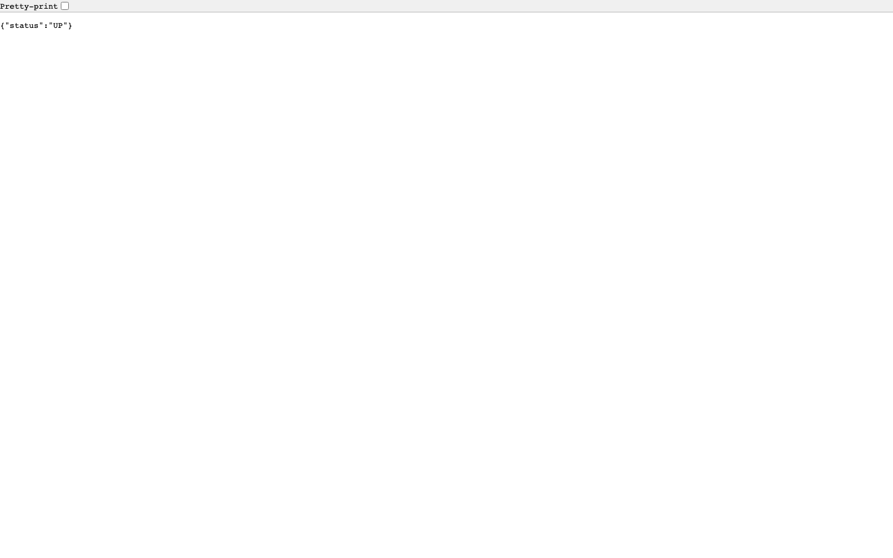 | 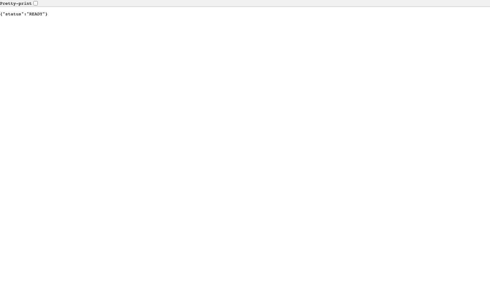 |

## M2: Testing

The tests run against a throwaway SQLite file, never the Postgres database. Twelve cases cover
health, readiness, create, validation errors, list, get, 404, update, delete, stats and `/metrics`.

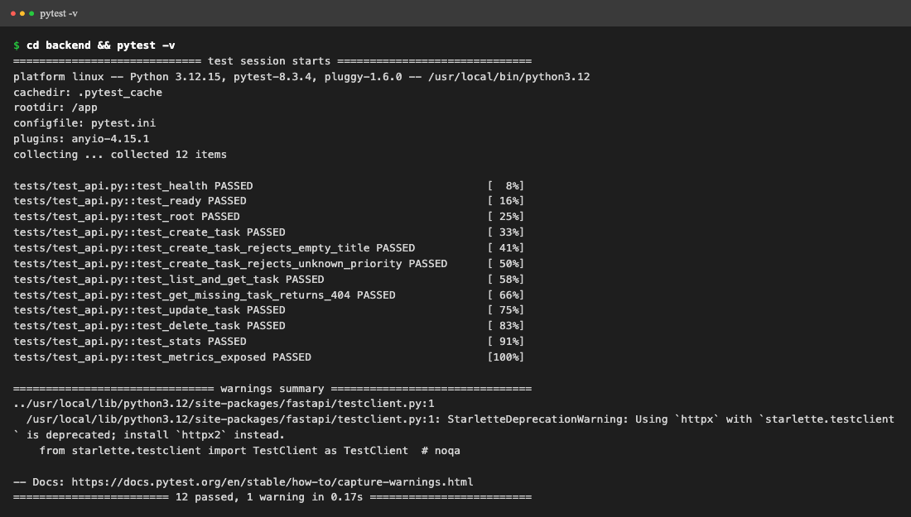

## M4: Docker

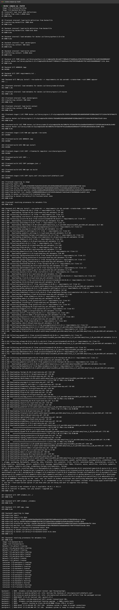
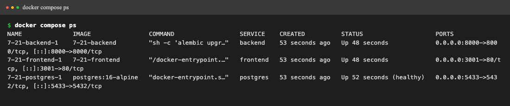

The frontend is a multi-stage build: Node builds `dist/`, and only that output and nginx reach the
~96 MB runtime image (27.7 MB compressed). The backend runs as UID 10001. The frontend still runs nginx as root, because
the stock `nginx` image needs root to bind port 80. Switching to `nginxinc/nginx-unprivileged` on
8080 would fix that, but it changes ports in the chart, so it was left out of scope.

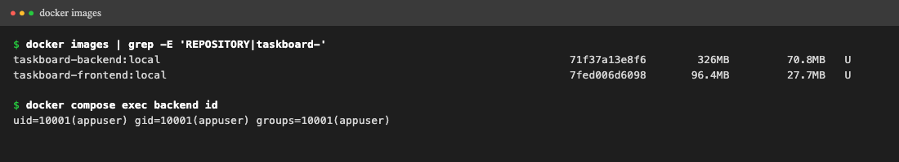

## M6: Trivy

Same settings as the CI workflow: `--severity HIGH,CRITICAL --ignore-unfixed --exit-code 1`.

**Before** (the pipeline would have stopped here):

| Backend: Starlette CVE-2025-62727 | Frontend: 44 Alpine package CVEs |
|---|---|
| 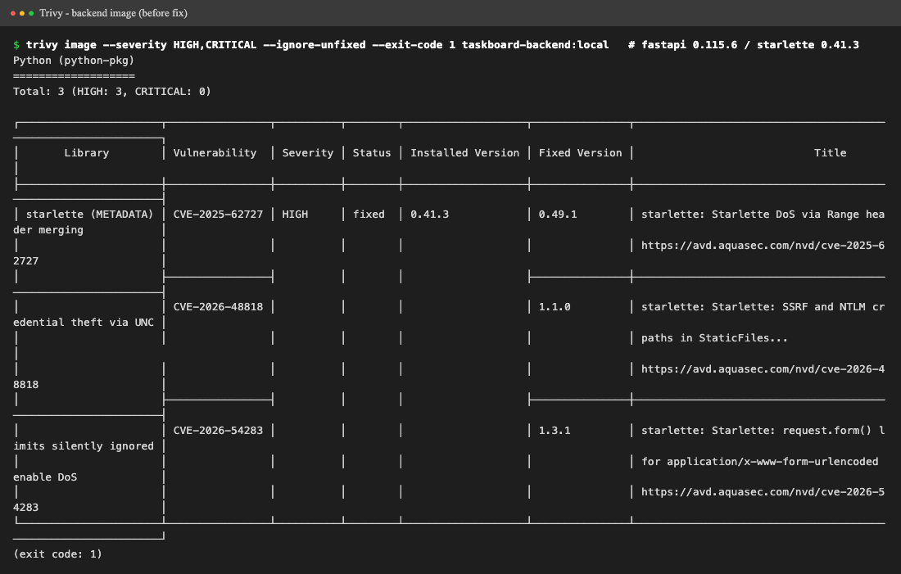 | 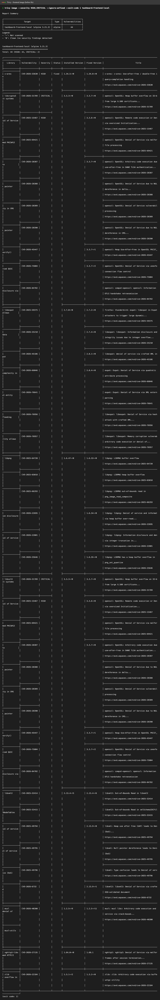 |

**After** (fixes 4 and 5 above). Both scans exit 0:

| Backend | Frontend |
|---|---|
| 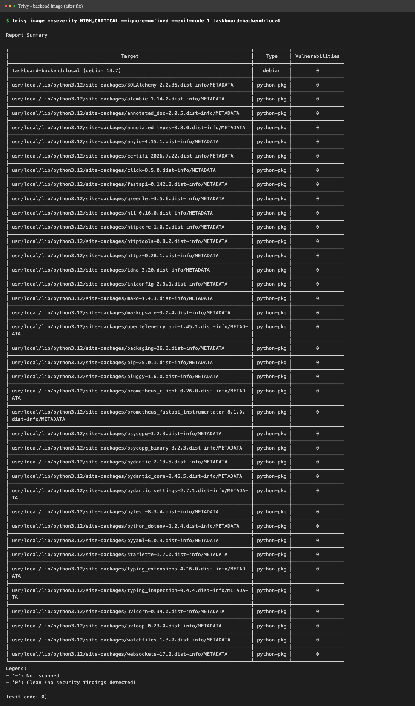 | 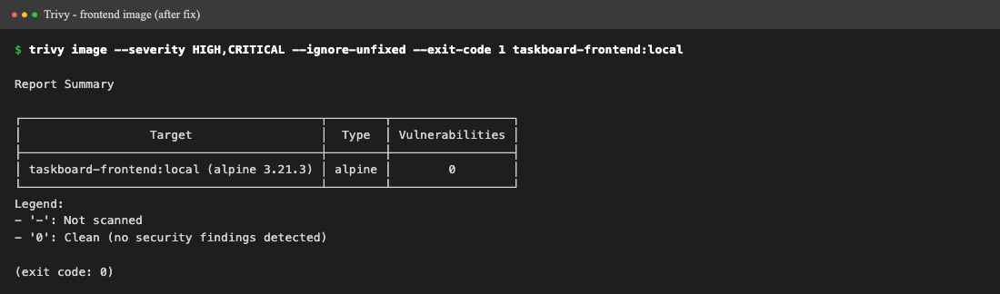 |

Trivy reads the OS package database (Debian for the backend, Alpine for the frontend) and the
Python package metadata in each image, then matches versions against known CVEs. CVE-2025-62727 was
a denial of service: crafted `Range` headers made Starlette's file responses burn CPU. It was
fixed in Starlette 0.49.1. A clean scan means no *known, fixable* HIGH or CRITICAL issues today.
It says nothing about unknown bugs or vulnerabilities that have no fix yet.

## M7: Terraform

`fmt`, `init` and `validate` all pass. `init` downloads the VPC and EKS modules and the AWS
provider. `plan` stops at the provider because no AWS credentials exist on this machine. That is
the expected failure, and `apply` was deliberately not run: an EKS cluster plus a NAT gateway bills
by the hour.

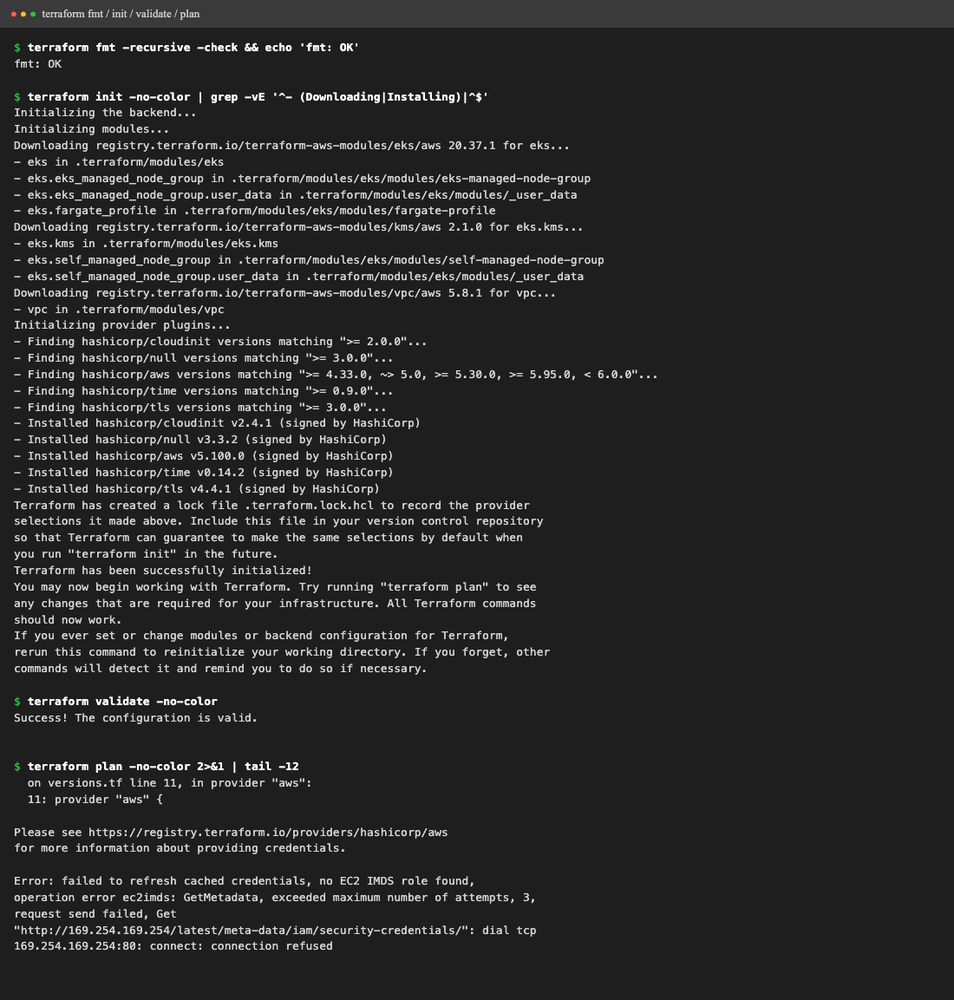

With credentials configured, the remaining steps are:

```bash
cd terraform
terraform plan
terraform apply
aws eks update-kubeconfig --region ap-south-1 --name taskboard-eks
terraform destroy
```

## M8: Kubernetes and Helm (on kind)

```bash
kind create cluster --config k8s/kind-cluster.yaml
kubectl apply -f https://raw.githubusercontent.com/kubernetes/ingress-nginx/controller-v1.11.3/deploy/static/provider/kind/deploy.yaml
helm install metrics-server metrics-server/metrics-server -n kube-system --set 'args={--kubelet-insecure-tls}'
kind load docker-image taskboard-backend:local taskboard-frontend:local --name taskboard
kubectl apply -f k8s/namespace.yaml
helm upgrade --install taskboard ./helm/taskboard -n taskboard --create-namespace -f helm/taskboard/values-kind.yaml
```

`values-kind.yaml` swaps the GHCR image references for the locally built images loaded into kind.

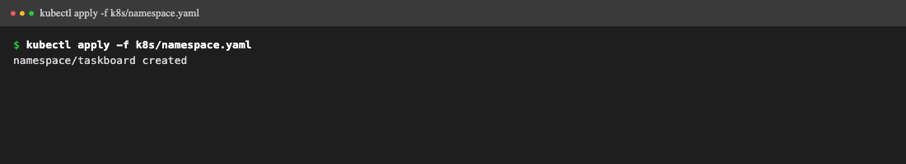
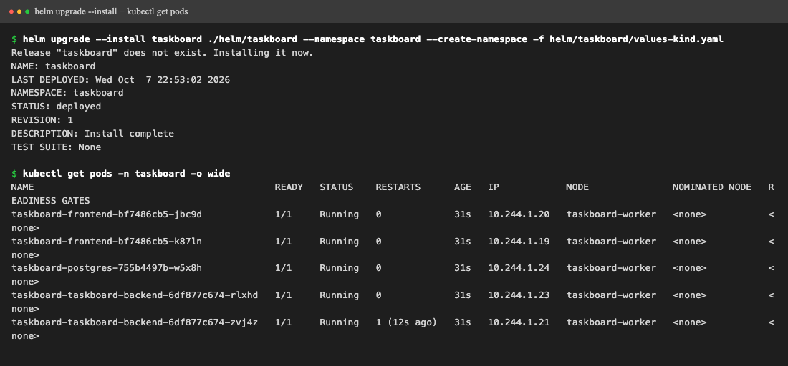

One backend shows one restart. On a fresh database, both replicas ran `alembic upgrade head` at the
same moment and one lost the race to create the table. It succeeded on retry. In production,
migrations belong in a single Job or Helm hook, not in every replica's start command.

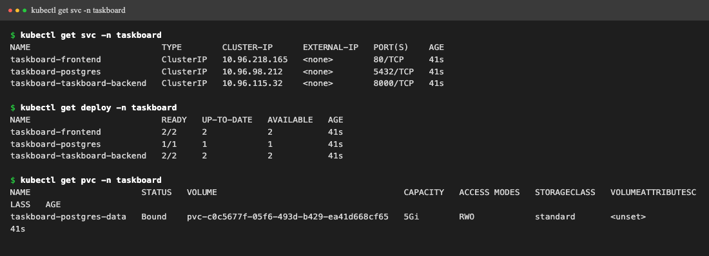

### Ingress

Revision 2 applies `values-dev.yaml`, which turns on the Ingress for `taskboard.local`. kind maps
the controller to `localhost:8088`. The browser was pointed at `taskboard.local` with Chromium's
host-resolver rules, so `/etc/hosts` didn't need editing.

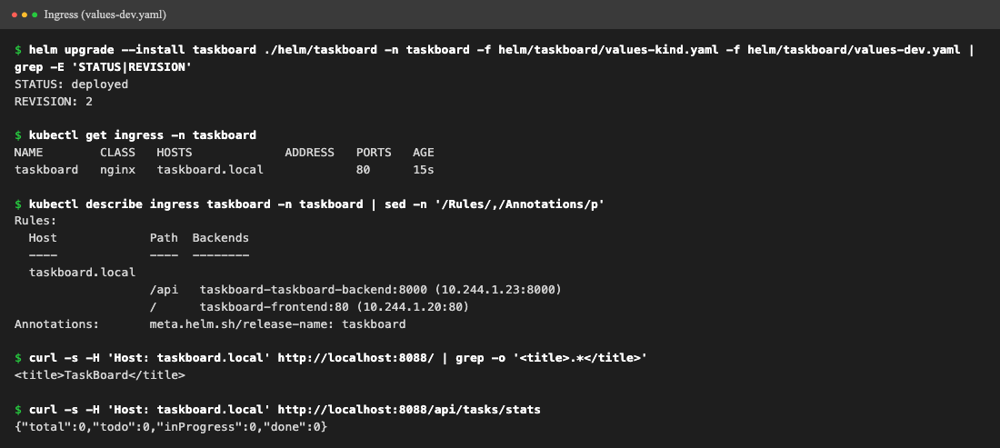

Same flow as with Compose, this time through the Ingress, with data in the in-cluster Postgres:

| Dashboard via Ingress | Create task via Ingress |
|---|---|
|  | 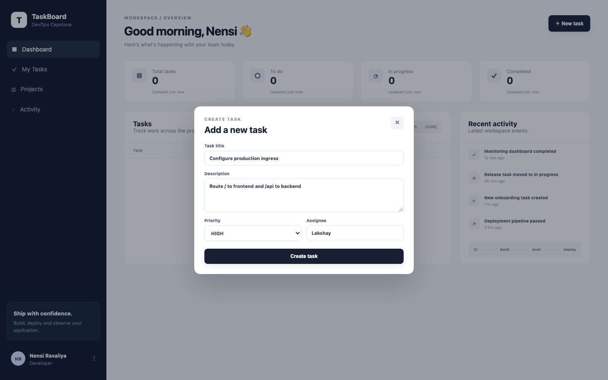 |

`values-dev.yaml` also turns HPA off, so revision 3 goes back to the defaults (2 replicas, HPA on)
and keeps the Ingress enabled:

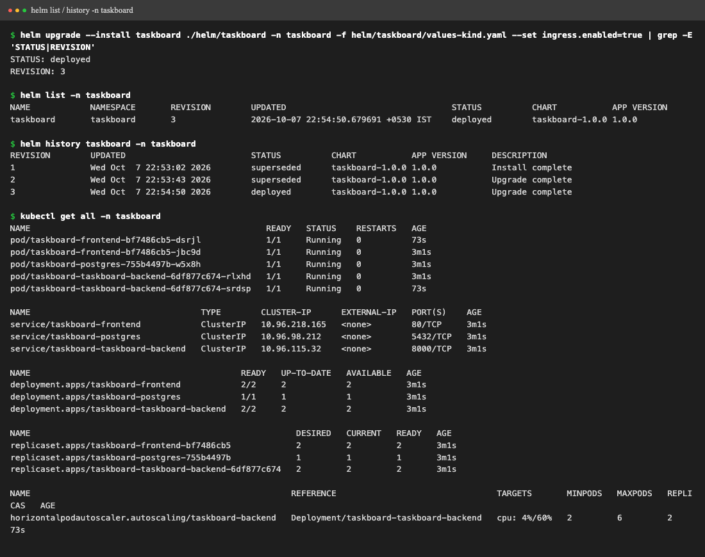

### HPA

At idle the backend sits at 4% of its 100m CPU request:

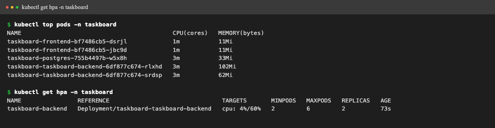

A busybox pod ran 40 parallel `wget` loops against the backend Service. CPU climbed to ~480% of
the request, and the HPA went from 2 to 4 to 6 replicas (the configured maximum) within about 30
seconds. After the load generator was deleted, the HPA scaled back in to 2 (6 → 3 → 2). Scale-in is
deliberately slow: the HPA waits out a 5-minute stabilization window before removing pods, so a
short dip doesn't cause flapping.

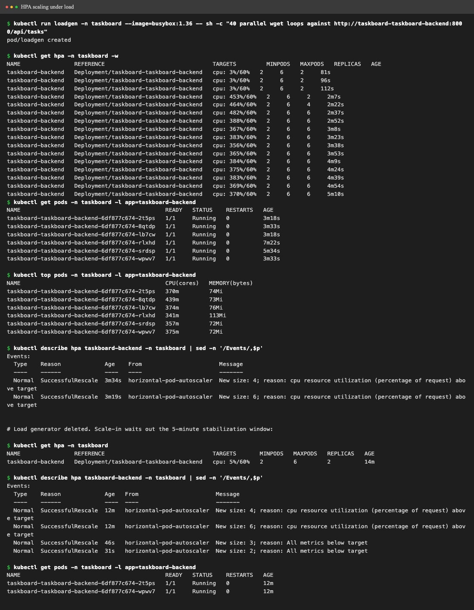

## M9: Prometheus and Grafana

```bash
helm install kube-prometheus-stack prometheus-community/kube-prometheus-stack \
  -n monitoring --create-namespace -f monitoring/prometheus-values.yaml
```

The chart's ServiceMonitor carries `release: kube-prometheus-stack`, so the operator picks it up.
All six backend replicas show as `UP`:

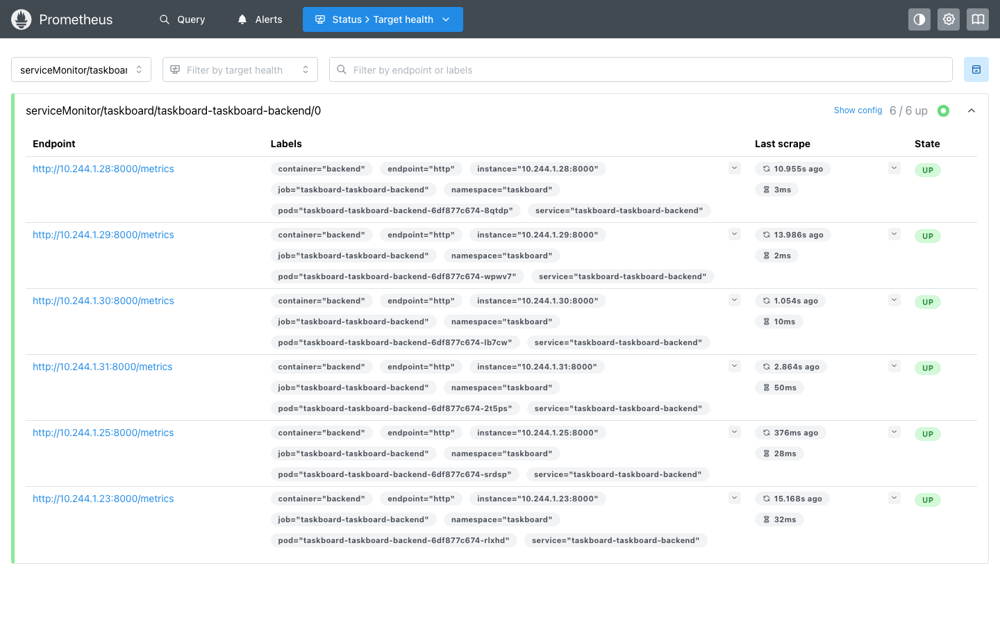

Raw `/metrics` output, then the same counter as a request rate during the load test:

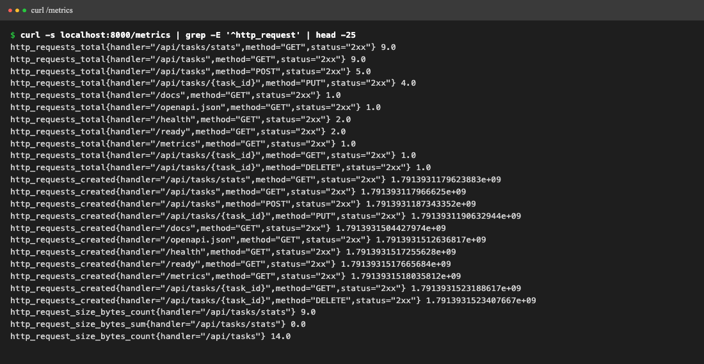
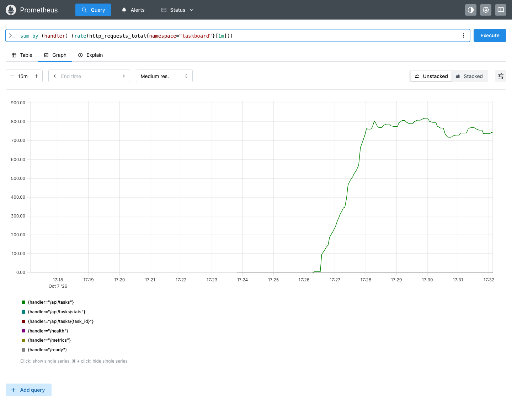

The Grafana dashboard ([monitoring/grafana-dashboard.json](monitoring/grafana-dashboard.json)) was
created through the Grafana API. It shows request rate per handler, p95 latency, 5xx error rate,
the number of scraped pods (2 → 4 → 6 as the HPA scaled), and CPU per pod:

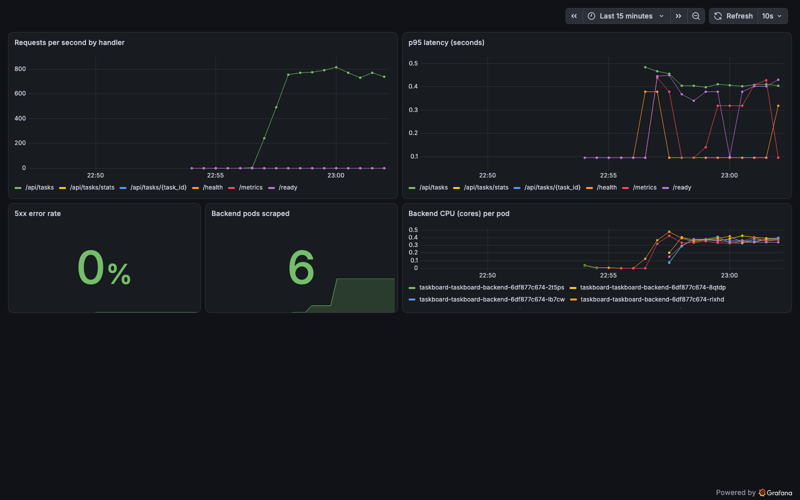

## Troubleshooting labs

**Broken image.** The pod sits in `ImagePullBackOff`. `describe` shows the pull of
`:does-not-exist` failing. Pointing the Deployment at a real image rolls out a healthy pod.

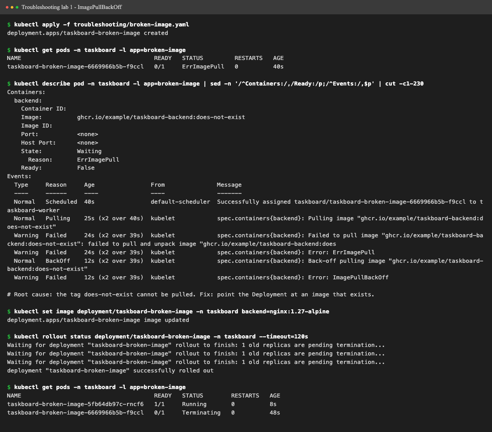

**Broken Service.** The Service exists but has no endpoints: its selector
`app=label-that-does-not-exist` matches none of the labels from `--show-labels`. Connections are
refused. The second bug is quieter: the backend listens on 8000, not 8080. After fixing both, six
endpoints appear and `/health` answers through the Service.

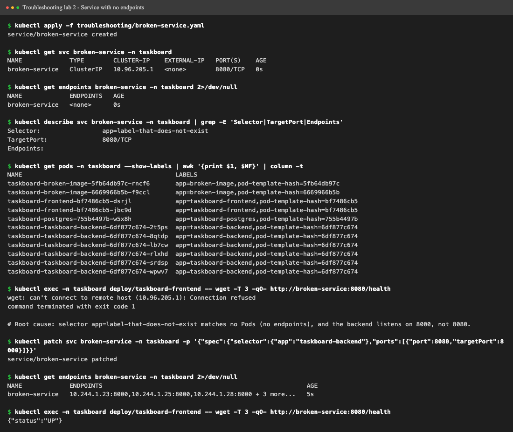

## What was not run

- **`terraform plan/apply/destroy` on AWS.** This needs AWS credentials, and the cluster costs
  money. The Kubernetes steps ran on kind instead. The Helm chart is the same one CI would deploy
  to EKS.
- **GitHub Actions, the GHCR push, and the Helm deploy from CI.** The workflow is at
  `.github/workflows/ci-cd.yml`, but GitHub only runs workflows from the repository root. Inside
  this coursework repo, `7-21/.github/` is never triggered. To see it run, push this folder as its
  own repository and add a `KUBE_CONFIG_DATA` secret for the deploy job. Every step the pipeline
  runs (pytest, frontend build, both Docker builds, both Trivy scans, `helm upgrade --install`)
  was run by hand above.
