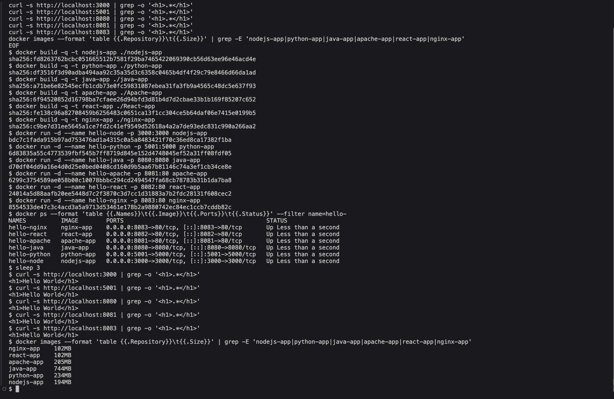

# Docker Fundamentals - six Hello World containers

The same "Hello World" page served six different ways, each with its own Dockerfile. All six
images were built and run together on one machine; the screenshots are from that run.

## Layout

```
Docker Fundamentals/
├── nodejs-app/    Node.js 20, built-in http module, no dependencies
├── python-app/    Python 3.12 + Flask
├── java-app/      Java 21, JDK's built-in HttpServer, compiled during the build
├── Apache-app/    httpd 2.4 serving a static page
├── React-app/     React 18 + Vite, built in stage 1, served by Nginx in stage 2
└── nginx-app/     Nginx serving a static page
```

## Ports

Each container listens on its natural port. Host ports were chosen to avoid clashes; port 5000
on macOS is taken by AirPlay Receiver, so Flask is exposed on 5001.

| App | Image tag | Container port | Host port | URL |
|---|---|---|---|---|
| Node.js | `nodejs-app` | 3000 | 3000 | http://localhost:3000 |
| Python / Flask | `python-app` | 5000 | 5001 | http://localhost:5001 |
| Java | `java-app` | 8080 | 8080 | http://localhost:8080 |
| Apache | `apache-app` | 80 | 8081 | http://localhost:8081 |
| React | `react-app` | 80 | 8082 | http://localhost:8082 |
| Nginx | `nginx-app` | 80 | 8083 | http://localhost:8083 |

## Build and run everything

From this directory:

```bash
docker build -t nodejs-app ./nodejs-app
docker build -t python-app ./python-app
docker build -t java-app   ./java-app
docker build -t apache-app ./Apache-app
docker build -t react-app  ./React-app
docker build -t nginx-app  ./nginx-app

docker run -d --name hello-node   -p 3000:3000 nodejs-app
docker run -d --name hello-python -p 5001:5000 python-app
docker run -d --name hello-java   -p 8080:8080 java-app
docker run -d --name hello-apache -p 8081:80   apache-app
docker run -d --name hello-react  -p 8082:80   react-app
docker run -d --name hello-nginx  -p 8083:80   nginx-app

docker ps --filter name=hello-
```

Tear down:

```bash
docker rm -f hello-node hello-python hello-java hello-apache hello-react hello-nginx
```

## Notes on each Dockerfile

**nodejs-app** - `node:20-alpine`, copies `package.json` and `app.js`, runs `node app.js`.
There is no `npm install` because the http module ships with Node. `.dockerignore` keeps
`node_modules` out of the build context.

**python-app** - `python:3.12-slim`. Requirements are copied and installed *before* the
application code so the pip layer is cached when only `app.py` changes. Flask binds to
`0.0.0.0`, otherwise it would only listen inside the container.

**java-app** - `eclipse-temurin:21-jdk`. `javac Main.java` runs at build time, so the image
contains the compiled class. The server uses `com.sun.net.httpserver`, which is part of the
JDK, so there is no Maven or Gradle to set up.

**Apache-app** - `httpd:2.4`. One `COPY` into `/usr/local/apache2/htdocs/`.

**React-app** - two stages. `node:20-alpine` installs dependencies and runs `vite build`;
`nginx:alpine` copies the resulting `dist/` folder. The Node toolchain never reaches the final
image, which is why `react-app` and `nginx-app` end up almost the same size.

**nginx-app** - `nginx:alpine`. One `COPY` into `/usr/share/nginx/html/`.

## Image sizes from the run

| Image | Size |
|---|---|
| nginx-app | 102 MB |
| react-app | 102 MB |
| nodejs-app | 194 MB |
| apache-app | 205 MB |
| python-app | 234 MB |
| java-app | 744 MB |

The Java image is large because it carries a full JDK. Swapping the runtime stage to a JRE image
or using `jlink` would shrink it considerably; that is the same idea the React build uses.

## Verifying with curl

Five of the six return `<h1>Hello World</h1>` straight from `curl`. The React app returns an
HTML shell with a `<script type="module">` tag; the heading is rendered by JavaScript in the
browser, which is why the browser screenshot is the real check for that one.

## Screenshots

Build, run, `docker ps`, `curl` checks and image sizes:



Each app in the browser:

| | |
|---|---|
| Node.js  | Python  |
| Java  | Apache  |
| React  | Nginx  |
