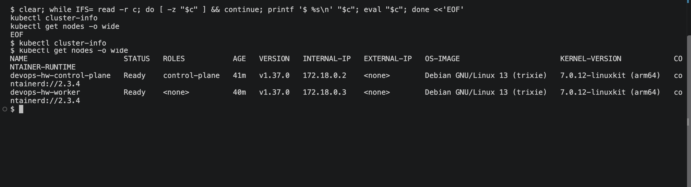
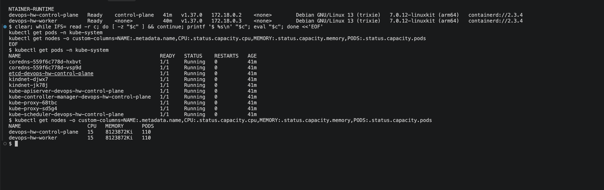
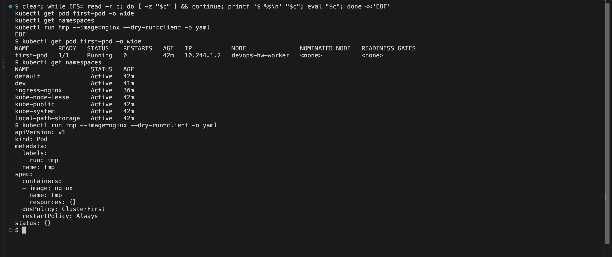

# Kubernetes Fundamentals

A local two-node cluster built with [kind](https://kind.sigs.k8s.io/), then a tour of what the
cluster is made of. kind runs each Kubernetes node as a Docker container on this machine, so no
cloud account is needed.

## The cluster definition

`kind-cluster.yaml` asks for one control-plane node and one worker. Two things in it matter
later: the `ingress-ready=true` label, which the ingress controller in the Ingress module
requires, and the port mappings, without which nothing inside the cluster is reachable from a
browser. Host ports 8088 and 30080 are used because the Docker modules already occupy 8080-8083.

```bash
kind create cluster --config kind-cluster.yaml
```

## 1. What the control plane is made of

```
$ kubectl cluster-info
Kubernetes control plane is running at https://127.0.0.1:50563
CoreDNS is running at https://127.0.0.1:50563/api/v1/namespaces/kube-system/services/kube-dns:dns/proxy

$ kubectl get nodes -o wide
NAME                      STATUS   ROLES           AGE   VERSION   INTERNAL-IP   OS-IMAGE                       CONTAINER-RUNTIME
devops-hw-control-plane   Ready    control-plane   35s   v1.37.0   172.18.0.2    Debian GNU/Linux 13 (trixie)   containerd://2.3.4
devops-hw-worker          Ready    <none>          21s   v1.37.0   172.18.0.3    Debian GNU/Linux 13 (trixie)   containerd://2.3.4
```

Both nodes report `Ready`, which means the kubelet on each is talking to the API server and the
CNI plugin has set up pod networking.



## 2. The architecture components are themselves Pods

The pieces named in every Kubernetes diagram are not special processes on the host; they run as
Pods in the `kube-system` namespace like anything else.

```
$ kubectl get pods -n kube-system
NAME                                              READY   STATUS    RESTARTS   AGE
coredns-559f6c778d-hxbvt                          1/1     Running   0          24s
coredns-559f6c778d-vsp9d                          1/1     Running   0          24s
etcd-devops-hw-control-plane                      1/1     Running   0          33s
kindnet-djwx7                                     1/1     Running   0          24s
kindnet-jk78j                                     1/1     Running   0          21s
kube-apiserver-devops-hw-control-plane            1/1     Running   0          34s
kube-controller-manager-devops-hw-control-plane   1/1     Running   0          33s
kube-proxy-68tbc                                  1/1     Running   0          24s
kube-proxy-sd5g4                                  1/1     Running   0          21s
kube-scheduler-devops-hw-control-plane            1/1     Running   0          33s
```

Reading that list against what each component does:

| Pod | Job |
|---|---|
| `kube-apiserver` | The only thing that talks to etcd. Every `kubectl` command goes through it |
| `etcd` | The database. All cluster state lives here |
| `kube-scheduler` | Decides which node an unassigned Pod lands on |
| `kube-controller-manager` | Runs the control loops that drive actual state toward desired state |
| `coredns` | Cluster DNS, which is what makes Service names resolvable |
| `kube-proxy` | Programs the node's networking so Service IPs route to Pods. One per node |
| `kindnet` | kind's CNI plugin, giving Pods their IPs. One per node |

The single-instance components carry the control-plane node's name as a suffix, and the per-node
ones (`kube-proxy`, `kindnet`) appear twice — once for each node.



## 3. Node capacity

```
$ kubectl get nodes -o custom-columns=NAME:.metadata.name,CPU:.status.capacity.cpu,MEMORY:.status.capacity.memory,PODS:.status.capacity.pods
NAME                      CPU   MEMORY      PODS
devops-hw-control-plane   15    8123872Ki   110
devops-hw-worker          15    8123872Ki   110
```

Both nodes report the same figures because both are containers on the same host, sharing what
Docker Desktop was given. `PODS: 110` is the kubelet's default cap per node, not a memory limit.

## 4. My first Pod

```
$ kubectl run first-pod --image=nginx:1.27-alpine
pod/first-pod created

$ kubectl get pod first-pod -o wide
NAME        READY   STATUS    RESTARTS   AGE   IP           NODE               NOMINATED NODE   READINESS GATES
first-pod   1/1     Running   0          21s   10.244.1.2   devops-hw-worker   <none>           <none>
```

The scheduler put it on the worker rather than the control plane, which carries a taint that
repels ordinary workloads. The `10.244.1.2` address is from the cluster's pod network and is
only routable inside the cluster.

## 5. Namespaces

Namespaces partition names, not machines. Two Pods can both be called `demo` as long as they sit
in different namespaces.

```
$ kubectl get namespaces
NAME                 STATUS   AGE
default              Active   67s
kube-node-lease      Active   67s
kube-public          Active   67s
kube-system          Active   67s
local-path-storage   Active   64s

$ kubectl create namespace dev
namespace/dev created
$ kubectl run demo --image=nginx:1.27-alpine -n dev
pod/demo created
$ kubectl get pods -n dev
NAME   READY   STATUS              RESTARTS   AGE
demo   0/1     ContainerCreating   0          0s
```

`kube-node-lease` holds the heartbeat objects nodes use to report they are alive, and
`local-path-storage` is the default storage provisioner kind installs.



## 6. Generating YAML from the CLI

Writing manifests from memory is slow. `--dry-run=client -o yaml` prints what would be sent to
the API server without creating anything, which is the fastest way to get a correct skeleton.

```
$ kubectl run tmp --image=nginx --dry-run=client -o yaml
apiVersion: v1
kind: Pod
metadata:
  labels:
    run: tmp
  name: tmp
spec:
  containers:
  - image: nginx
    name: tmp
    resources: {}
  dnsPolicy: ClusterFirst
  restartPolicy: Always
status: {}
```

`kubectl explain pod.spec.containers` does the same job for documentation, straight from the
API server's own schema rather than a web page that might describe a different version.

## 7. Listing what the API supports

```
$ kubectl api-resources --namespaced=true -o name | head -12
bindings
configmaps
endpoints
events
limitranges
persistentvolumeclaims
pods
podtemplates
replicationcontrollers
resourcequotas
secrets
serviceaccounts
```

Useful when a manifest is rejected for an unknown `kind` — it shows exactly what this cluster
version accepts, and `--namespaced=false` lists the cluster-scoped objects such as nodes and
namespaces.

## kubectl cheat sheet

| Command | What it does |
|---|---|
| `kubectl get <kind>` | List objects; add `-o wide` for node and IP columns |
| `kubectl describe <kind>/<name>` | Full detail plus the recent event log — the first stop when something is wrong |
| `kubectl logs <pod>` | Container stdout; `-f` to follow, `--previous` for a crashed container |
| `kubectl exec -it <pod> -- sh` | A shell inside a running container |
| `kubectl apply -f <file>` | Create or update from a manifest |
| `kubectl delete -f <file>` | Remove what that manifest created |
| `kubectl get events --sort-by=.lastTimestamp` | Cluster events in time order |
| `kubectl api-resources` | Every object kind this cluster understands |

## Clean up

```bash
kubectl delete pod first-pod
kubectl delete namespace dev
kind delete cluster --name devops-hw
```
