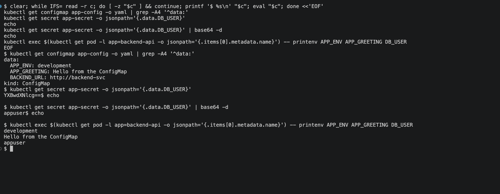
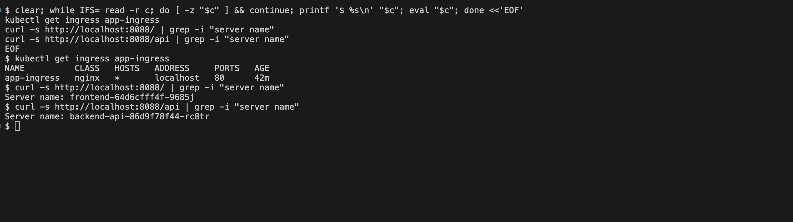

# Kubernetes Ingress, ConfigMaps and Secrets

Configuration kept out of the image, and one entry point in front of several Services.

## 0. The Ingress controller

An Ingress object is only a set of routing rules — something has to read them and actually proxy
traffic. That something is an ingress controller, and nothing happens without one installed.

```bash
kubectl apply -f https://raw.githubusercontent.com/kubernetes/ingress-nginx/controller-v1.11.3/deploy/static/provider/kind/deploy.yaml
kubectl wait --namespace ingress-nginx \
  --for=condition=ready pod --selector=app.kubernetes.io/component=controller --timeout=300s
```

```
pod/ingress-nginx-controller-746c8469d8-tsfwq condition met
```

This is the kind-specific manifest, which schedules the controller onto the node labelled
`ingress-ready=true` and binds it to the host ports mapped in `kind-cluster.yaml`.

## 1. ConfigMap

Non-secret configuration, so the same image can run in any environment.

```
$ kubectl get configmap app-config -o yaml | grep -A4 '^data:'
data:
  APP_ENV: development
  APP_GREETING: Hello from the ConfigMap
  BACKEND_URL: http://backend-svc
```

## 2. Secret

```
$ kubectl get secret app-secret
NAME         TYPE     DATA   AGE
app-secret   Opaque   2      2s
```

The manifest uses `stringData` so the values can be written in plain text and Kubernetes encodes
them on the way in. What it does *not* do is encrypt anything:

```
$ kubectl get secret app-secret -o jsonpath='{.data.DB_USER}'
YXBwdXNlcg==

$ kubectl get secret app-secret -o jsonpath='{.data.DB_USER}' | base64 -d
appuser
```

Base64 is an encoding, not encryption. Anyone who can read the Secret object can read the value,
so the real protection is RBAC plus encryption at rest on etcd — not the Secret kind itself. The
password in this repo is a throwaway string for the exercise; a real credential would never be
committed.

## 3. Injecting configuration into Pods

Two ways, one in each Deployment. The backend uses `envFrom` to pull in everything at once:

```
$ kubectl exec backend-api-86d9f78f44-pkwbj -- printenv APP_ENV APP_GREETING DB_USER DB_PASSWORD
development
Hello from the ConfigMap
appuser
not-a-real-password
```

The frontend names individual keys with `configMapKeyRef`, which is more verbose but explicit
about what it depends on:

```
$ kubectl exec frontend-64d6cfff4f-9685j -- printenv APP_GREETING BACKEND_URL
Hello from the ConfigMap
http://backend-svc
```

One caveat worth knowing: env vars are read once at container start. Editing the ConfigMap does
not update a running Pod — it needs a restart, or the values must be mounted as a volume instead.



## 4. Ingress

Without Ingress, exposing two Services externally means two NodePorts or two LoadBalancers. The
Ingress puts both behind one address and routes on the request path.

```
$ kubectl get ingress app-ingress
NAME          CLASS   HOSTS   ADDRESS     PORTS   AGE
app-ingress   nginx   *       localhost   80      89s
```

```
$ curl -s http://localhost:8088/ | grep -i 'server name'
Server name: frontend-64d6cfff4f-c7wlh

$ curl -s http://localhost:8088/api | grep -i 'server name'
Server name: backend-api-86d9f78f44-pkwbj
```

`/` reaches the frontend and `/api` reaches the backend, through the single port 8088 that
`kind-cluster.yaml` maps to the cluster. The `rewrite-target: /$2` annotation with the
`/api(/|$)(.*)` path strips the prefix, so the backend receives `/` rather than `/api` — without
it the backend would 404 on a path it knows nothing about.



## A bug worth recording

The first run of this module returned the default nginx welcome page on `/api` instead of the
backend. The Ingress was fine; the Service selector was not:

```
$ kubectl get endpointslice -l kubernetes.io/service-name=backend-svc
NAME                ENDPOINTS                                      AGE
backend-svc-hgrjl   10.244.1.5,10.244.1.9,10.244.1.8 + 4 more...   69s
```

Seven endpoints for a two-replica Deployment. The backend here and the ReplicaSet in
`Kubernetes Pods and Deployments/` both used `app: backend`, so `backend-svc` was selecting both
sets of Pods and sending some requests to plain nginx. Relabelling this module's Deployment to
`app: backend-api` fixed it:

```
$ kubectl get endpointslice -l kubernetes.io/service-name=backend-svc
NAME                ADDRESSTYPE   PORTS   ENDPOINTS                 AGE
backend-svc-hgrjl   IPv4          80      10.244.1.41,10.244.1.40   100s
```

Two endpoints, and `/api` then returned the right Pod. Labels are cluster-wide within a
namespace — a Service will happily select any Pod that matches, whichever manifest created it.

## Clean up

```bash
kubectl delete -f manifests/
kubectl delete -f https://raw.githubusercontent.com/kubernetes/ingress-nginx/controller-v1.11.3/deploy/static/provider/kind/deploy.yaml
```
