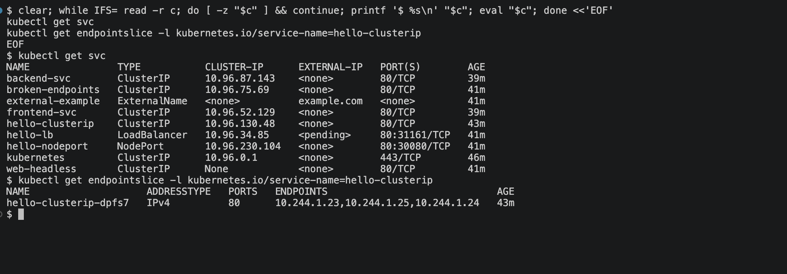
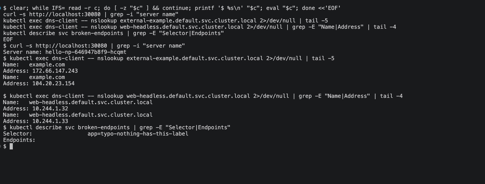

# Kubernetes Networking and Services

Pod IPs are not stable — every rollout replaces Pods and every replacement gets a new address.
A Service is a fixed name and IP in front of a changing set of Pods. This module covers all five
Service types and one common failure.

## 1. ClusterIP — the default

One virtual IP inside the cluster, load-balanced across every Pod matching the selector. Not
reachable from outside the cluster at all.

```
$ kubectl apply -f manifests/01-clusterip/
deployment.apps/hello created
pod/client created
service/hello-clusterip created

$ kubectl get svc hello-clusterip
NAME              TYPE        CLUSTER-IP     EXTERNAL-IP   PORT(S)   AGE
hello-clusterip   ClusterIP   10.96.130.48   <none>        80/TCP    75s
```

The Service tracks its Pods through an EndpointSlice, which is the list of addresses traffic can
actually go to:

```
$ kubectl get endpointslice -l kubernetes.io/service-name=hello-clusterip
NAME                    ADDRESSTYPE   PORTS   ENDPOINTS                             AGE
hello-clusterip-dpfs7   IPv4          80      10.244.1.23,10.244.1.25,10.244.1.24   76s

$ kubectl get pods -l app=hello -o custom-columns='NAME:.metadata.name,IP:.status.podIP'
NAME                     IP
hello-5fbcc4b876-45zzx   10.244.1.23
hello-5fbcc4b876-nvrfk   10.244.1.24
hello-5fbcc4b876-th5hq   10.244.1.25
```

Those three endpoint addresses are exactly the three Pod IPs — that is the Service following its
Pods rather than pointing at anything fixed.



### DNS and load balancing

CoreDNS gives every Service a record, so the name works without knowing any IP:

```
$ kubectl exec client -- nslookup hello-clusterip.default.svc.cluster.local
Name:	hello-clusterip.default.svc.cluster.local
Address: 10.96.130.48
```

And requests spread across the Pods:

```
$ for i in 1 2 3 4 5 6; do kubectl exec client -- curl -s hello-clusterip | grep -i "server name"; done
Server name: hello-5fbcc4b876-45zzx
Server name: hello-5fbcc4b876-45zzx
Server name: hello-5fbcc4b876-th5hq
Server name: hello-5fbcc4b876-th5hq
Server name: hello-5fbcc4b876-th5hq
Server name: hello-5fbcc4b876-th5hq
```

Not strict round-robin — kube-proxy picks a backend per connection, so the distribution is only
even over many requests.

## 2. NodePort — reachable from outside

NodePort opens the same port on every node and forwards to the Service.

```
$ kubectl get svc hello-nodeport
NAME             TYPE       CLUSTER-IP      EXTERNAL-IP   PORT(S)        AGE
hello-nodeport   NodePort   10.96.230.104   <none>        80:30080/TCP   2s

$ curl -s http://localhost:30080 | grep -i 'server name'
Server name: hello-np-646947b8f9-p9qmv
```

The port is pinned to 30080 rather than left random because `kind-cluster.yaml` maps exactly
that port from the node container to the host. A random nodePort would work inside the cluster
but would not be reachable from the browser.

## 3. LoadBalancer — and why it stays pending

```
$ kubectl get svc hello-lb
NAME       TYPE           CLUSTER-IP    EXTERNAL-IP   PORT(S)        AGE
hello-lb   LoadBalancer   10.96.34.85   <pending>     80:31161/TCP   15s
```

`<pending>` is the correct result here, not a failure. LoadBalancer asks the cloud provider for
an external address, and kind has no cloud provider to ask. On EKS or GKE this same manifest
would get a real IP within a minute. Note it still allocated a NodePort (31161) underneath —
LoadBalancer is built on top of NodePort, which is built on top of ClusterIP.

## 4. ExternalName — a CNAME, not a proxy

No selector, no endpoints, no traffic through kube-proxy. It is purely a DNS alias, so in-cluster
code can use a stable internal name for something that lives outside.

```
$ kubectl exec dns-client -- nslookup external-example.default.svc.cluster.local
Name:	example.com
Address: 104.20.23.154
Name:	example.com
Address: 172.66.147.243
```

The lookup returns `example.com`'s real addresses. Swapping the target later means editing one
Service instead of every application's configuration.

## 5. Headless Service and StatefulSet

`clusterIP: None` makes a Service headless: DNS returns the Pod IPs directly instead of one
virtual IP. Paired with a StatefulSet, each Pod also gets a stable ordinal name.

```
$ kubectl get pods -l app=web-sts
NAME    READY   STATUS    RESTARTS   AGE
web-0   1/1     Running   0          14s
web-1   1/1     Running   0          14s

$ kubectl exec dns-client -- nslookup web-headless.default.svc.cluster.local
Name:	web-headless.default.svc.cluster.local
Address: 10.244.1.33
Name:	web-headless.default.svc.cluster.local
Address: 10.244.1.32
```

`web-0` and `web-1` instead of the random suffixes a Deployment produces, and both Pod IPs come
back from one query. This is what databases and queues need, where clients must address a
specific member rather than "any healthy one".

## 6. Troubleshooting — a Service with no endpoints

`empty-endpoints.yaml` has a selector no Pod matches. Kubernetes accepts it happily:

```
$ kubectl get svc broken-endpoints
NAME               TYPE        CLUSTER-IP    EXTERNAL-IP   PORT(S)   AGE
broken-endpoints   ClusterIP   10.96.75.69   <none>        80/TCP    30s

$ kubectl describe svc broken-endpoints | grep -E 'Selector|Endpoints'
Selector:                 app=typo-nothing-has-this-label
Endpoints:

$ kubectl exec client -- curl -s --max-time 5 broken-endpoints
exit=7
```

The Service exists and has a ClusterIP, so `kubectl get svc` looks fine. The empty `Endpoints:`
line is the tell, and curl's exit code 7 is "failed to connect" — there is nowhere to send the
traffic. An EndpointSlice object does get created, but with no addresses in it.

A selector that matches nothing is the usual cause of a Service that "exists but does not work",
and it is almost always a label typo or a namespace mismatch.



## Summary

| Type | Reachable from | Use when |
|---|---|---|
| ClusterIP | Inside the cluster only | Internal service-to-service traffic (the default) |
| NodePort | Any node's IP on a high port | Development, or behind an external load balancer |
| LoadBalancer | A cloud-provided external IP | Production traffic on a managed cluster |
| ExternalName | DNS alias, no proxying | Pointing at something outside the cluster |
| Headless (`clusterIP: None`) | Pod IPs directly | StatefulSets, where identity matters |

## Clean up

```bash
kubectl delete -f manifests/01-clusterip/ -f manifests/02-nodeport/ \
  -f manifests/03-loadbalancer/ -f manifests/04-externalname/ \
  -f manifests/05-headless/ -f manifests/empty-endpoints.yaml
```
