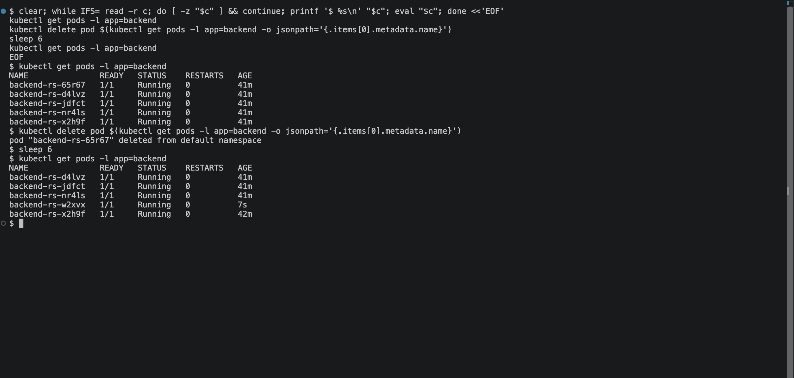
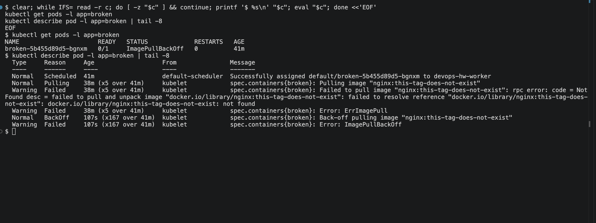
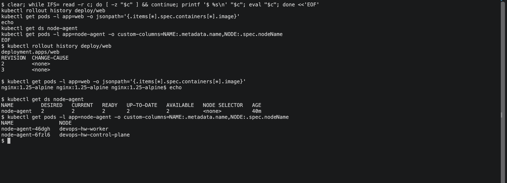

# Kubernetes Pods, ReplicaSets and Deployments

Four ways of running workloads, and what each layer adds over the one below it. Everything here
runs on the two-node kind cluster from `Kubernetes Fundamentals/`.

## The ownership chain

A bare **Pod** is the smallest schedulable unit, and nothing watches it. A **ReplicaSet** owns
Pods and keeps a set number alive. A **Deployment** owns ReplicaSets, and that extra layer is
what makes rolling updates and rollbacks possible. A **DaemonSet** ignores replica counts and
runs one Pod per node instead.

## 1. A bare Pod

```
$ kubectl apply -f manifests/nginx-pod.yaml
pod/nginx-pod created
```

If the node hosting it dies, this Pod is simply gone. Nothing recreates it — that is the gap the
ReplicaSet fills.

## 2. ReplicaSet — self-healing

```
$ kubectl apply -f manifests/backend-rs.yaml
replicaset.apps/backend-rs created

$ kubectl get rs,pods -l app=backend
NAME                   READY   STATUS    RESTARTS   AGE
pod/backend-rs-477mr   1/1     Running   0          15s
pod/backend-rs-65r67   1/1     Running   0          15s
pod/backend-rs-x2h9f   1/1     Running   0          15s
```

Deleting one Pod proves the controller is actually watching:

```
$ kubectl delete pod backend-rs-477mr
pod "backend-rs-477mr" deleted from default namespace

$ kubectl get pods -l app=backend
NAME               READY   STATUS    RESTARTS   AGE
backend-rs-65r67   1/1     Running   0          22s
backend-rs-nr4ls   1/1     Running   0          6s
backend-rs-x2h9f   1/1     Running   0          22s
```

The replacement `backend-rs-nr4ls` is 6 seconds old while its two siblings are 22 — the
ReplicaSet noticed the count had dropped to 2 and created one more. The name is new because it
is a new Pod, not the old one restarted.



Scaling is the same mechanism with a different target:

```
$ kubectl scale rs/backend-rs --replicas=5
replicaset.apps/backend-rs scaled
pods now: 5
```

## 3. Deployment — rolling update and rollback

`deployment-v1.yaml` runs `nginx:1.25-alpine`; `deployment-v2.yaml` is identical except for the
tag. The strategy is set to `maxUnavailable: 0, maxSurge: 1`, so capacity never dips below three
and the rollout proceeds one Pod at a time.

```
$ kubectl apply -f manifests/deployment-v1.yaml
deployment.apps/web created

$ kubectl apply -f manifests/deployment-v2.yaml   # rolling update 1.25 -> 1.27
deployment.apps/web configured

$ kubectl rollout status deploy/web
Waiting for deployment "web" rollout to finish: 1 out of 3 new replicas have been updated...
Waiting for deployment "web" rollout to finish: 2 out of 3 new replicas have been updated...
Waiting for deployment "web" rollout to finish: 1 old replicas are pending termination...
deployment "web" successfully rolled out
```

That trace is the whole point of a Deployment: new Pods come up and old ones retire gradually,
so the service never goes fully down.

```
$ kubectl rollout history deploy/web
deployment.apps/web
REVISION  CHANGE-CAUSE
1         <none>
2         <none>
```

Two revisions, one per ReplicaSet. `CHANGE-CAUSE` is empty because the applies were not
annotated; `kubectl annotate deploy/web kubernetes.io/change-cause="..."` fills it in.

Rolling back is the same machinery pointed at the older ReplicaSet:

```
$ kubectl rollout undo deploy/web
deployment.apps/web rolled back

$ kubectl get pods -l app=web -o jsonpath='{.items[*].spec.containers[*].image}'
nginx:1.25-alpine nginx:1.25-alpine nginx:1.25-alpine
```

Back on 1.25. The old ReplicaSet was never deleted — it was scaled to zero and kept, which is
exactly what makes the rollback instant.

## 4. Troubleshooting a broken image

`broken-image.yaml` deliberately references a tag that does not exist.

```
$ kubectl apply -f manifests/broken-image.yaml
deployment.apps/broken created

$ kubectl get pods -l app=broken
NAME                      READY   STATUS             RESTARTS   AGE
broken-5b455d89d5-bgnxm   0/1     ImagePullBackOff   0          25s
```

`kubectl get` says something is wrong; `kubectl describe` says what:

```
$ kubectl describe pod -l app=broken | tail -8
  Type     Reason     Age               From               Message
  ----     ------     ----              ----               -------
  Normal   Scheduled  25s               default-scheduler  Successfully assigned default/broken-5b455d89d5-bgnxm to devops-hw-worker
  Normal   BackOff    21s               kubelet            Back-off pulling image "nginx:this-tag-does-not-exist"
  Warning  Failed     21s               kubelet            Error: ImagePullBackOff
  Normal   Pulling    8s (x2 over 25s)  kubelet            Pulling image "nginx:this-tag-does-not-exist"
  Warning  Failed     4s (x2 over 22s)  kubelet            Failed to pull image "nginx:this-tag-does-not-exist": ... not found
  Warning  Failed     4s (x2 over 22s)  kubelet            Error: ErrImagePull
```

Worth noting the sequence: `Scheduled` succeeded, so this is not a scheduling problem. The first
failure is `ErrImagePull`, and `ImagePullBackOff` is the kubelet backing off between retries
rather than a separate fault. The `(x2 over 25s)` counter shows the retries stacking up.



## 5. DaemonSet — one Pod per node

```
$ kubectl apply -f manifests/node-agent-ds.yaml
daemonset.apps/node-agent created

$ kubectl get ds node-agent
NAME         DESIRED   CURRENT   READY   UP-TO-DATE   AVAILABLE   NODE SELECTOR   AGE
node-agent   2         2         2       2            2           <none>          20s

$ kubectl get pods -l app=node-agent -o custom-columns=NAME:.metadata.name,NODE:.spec.nodeName,STATUS:.status.phase
NAME               NODE                      STATUS
node-agent-46dgh   devops-hw-worker          Running
node-agent-6fzl6   devops-hw-control-plane   Running
```

`DESIRED 2` was never written in the manifest — it is derived from the node count, and adding a
third node would make it 3. The manifest carries a toleration for
`node-role.kubernetes.io/control-plane`; without it the control-plane taint would keep the agent
off that node and only one Pod would exist. This is the shape log shippers and monitoring agents
use, since they need to be everywhere rather than in a fixed number of copies.



## Pod status cheat sheet

| Status | Meaning | First thing to check |
|---|---|---|
| `Pending` | Accepted but not placed on a node | `kubectl describe pod` — usually insufficient resources or a taint |
| `ContainerCreating` | Scheduled, image pulling or volumes mounting | Normal briefly; if stuck, check image size and volumes |
| `Running` | At least one container started | `READY` column — `0/1` means it started but is failing its readiness probe |
| `ErrImagePull` / `ImagePullBackOff` | Image cannot be fetched | Tag spelling, registry auth |
| `CrashLoopBackOff` | Container starts then exits repeatedly | `kubectl logs --previous` |
| `Completed` | Exited with code 0 | Expected for Jobs, a bug for long-running apps |

## Clean up

```bash
kubectl delete -f manifests/
```
