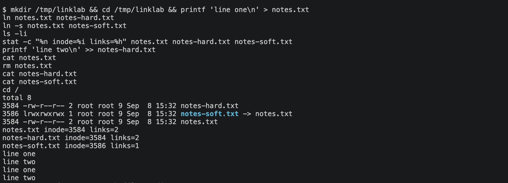
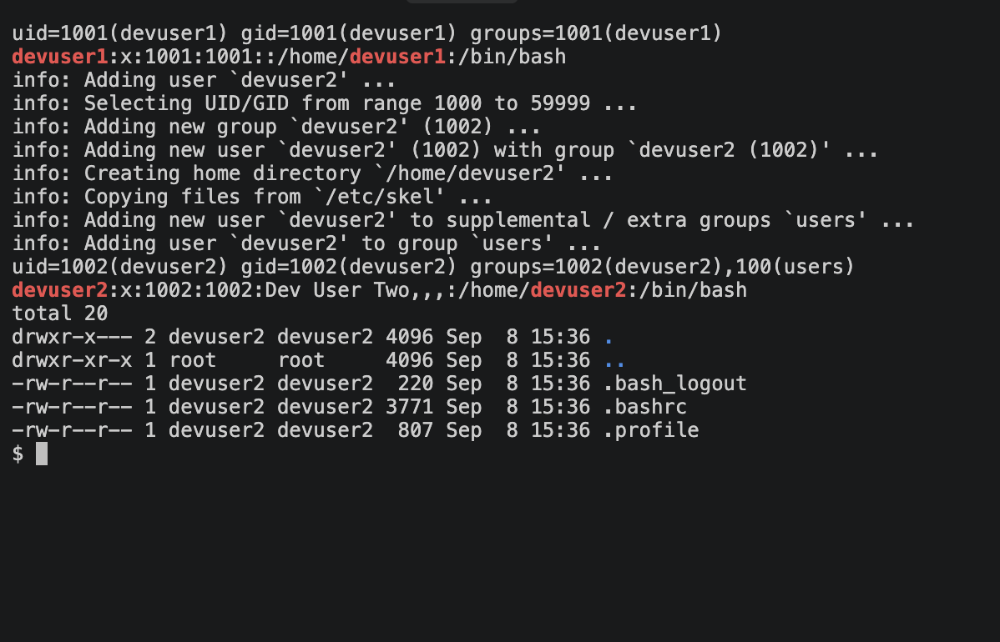
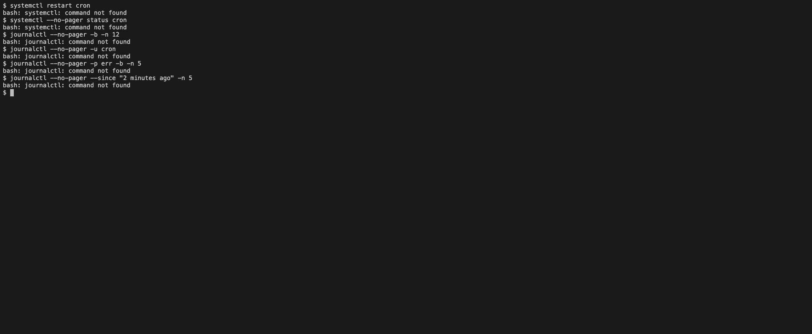
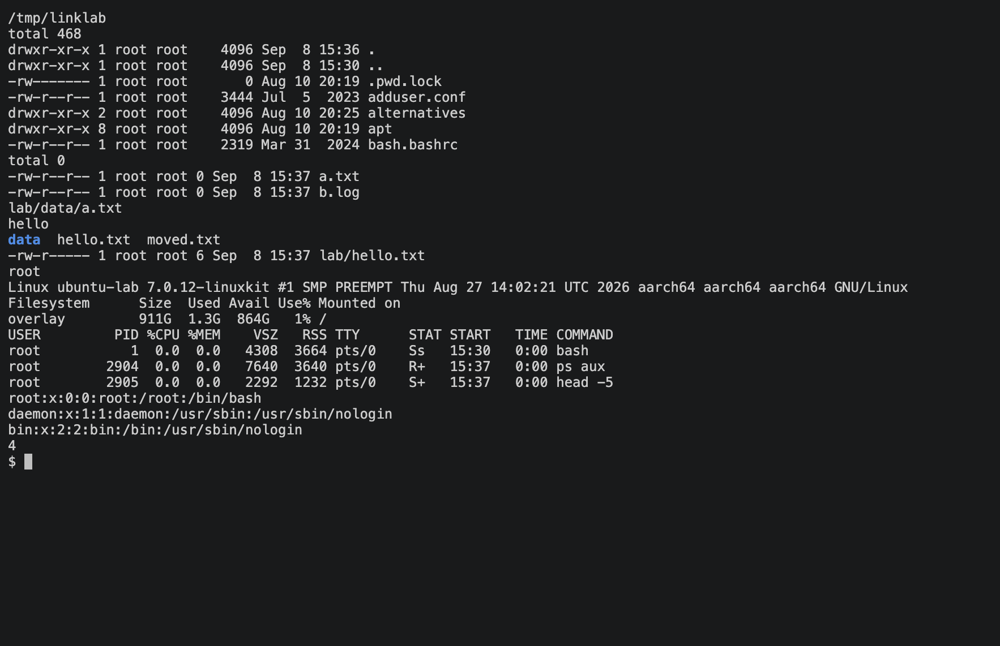

# Linux Fundamentals

Working notes for the Linux assignment. Every command below was run in an Ubuntu 24.04
environment (hostname `ubuntu-lab`) and the output was captured as screenshots.

## Part 1 - Hard links vs symbolic links

A file name in Linux is just a directory entry that points at an inode. The inode holds the
actual metadata and data blocks. Links are two different ways of giving that data another name.

**Hard link** - a second directory entry pointing at the *same inode*. Both names are equal
peers; there is no "original". The link count on the inode goes up by one, and the data is only
freed when the count drops to zero.

**Symbolic (soft) link** - a separate small file whose content is a *path* to another file.
It has its own inode. If the target is removed the link stays behind but points at nothing.

| | Hard link | Symbolic link |
|---|---|---|
| What it stores | Inode reference | A path string |
| Own inode? | No, shares the target's | Yes |
| Survives deleting the target | Yes, data stays reachable | No, becomes dangling |
| Works across filesystems | No | Yes |
| Can point to a directory | No (normal users) | Yes |
| `ls -l` marker | Looks like a regular file | `l` type, shows `-> target` |

### Commands used

```bash
ln notes.txt notes-hard.txt        # hard link
ln -s notes.txt notes-soft.txt     # symbolic link
ls -li                             # -i shows inode numbers
stat -c "%n inode=%i links=%h" notes.txt notes-hard.txt notes-soft.txt
rm notes.txt                       # delete the original name
unlink notes-soft.txt              # remove a link (same as rm)
```

### What the run showed

- `notes.txt` and `notes-hard.txt` had the same inode (`3584`) and a link count of 2.
- `notes-soft.txt` had its own inode (`3586`) and a link count of 1.
- Appending to the hard link changed `notes.txt` too, since they are the same data.
- After `rm notes.txt`, the hard link still printed both lines. The symlink returned
  `No such file or directory`.



## Part 2 - useradd vs adduser

Both create users, but they sit at different levels.

- `useradd` is the low-level binary from the shadow-utils package. It does exactly what the
  flags say and nothing more. Without `-m` there is no home directory, without `-s` the shell is
  the system default (`/bin/sh` on Debian-based systems), and no password is set.
- `adduser` is a Perl front-end shipped by Debian and Ubuntu. It calls `useradd` internally,
  but it also creates the home directory, copies `/etc/skel`, picks the next free UID, sets
  `/bin/bash`, adds the user to the `users` group, and prompts for a password and full name.

**Which one on Ubuntu?** `adduser` for interactive admin work, because it leaves the account
in a usable state in one step. `useradd` is the better choice inside scripts and Dockerfiles
where you want every detail spelled out and no prompts.

### Commands used

```bash
useradd -m -s /bin/bash devuser1
id devuser1
grep devuser1 /etc/passwd

adduser --disabled-password --gecos "Dev User Two" devuser2
id devuser2
grep devuser2 /etc/passwd
ls -la /home/devuser2
```

`--disabled-password` and `--gecos` were passed so the run is non-interactive; without them
`adduser` prompts for a password and the name fields.

### What the run showed

- `useradd` created `devuser1` with only the basics: uid 1001, one group, an empty home.
- `adduser` printed each step it took: choosing uid 1002, creating the group, creating the home,
  copying skeleton files, and adding the user to the extra `users` group. The GECOS field
  (`Dev User Two,,,`) and `/bin/bash` shell show up in `/etc/passwd`, and the home directory
  already contains `.bashrc`, `.profile` and `.bash_logout`.
- Note: the stock `ubuntu:24.04` container image does not ship `adduser`, so it was installed
  first with `apt-get install adduser`.



## Part 3 - journalctl

`journalctl` queries the binary log kept by `systemd-journald`. Instead of grepping through
`/var/log/*.log`, you filter the journal by unit, priority, boot, or time range.

Frequently used forms:

```bash
journalctl                      # everything, oldest first (paged)
journalctl -b                   # only the current boot
journalctl -n 20                # last 20 lines
journalctl -f                   # follow, like tail -f
journalctl -u cron              # a single unit's log
journalctl -p err               # priority err and worse
journalctl --since "2 minutes ago"
journalctl --since today --until "1 hour ago"
journalctl --no-pager           # plain output, useful in scripts
```

### Practice: reading a service's log

A container has no init system, so to test this properly I started `ubuntu:24.04` with
`systemd` installed and `/usr/lib/systemd/systemd` as PID 1 (`--privileged` and the host's
cgroup namespace are required). Once `systemctl is-system-running` reported `running`, I
restarted `cron.service` and then pulled its log entries in several ways:

```bash
systemctl restart cron
systemctl --no-pager status cron
journalctl --no-pager -b -n 12
journalctl --no-pager -u cron
journalctl --no-pager -p err -b -n 5
journalctl --no-pager --since "2 minutes ago" -n 5
```

The `-u cron` output shows the stop/start pair from the restart and cron's own startup lines,
the `-p err` filter returned `-- No entries --` because nothing had failed, and the time filter
returned only the recent lines.



## Part 4 - Command cheat sheet

Grouped by what I reach for them.

**Where am I, what is here**

| Command | Notes |
|---|---|
| `pwd` | print working directory |
| `ls -la` | long listing including dotfiles |
| `cd -` | jump back to the previous directory |
| `tree -L 2` | directory tree, two levels (needs the `tree` package) |
| `find . -name "*.txt"` | search by name; `-type f`, `-mtime -1` for filters |
| `du -sh *` | size of each item in the current directory |

**Creating, moving, removing**

| Command | Notes |
|---|---|
| `mkdir -p a/b/c` | create nested directories in one go |
| `touch file` | create an empty file or bump its timestamp |
| `cp -r src dst` | copy; `-r` for directories |
| `mv old new` | move or rename |
| `rm -rf dir` | remove recursively without prompting; be careful |

**Reading files**

| Command | Notes |
|---|---|
| `cat file` | dump the whole file |
| `less file` | page through it; `/` to search, `q` to quit |
| `head -n 5` / `tail -n 5` | first or last lines |
| `tail -f log` | follow a growing file |
| `grep -rn "text" .` | recursive search with line numbers |
| `wc -l file` | count lines |

**Permissions and ownership**

| Command | Notes |
|---|---|
| `chmod 640 file` | owner rw, group r, others nothing |
| `chmod +x script.sh` | make executable |
| `chown user:group file` | change owner and group |
| `umask` | default permission mask for new files |

**Users and identity**

| Command | Notes |
|---|---|
| `whoami` / `id` | current user, uid and groups |
| `sudo adduser name` | create a user interactively |
| `passwd name` | set or change a password |
| `su - name` | switch user with a login shell |
| `groups name` | list group membership |

**Processes and resources**

| Command | Notes |
|---|---|
| `ps aux` | all processes; pipe into `grep` |
| `top` / `htop` | live view |
| `kill -15 PID` | ask a process to exit; `-9` to force |
| `df -h` | disk usage per filesystem |
| `free -h` | memory |
| `uname -a` | kernel and architecture |
| `uptime` | load averages |

**Networking**

| Command | Notes |
|---|---|
| `ip a` / `ip route` | interfaces and routing table |
| `ss -tulpn` | listening sockets and owning processes |
| `ping -c 4 host` | reachability |
| `curl -I url` | HTTP headers only |

**Services and logs**

| Command | Notes |
|---|---|
| `systemctl status unit` | is it running |
| `systemctl restart unit` | restart |
| `systemctl enable --now unit` | start now and on boot |
| `journalctl -u unit -f` | follow a unit's log |

**Packages and archives**

| Command | Notes |
|---|---|
| `apt update && apt install pkg` | Debian/Ubuntu packages |
| `tar -czf out.tgz dir` | create a gzip tarball |
| `tar -xzf out.tgz` | extract it |
| `man cmd` / `cmd --help` | built-in documentation |
| `history \| grep ssh` | find a command you ran before |

A short session exercising the file, permission and process commands:


