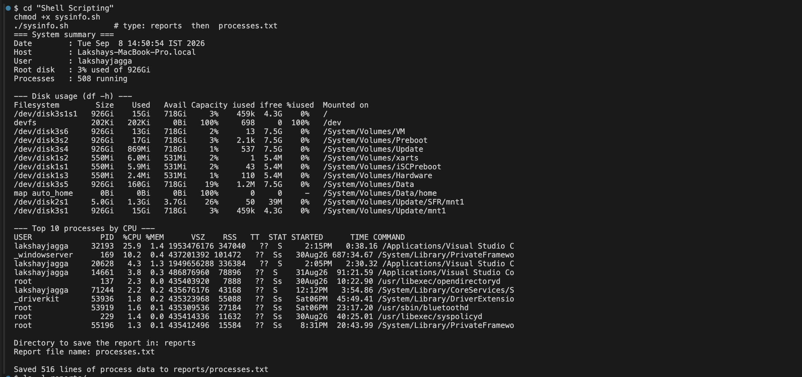
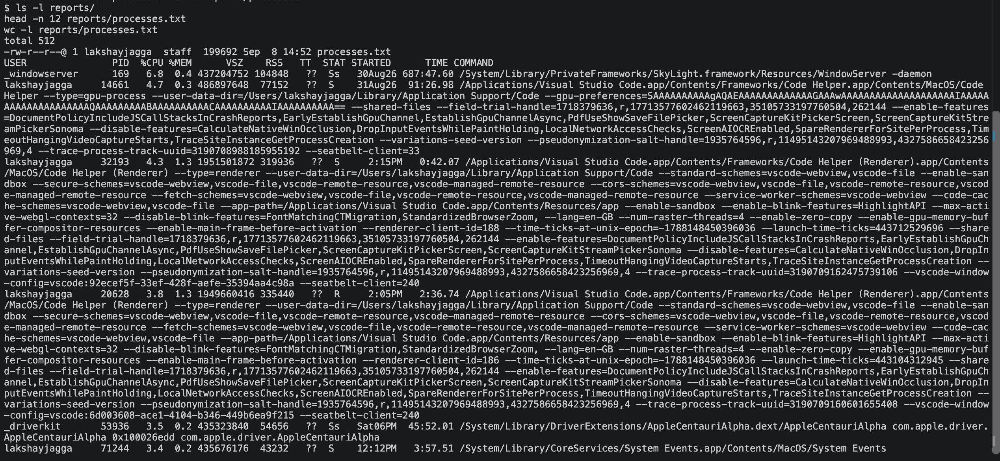

# Shell Scripting - sysinfo.sh

A Bash script that summarises the machine it runs on, asks the user where to put a report, and
writes the full process list to that report using `>` output redirection.

## Requirements covered

| Requirement | How the script does it |
|---|---|
| Print the current date | `run_date=$(date)` |
| Print the hostname | `host_name=$(hostname)` |
| Print the username | `user_name=$(whoami)` |
| Print the disk usage | `df -h`, plus a one-line summary parsed with `awk` |
| Print the running processes | `ps aux`, sorted by %CPU, top 10 |
| Use variables to store and use data | `run_date`, `host_name`, `user_name`, `root_usage`, `process_total`, `report_dir`, `report_file`, `report_path` |
| Take user input using `read -p` | two `read -r -p` prompts for the directory and file name |
| Create a directory using `mkdir` | `mkdir -p "$report_dir"` |
| Create a file using `touch` | `touch "$report_path"` |
| Store the process info using `>` | `ps aux > "$report_path"` |

## The script

```bash
#!/usr/bin/env bash
#
# sysinfo.sh - print a short system summary, then dump the full process
# list to a file the user names.
#
# Practises: variables, command substitution, read prompts, mkdir/touch,
# and output redirection with >.

# -e  stop on the first failing command
# -u  treat an unset variable as an error instead of an empty string
# -o pipefail  a pipeline fails if any stage in it fails, not just the last
set -euo pipefail

# Width the on-screen process table is trimmed to so it fits a normal
# terminal. Kept in one place instead of repeated at each cut call.
readonly TABLE_WIDTH=110

# Defaults used when the user just presses Enter at a prompt.
readonly DEFAULT_DIR="reports"
readonly DEFAULT_FILE="processes.txt"

# heading <text> - print a section heading with a blank line above it.
heading() {
    printf '\n--- %s ---\n' "$1"
}

# Every value is captured once up front with $(...) command substitution, so
# the summary is a snapshot of a single moment rather than of several.
run_date=$(date)
host_name=$(hostname)
user_name=$(whoami)
# awk NR==2 skips the df header row and keeps the percentage and total size.
root_usage=$(df -h / | awk 'NR==2 {print $5 " used of " $2}')
# wc counts the ps header line too, so subtract 1 for the real process count.
process_total=$(($(ps aux | wc -l) - 1))

printf '=== System summary ===\n'
# printf reuses its format string until the arguments run out, so one call
# lays out every row. %-12s pads each label to a fixed width, which keeps the
# colons aligned without padding the labels by hand.
printf '%-12s: %s\n' \
    "Date" "$run_date" \
    "Host" "$host_name" \
    "User" "$user_name" \
    "Root disk" "$root_usage" \
    "Processes" "$process_total running"

heading "Disk usage (df -h)"
df -h

heading "Top 10 processes by CPU"
# The header row is printed on its own. Piping all of ps into sort would sort
# the header along with the data and bury it in the middle of the table.
ps aux | head -n 1 | cut -c1-"$TABLE_WIDTH" || true
# Column 3 of ps aux is %CPU, so -k 3 sorts on it and -r makes that descending.
# tail -n +2 drops the header first. head closes the pipe early, so sort takes
# a SIGPIPE that pipefail would otherwise treat as a failure; || true keeps
# set -e from killing the run.
ps aux | tail -n +2 | sort -rk 3 | head -n 10 | cut -c1-"$TABLE_WIDTH" || true

# read -p writes the prompt without a trailing newline; -r keeps backslashes
# in the answer literal rather than treating them as escapes.
echo
read -r -p "Directory to save the report in: " report_dir
read -r -p "Report file name: " report_file

# Empty input would leave the path as a bare "/", so fall back to the
# defaults instead of failing further down.
: "${report_dir:=$DEFAULT_DIR}"
: "${report_file:=$DEFAULT_FILE}"

report_path="$report_dir/$report_file"

# -p creates parent directories as needed and stays quiet if they exist,
# which lets the script be re-run without error.
mkdir -p "$report_dir"
# touch creates the file up front, so the path exists before anything is
# written to it.
touch "$report_path"

# > truncates and writes; swap it for >> to append to an existing report.
ps aux > "$report_path"

saved_lines=$(wc -l < "$report_path" | tr -d ' ')
printf '\nSaved %s lines of process data to %s\n' "$saved_lines" "$report_path"
```

A few choices worth noting:

- `set -euo pipefail` stops the script on the first error instead of carrying on with
  half-populated variables.
- Every value is captured once up front with `$(...)`, so the summary is a snapshot of one
  moment rather than of several.
- One `printf '%-12s: %s\n'` call lays out all five summary rows. `printf` reuses its format
  string until the arguments run out, and `%-12s` pads each label to a fixed width, which keeps
  the colons aligned without padding the labels by hand.
- Variables are quoted everywhere they are expanded, so a directory name containing a space
  still works.
- `mkdir -p` does not fail if the directory already exists, so the script can be re-run.
- The `ps` header row is printed separately from the sorted body. Piping all of `ps aux` into
  `sort` would sort the header along with the data and bury it in the middle of the table.
- `head` closes the pipe early, so `sort` takes a SIGPIPE that `pipefail` would treat as a
  failure. `|| true` keeps `set -e` from killing the run.
- `>` truncates and rewrites the report on each run. Swapping it for `>>` would append instead.
- The on-screen table is trimmed to `TABLE_WIDTH` columns so it fits a normal terminal. The
  file gets the untrimmed list.

## Running it

```bash
chmod +x sysinfo.sh
./sysinfo.sh
```

## Output

Run in full, entering `reports` for the directory and `processes.txt` for the file name:

```
$ ./sysinfo.sh
=== System summary ===
Date        : Tue Sep  8 14:35:40 IST 2026
Host        : Lakshays-MacBook-Pro.local
User        : lakshayjagga
Root disk   : 3% used of 926Gi
Processes   : 560 running

--- Disk usage (df -h) ---
Filesystem        Size    Used   Avail Capacity iused ifree %iused  Mounted on
/dev/disk3s1s1   926Gi    15Gi   719Gi     3%    459k  4.3G    0%   /
devfs            201Ki   201Ki     0Bi   100%     696     0  100%   /dev
/dev/disk3s6     926Gi    12Gi   719Gi     2%      12  7.5G    0%   /System/Volumes/VM
/dev/disk3s2     926Gi    17Gi   719Gi     3%    2.1k  7.5G    0%   /System/Volumes/Preboot
/dev/disk3s4     926Gi   869Mi   719Gi     1%     537  7.5G    0%   /System/Volumes/Update
/dev/disk1s2     550Mi   6.0Mi   531Mi     2%       1  5.4M    0%   /System/Volumes/xarts
/dev/disk1s1     550Mi   5.9Mi   531Mi     2%      43  5.4M    0%   /System/Volumes/iSCPreboot
/dev/disk1s3     550Mi   2.4Mi   531Mi     1%     110  5.4M    0%   /System/Volumes/Hardware
/dev/disk3s5     926Gi   159Gi   719Gi    19%    1.2M  7.5G    0%   /System/Volumes/Data
map auto_home      0Bi     0Bi     0Bi   100%       0     0     -   /System/Volumes/Data/home
/dev/disk2s1     5.0Gi   1.3Gi   3.7Gi    26%      50   39M    0%   /System/Volumes/Update/SFR/mnt1
/dev/disk3s1     926Gi    15Gi   719Gi     3%    459k  4.3G    0%   /System/Volumes/Update/mnt1

--- Top 10 processes by CPU ---
USER               PID  %CPU %MEM      VSZ    RSS   TT  STAT STARTED      TIME COMMAND
root             35769  32.0  0.1 435399840  34544   ??  Ss    2:18PM   0:00.59 /System/Library/PrivateFramewo
_windowserver      169   9.7  0.3 437224432  69456   ??  Ss   30Aug26 685:42.37 /System/Library/PrivateFramewo
lakshayjagga     20628   9.0  1.4 1949648608 347312   ??  S     2:05PM   1:28.17 /Applications/Visual Studio C
lakshayjagga     71244   8.4  0.2 435676176  42896   ??  S    12:12PM   3:20.67 /System/Library/CoreServices/S
root               229   8.3  0.1 435491664  14960   ??  Ss   30Aug26  40:04.88 /usr/libexec/syspolicyd
root             53919   5.6  0.1 435310096  27680   ??  Ss   Sat06PM  22:55.35 /usr/sbin/bluetoothd
lakshayjagga     14661   4.7  0.3 486904192  68944   ??  S    31Aug26  90:44.61 /Applications/Visual Studio Co
_trustd            179   4.7  0.0 435411104  10176   ??  Ss   30Aug26  27:16.59 /usr/libexec/trustd
lakshayjagga       172   3.7  0.2 435743760  41568   ??  Ss   30Aug26  57:43.71 /System/Library/CoreServices/l
root             55196   3.5  0.1 435412496  14960   ??  Ss    8:31PM  20:24.74 /System/Library/PrivateFramewo


Saved 559 lines of process data to reports/processes.txt
```

## The individual commands

Each command the script relies on, run on its own:

```
$ date
Tue Sep  8 14:35:40 IST 2026

$ hostname
Lakshays-MacBook-Pro.local

$ whoami
lakshayjagga

$ df -h /
Filesystem        Size    Used   Avail Capacity iused ifree %iused  Mounted on
/dev/disk3s1s1   926Gi    15Gi   719Gi     3%    459k  4.3G    0%   /

$ ps aux | wc -l
     558
```

## Verifying the report was written

`mkdir` created the directory, `touch` created the file, and `>` filled it:

```
$ ls -l reports/
total 400
-rw-r--r--@ 1 lakshayjagga  staff  204629 Sep  8 14:35 processes.txt

$ head -n 5 reports/processes.txt
USER               PID  %CPU %MEM      VSZ    RSS   TT  STAT STARTED      TIME COMMAND
root             35769  12.4  0.1 435399840  34544   ??  Ss    2:18PM   0:00.59 /System/Library/PrivateFramewo
root               137  11.4  0.0 435404480   7984   ??  Ss   30Aug26  10:20.56 /usr/libexec/opendirectoryd
_windowserver      169   6.4  0.3 437224432  69456   ??  Ss   30Aug26 685:42.39 /System/Library/PrivateFramewo
lakshayjagga     20628   5.4  1.4 1949648608 347440   ??  S     2:05PM   1:28.18 /Applications/Visual Studio C

$ wc -l < reports/processes.txt
     558
```

Screenshots of the same session. The summary block, disk usage and top processes, through to
the report being written:



The report checked with `ls -l`, `head` and `wc -l`:



The screenshots are a separate run from the text above, taken a few minutes later, so the
process counts differ slightly.

558 lines is the `ps aux` header plus 557 process rows. The count differs slightly from the
`Processes` line in the summary above, because processes start and exit between the two `ps`
calls.

Pressing Enter at both prompts instead of typing a path falls back to the defaults, which are
`reports` and `processes.txt`:

```
$ printf '\n\n' | ./sysinfo.sh >/dev/null && ls reports/
processes.txt
```

The `reports/` directory is a run-time artefact and is not committed; it is listed in
`.gitignore`.

## Environment

```
$ bash --version
GNU bash, version 3.2.57(1)-release (arm64-apple-darwin25)

$ sw_vers
ProductName:		macOS
ProductVersion:		26.6
BuildVersion:		25G72
```

The script uses `#!/usr/bin/env bash` rather than a hardcoded path, so it also runs unchanged
against a newer Bash from Homebrew or on Linux.
