# Session 13: Kubernetes Storage, HPA and Probes

Volumes and persistent storage, dynamic provisioning with a StorageClass, the Horizontal Pod
Autoscaler, and liveness, readiness and startup probes, all tied together in a mini project.

The source is the `session-13-storage-hpa-probes` folder of
[Nency-Ravaliya/devops-heros](https://github.com/Nency-Ravaliya/devops-heros/tree/main/session-13-storage-hpa-probes).
Each module folder keeps the course's own README (`volume.md`, `readme1.md`, `probes.md`,
`mini-project/README.md`) with the instructions. This file records what was run and what came out.
Every screenshot in `screenshots/` was taken automatically with Playwright. Terminal output was
rendered to an image from the exact command and its real output, and the two nginx pages were
loaded in headless Chromium through a port-forward.

Environment: macOS (Apple Silicon), Docker Desktop, kind v0.33.0 with one node (Kubernetes
v1.37.0), Helm v4.3.0, and metrics-server 0.9.0 installed from its Helm chart.

## Differences from the course instructions

| Where | Course says | What was done, and why |
|---|---|---|
| Cluster | Minikube, `minikube addons enable metrics-server` | kind instead. metrics-server came from the `metrics-server/metrics-server` Helm chart with `--kubelet-insecure-tls`, because kind's kubelets use self-signed certificates. kind's default StorageClass is also called `standard`, but its provisioner is `rancher.io/local-path`. |
| Images | Pulled by the cluster | Docker Hub rate-limits anonymous pulls from kind nodes (429). `nginx:1.27`, `busybox:1.36`, `busybox` and `python:3.12-alpine` were pulled on the host from `public.ecr.aws/docker/library` (the same official images), re-tagged, and imported into the node with `docker save \| ctr images import`. |
| 02 `pv.yaml`, `pvc.yaml` | The PVC binds to `student-pv` | **Bug.** Neither file set `storageClassName`, so the cluster's default class was written into the PVC. It never bound to `student-pv`: on kind it waited for a consumer to provision a new volume (screenshot below), and on Minikube it would bind to a newly provisioned volume instead. **Fix:** `storageClassName: ""` on both, which means "no class, bind statically". |
| 03 `pod.yaml` (new) | `kubectl get pvc` shows `Bound` right after `apply` | kind's `standard` class uses `WaitForFirstConsumer`, so the PVC stays `Pending` until a Pod mounts it. Added `03-storageclass/pod.yaml`, a small nginx Pod that mounts `dynamic-pvc`, and a note in `readme1.md`. |
| 04 `demo-chart/Chart.yaml` | `appVersion: "1.16.0"` | The chart's image tag comes from `appVersion`, so it deployed `nginx:1.16.0` (2019). Changed to `"1.27"` to match the rest of the session. |
| 04 `demo-chart/templates/tests/test-connection.yaml` | Default `helm create` test Pod | **Bug.** The finished test Pod keeps the app's labels, so the HPA's selector matched it. It has no CPU request, and the HPA got stuck at `<unknown>` with `missing request for cpu in container wget`. **Fix:** `helm.sh/hook-delete-policy: before-hook-creation,hook-succeeded`, so the test Pod is deleted once it passes. |
| 05 `probes.md` sections 12, 13 | Edit the probe path, then `kubectl apply -f` | Probes on a bare Pod can't be changed in place. `apply` fails with `pod updates may not change fields other than ...`. Changed to `kubectl replace --force -f`, which deletes and recreates the Pod. The broken copies were made in a scratch folder, so the YAML files here still have the working `/` paths. |
| 05 `probes.md` section 14 | `wget -qO- http://localhost:80/` inside the container | `nginx:1.27` is Debian-based and has no `wget` (`sh: 1: wget: not found`). Changed to `curl`. |
| `hpa/backend-deployment.yaml` (new) | The folder has a Service and an HPA for `yatri-backend`, but no Deployment | The HPA can't do anything without its target (`deployments.apps "yatri-backend" not found`). Added a stand-in: a small Python HTTP server on port 5000 with `/healthz`, CPU request `100m`, that does a fixed amount of CPU work per request. |
| `hpa/load_generator.sh` | Port-forward hard-coded to 5000; trap kills only the port-forward | Added `LOCAL_PORT` (default still 5000) and ran it with `LOCAL_PORT=18101`. The trap now kills every background job on exit. Before, stopping the script with `kill` instead of Ctrl+C left its 10 curl loops running. |
| Ports | 8080 for the mini project and the chart's NOTES | 8080 is taken on this machine. Port-forwards used 18100 (chart), 18101 (`load_generator.sh`) and 18102 (mini project). |
| Interactive shells | `kubectl exec -it <pod> -- bash`, then type commands | Run as one-shot commands, `kubectl exec <pod> -- bash -c '...'`, so the exact command and its output are in the screenshot. Same effect. |

---

## 01: Volumes

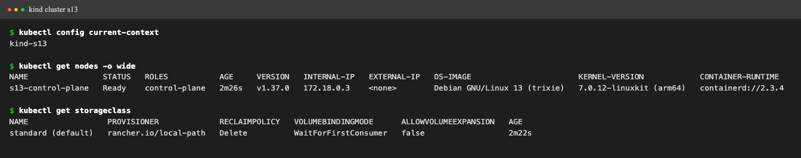

**emptyDir.** A file written to `/data` is there while the Pod lives. After the Pod is deleted
and re-created, `cat` fails with `No such file or directory`, just as the README says. The
emptyDir was created with the Pod and deleted with it.

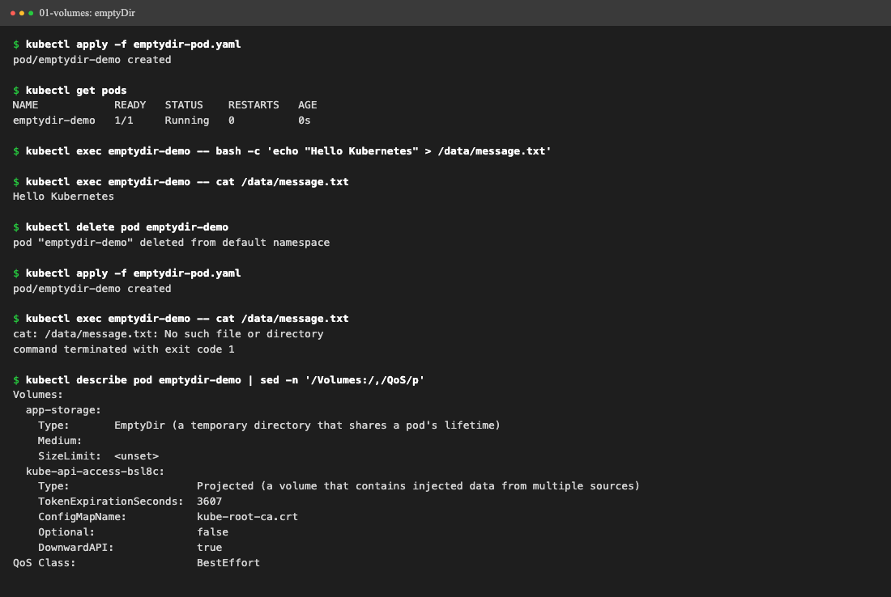

**hostPath.** `hostpath-pod.yaml` was in the folder but not in the README's steps, so it was run
the same way. Here the file survives Pod deletion, because it lives on the node, at
`/tmp/hostpath-data` inside the kind node container. It is tied to that one node, which is why
the README calls hostPath a tool for learning and testing, not real persistent storage.

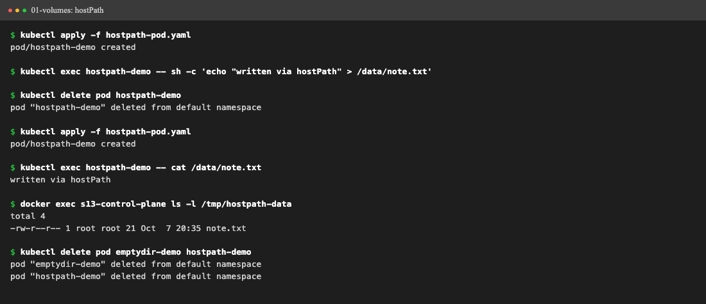

## 02: Persistent Storage (PV and PVC)

First, the course files as they were. The PVC picked up `standard` from the default StorageClass
and sat in `Pending` (`WaitForFirstConsumer`) while `student-pv` stayed `Available`:

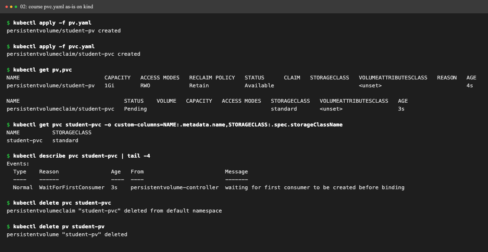

With `storageClassName: ""` on both, the PVC binds to `student-pv` straight away. The PVC asked
for 500Mi but shows 1Gi, because a claim binds to a whole PV:

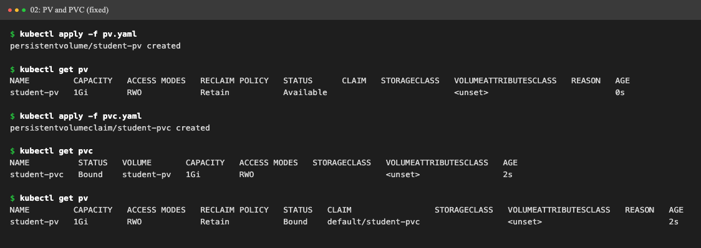

`Kubernetes Storage` written from the first Pod is still there in the re-created Pod, and on the
node at `/tmp/student-data`. The data lives in the PV, not in the Pod.

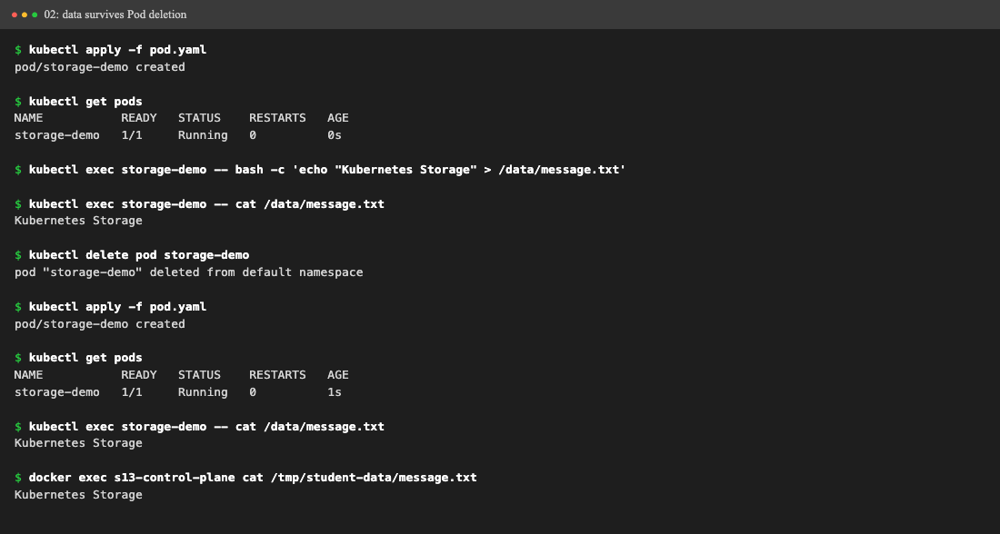
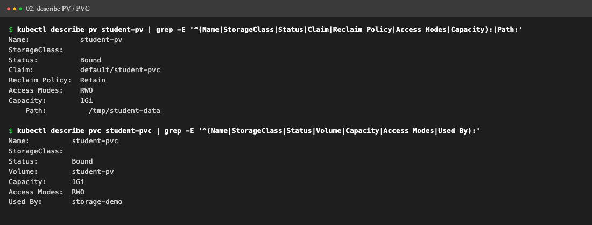

The reclaim policy is `Retain`, so deleting the PVC leaves the PV as `Released` with its data
still in place. It had to be deleted by hand:

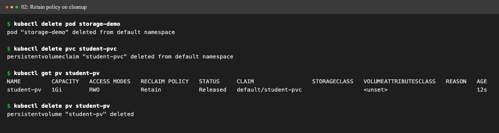

## 03: StorageClass and Dynamic Provisioning

```bash
kubectl get storageclass
kubectl describe storageclass standard
```

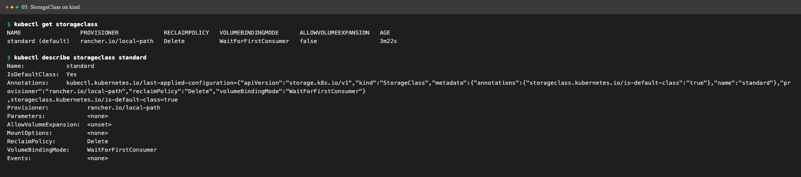

`dynamic-pvc` stays `Pending` with no PV at first, because the class binds on first consumer:

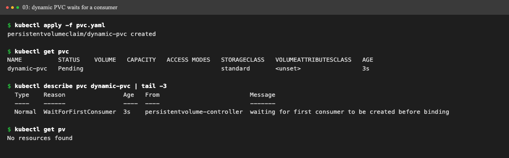

Once `pod.yaml` mounts it, the local-path provisioner creates `pvc-0305…` (500Mi, the exact
request), and the PVC is `Bound`. Nobody wrote a PV, which is dynamic provisioning. The events
show the whole sequence: WaitForFirstConsumer, then Provisioning, then ProvisioningSucceeded.

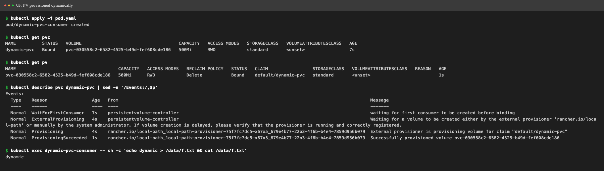

This class's reclaim policy is `Delete`, so removing the PVC removed the PV too (compare with
`Retain` in 02):

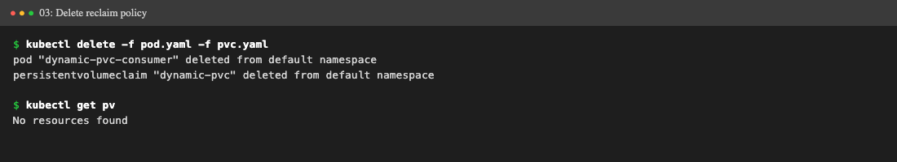

## 04: Horizontal Pod Autoscaler

```bash
kubectl apply -f deployment.yaml
kubectl apply -f service.yaml
```

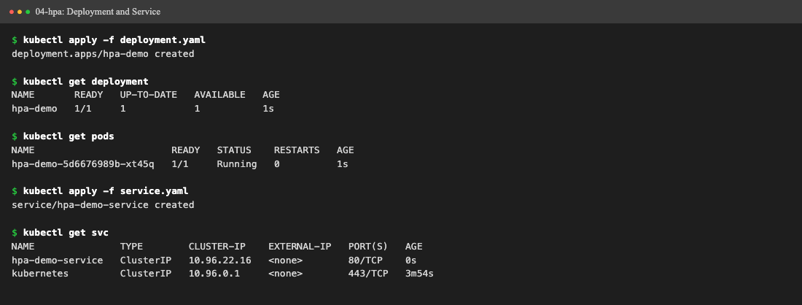

`kubectl top nodes` first returned `Metrics API not available`, as the README warns. After the
metrics-server chart was installed, `top` worked:

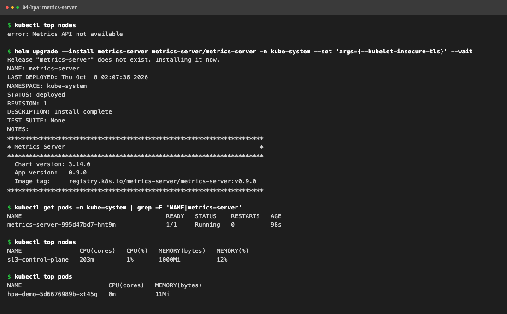
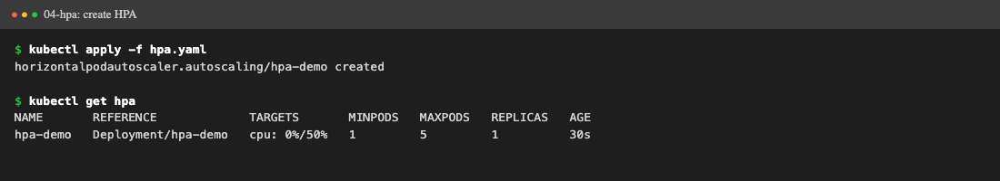

**Scale up.** With the busybox `wget` loop running, CPU went to 57% and then 80% of the 100m
request, and the HPA scaled 1 → 2. Load was then split across two Pods at about 42% each, below
the 50% target, so it stayed at 2. One `wget` loop is a limited load: the load-generator Pod
itself used about 800m of CPU to produce about 85m of nginx work, so it never pushed further.

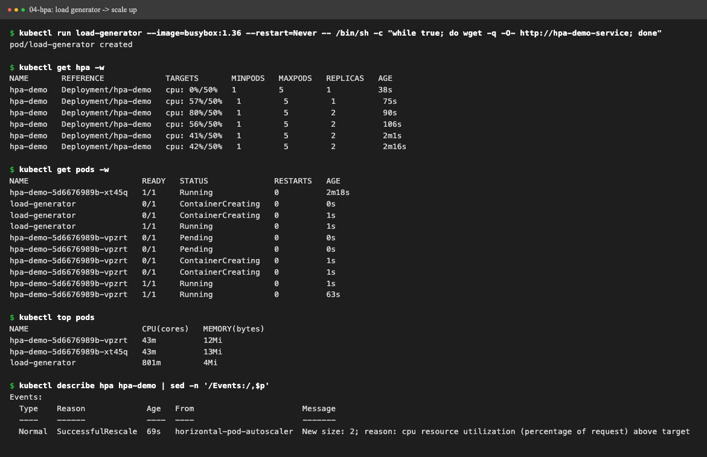

**Scale down.** After the load generator was deleted, CPU fell to 0% within a minute, but
replicas stayed at 2 for about 5 more minutes before dropping to 1 (`All metrics below target`).
That delay is the HPA's default 300-second scale-down stabilization window, which stops the
replica count from flapping.

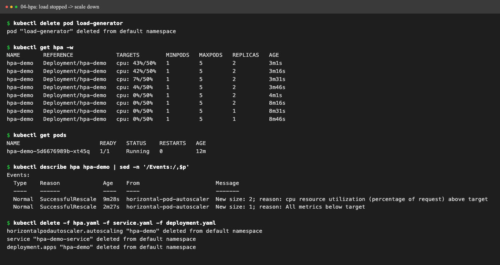

### demo-chart

The folder also has a `helm create` chart, which can render its own HPA. It was linted, rendered
and installed with autoscaling turned on and a CPU request set:

```bash
helm install demo demo-chart -n chart-demo --create-namespace \
  --set autoscaling.enabled=true --set autoscaling.maxReplicas=5 \
  --set autoscaling.targetCPUUtilizationPercentage=50 --set resources.requests.cpu=100m
```

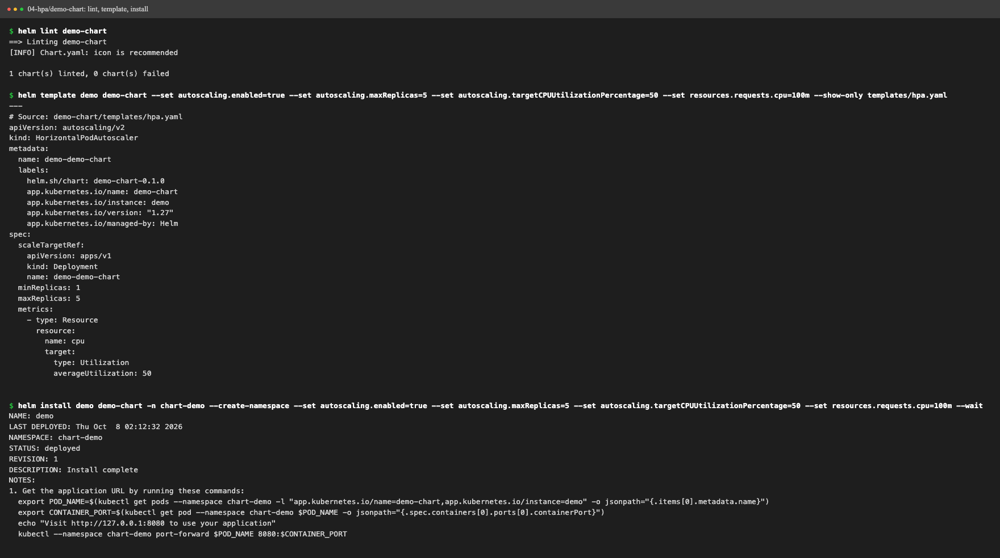
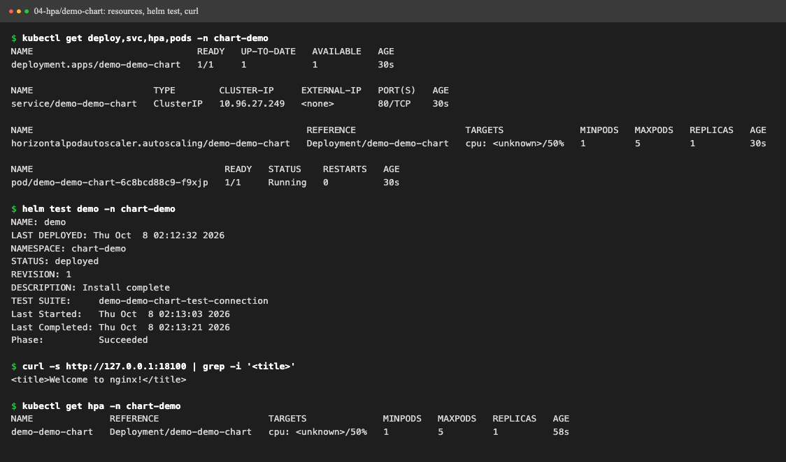


After `helm test`, the HPA stayed at `<unknown>`. The completed test Pod carries the same labels
as the app, so the HPA counted it, and it has no CPU request:

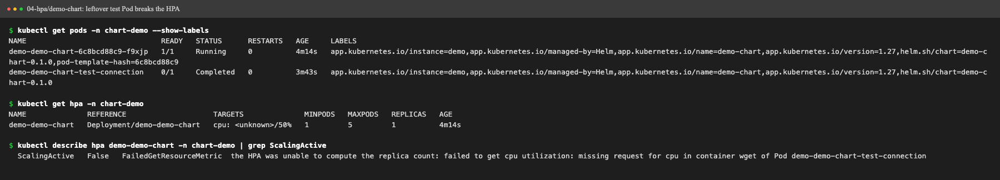

With the hook-delete-policy fix, `helm upgrade` and `helm test` leave no test Pod behind, and the
HPA reads `cpu: 1%/50%`. (The stale test Pod from the first run was deleted by hand before the
re-test.)

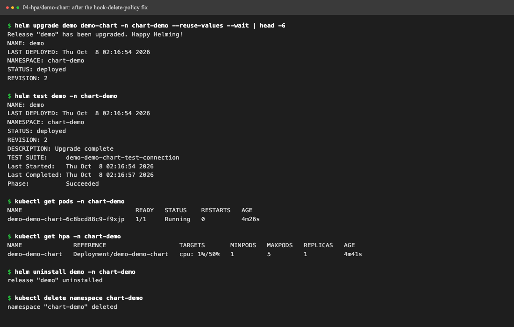

## 05: Probes

| Liveness | Readiness |
|---|---|
| 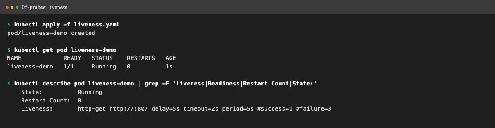 | 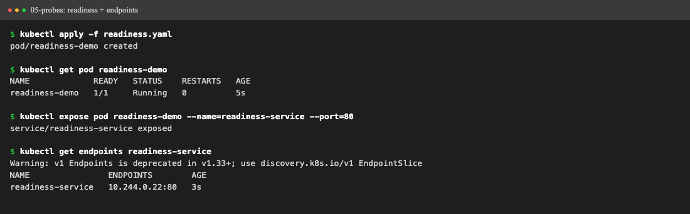 |

`startup.yaml` has all three probes. While the startup probe is running, the other two wait.

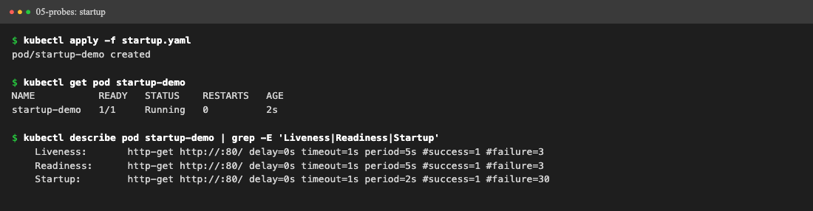

**Breaking readiness** (`/wrong-path`). `kubectl apply` is rejected because Pod probes can't be
changed in place, so the Pod was recreated with `replace --force`. The result is
`STATUS Running` but `READY 0/1`, the Service has **no endpoints**, the events show
`Readiness probe failed ... 404`, and `RESTARTS` stays at 0. A readiness failure takes the Pod
out of traffic but does not restart it.

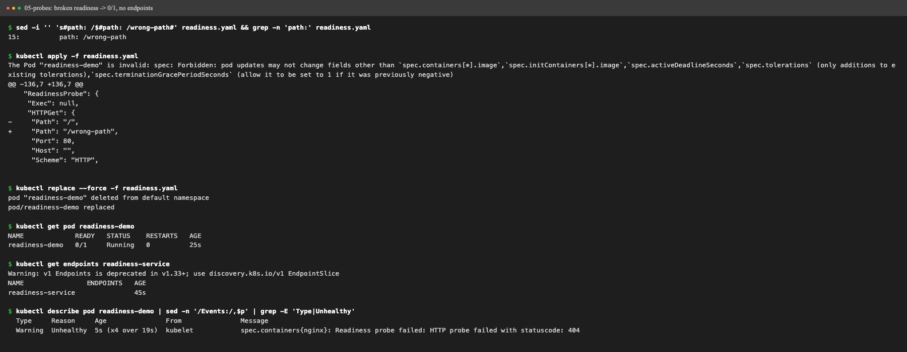

**Breaking liveness** (`/wrong-path`). Restarts come at 16 s, 31 s and 46 s. That matches
`initialDelaySeconds: 5` plus 3 failures × `periodSeconds: 5`, so about 15 s per cycle. Events
show `Container nginx failed liveness probe, will be restarted`.

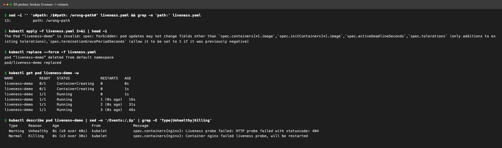

**Debugging.** `wget` isn't in the image, but `curl` from inside the container shows `/` returns
200 and `/wrong-path` returns 404. nginx's access log shows the `kube-probe/1.37` requests that
got 404. One extra event appeared: `startup-demo` failed a readiness check once with
`context deadline exceeded`, most likely because its probes use the default 1 s timeout and the
node was busy at that moment. It passed again on the next check.

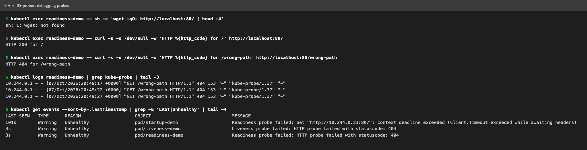

With the original `readiness.yaml` back, the Pod is `1/1` and the EndpointSlice lists its IP
again:

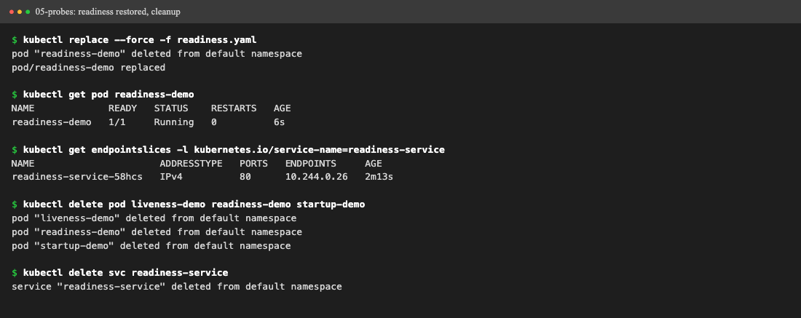

## hpa/ (yatri-backend)

This folder has no README. On their own, the Service and HPA apply, but the HPA can't find its
target:

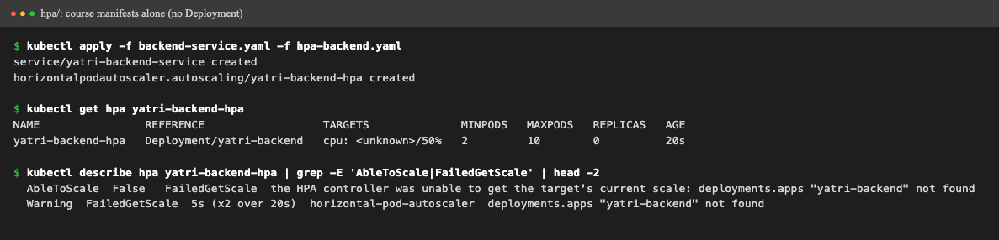

With the stand-in `backend-deployment.yaml` added, the HPA starts at its minimum of 2:

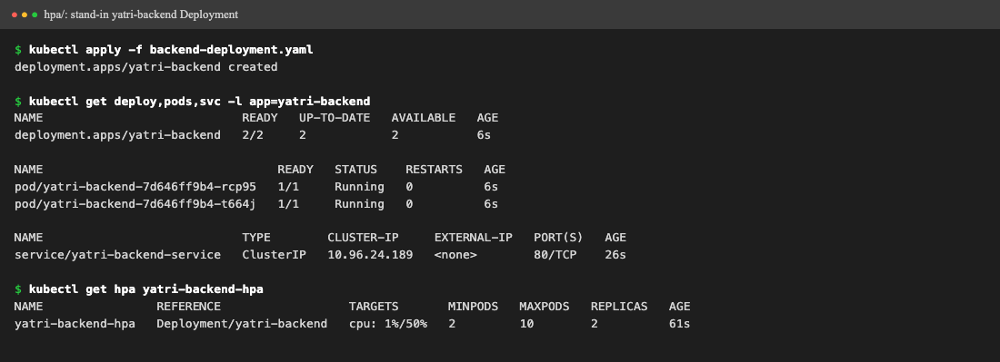

`LOCAL_PORT=18101 ./load_generator.sh` started its own port-forward and 10 curl loops. CPU hit 78%
and the HPA scaled 2 → 4. `kubectl top` shows why it then settled: **all the load lands on one
Pod** (155m, against 3–4m on the others). `kubectl port-forward svc/...` connects to a single
backing Pod and does not load-balance, so extra replicas don't help this test. Real traffic
through the Service's ClusterIP, like the busybox generator in 04, is spread out. A first attempt
with less work per request (`range(20000)`) only reached 26%, so the stand-in was changed to
`range(300000)`. After stopping the script, no port-forward or curl process was left:

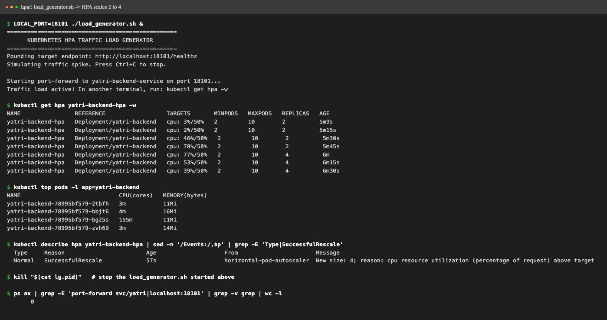
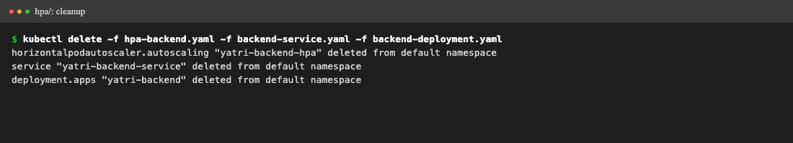

## Mini Project: Production-Ready Web App

**5.1–5.4.** The PVC is `Pending` until the Deployment's Pods mount it (kind's
`WaitForFirstConsumer`), then it is `Bound` to a dynamically provisioned 500Mi volume. Both Pods
are ready, both IPs are in the Service's EndpointSlice, and the HPA reads `0%/50%` with 2
replicas.

| Namespace | PVC |
|---|---|
| 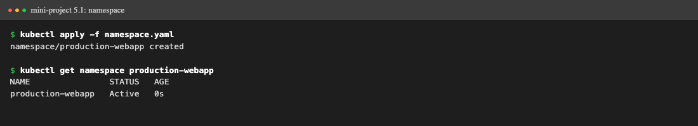 | 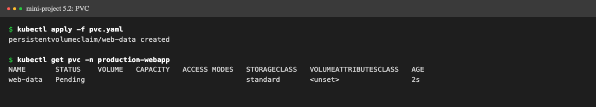 |

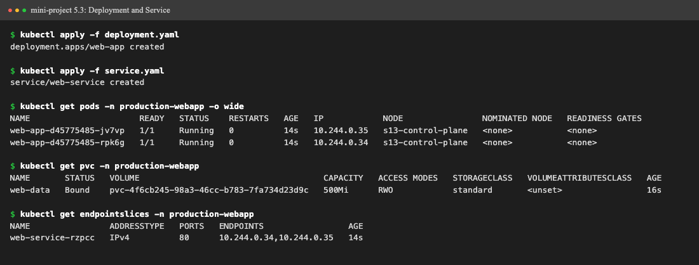
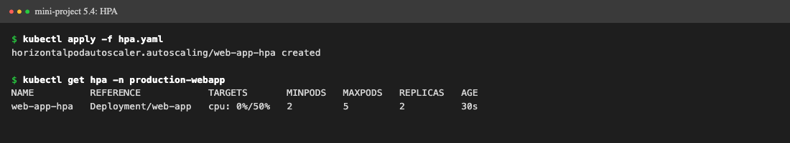

**Task 1: storage persistence.** `Student: Lakshay Jagga` was written from one Pod, that Pod was
deleted, and the replacement Pod still reads the file. The other replica reads it too, because
both Pods mount the same PVC. That works with `ReadWriteOnce` only because both are on the same
node. RWO limits the volume to one *node*, not one Pod.

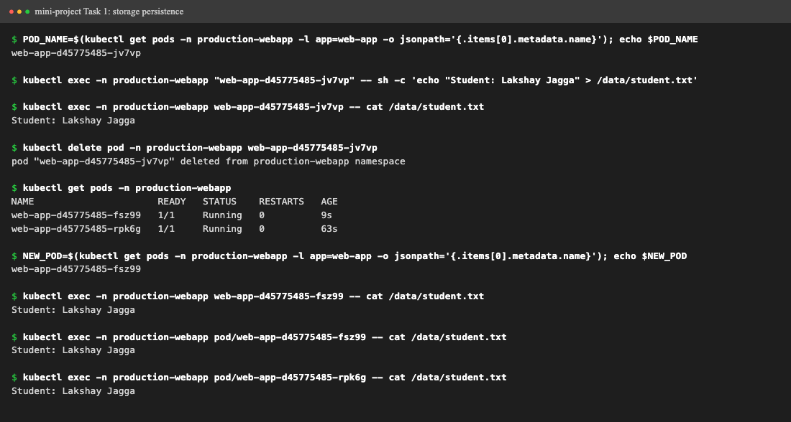

**Task 2: Service.** Port-forwarded on 18102 instead of 8080:

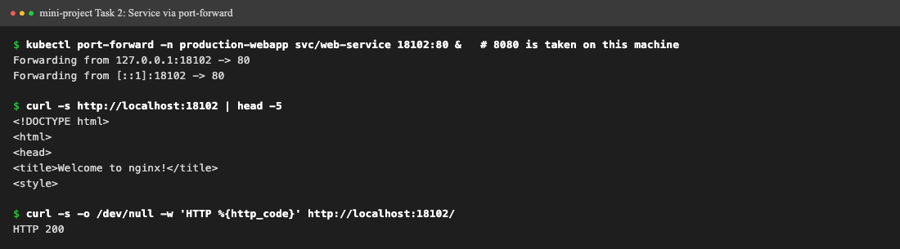


**Task 3: HPA.** The README's expected log shows 110% and then 5 replicas. That did not happen
here. With one busybox `wget` loop, CPU levelled off at 41–43% of the request, just under the 50%
target, so the HPA correctly stayed at 2. The load generator was the bottleneck: it used about
816m of CPU itself to produce about 85m of nginx work.

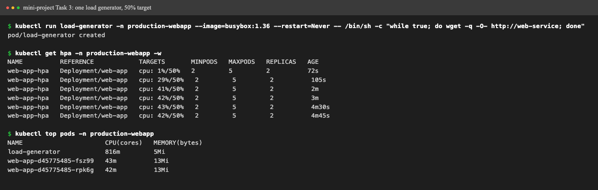

**Bonus 1: target tuning.** With the same load still running, lowering the target to 30% (on a
scratch copy of `hpa.yaml`) scaled out to 3 within about 10 seconds, which brought the average
down to 28%.

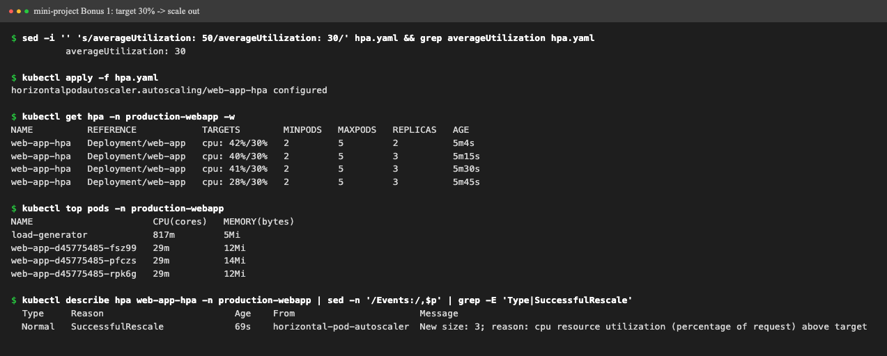

After the load generator was deleted and the course's 50% `hpa.yaml` re-applied, CPU fell to 1%.
The replicas went 3 → 2 about 4.5 minutes after the load stopped, and stopped at
`minReplicas: 2`. The 5-minute stabilization window the README mentions counts from the last time
the HPA wanted 3 replicas, which was just before the load was stopped.

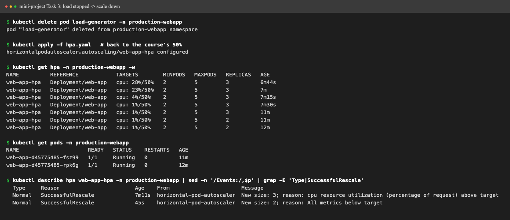

**Bonus 2: readiness gating** (`/does-not-exist`). Both new Pods are `Running` but `0/1`. The
`Endpoints` object is empty, and the EndpointSlice still lists the IPs, but with `ready=false`.
The Service sends them no traffic.

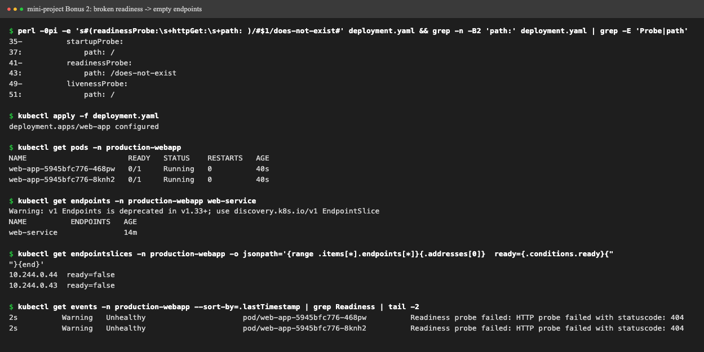

**Bonus 3: liveness restart loop** (`/crash`). `RESTARTS` goes to 1, 2 and 3 at 15 s, 30 s and
45 s, the "every 15 seconds" the README predicts (`failureThreshold 3 × periodSeconds 5`). Each
Pod also goes `0/1` briefly after every restart, until its startup and readiness probes pass
again.

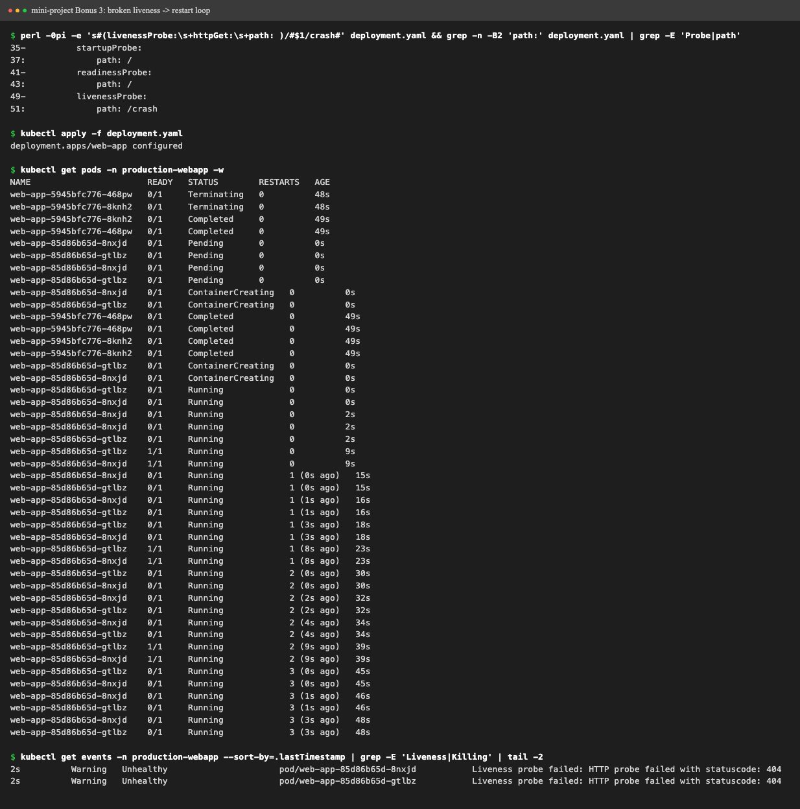

Deleting the namespace removed the PVC, and its `Delete`-policy PV with it:

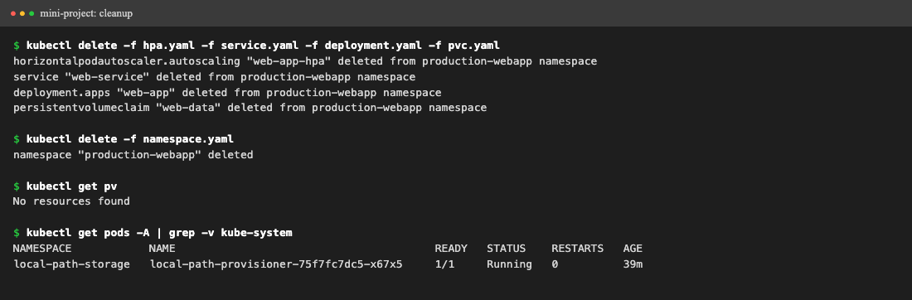

The kind cluster `s13` was deleted at the end.

---

## Answers to the README questions

1. **What is a Volume, and why do containers need one?** A container's own filesystem is thrown
   away with the container. A volume is storage defined at the Pod level and mounted into
   containers, so data can outlive a container restart, be shared between containers in a Pod,
   or (with a PV) outlive the Pod.
2. **emptyDir:** an empty directory created when the Pod is scheduled and deleted with the Pod.
   Kubernetes keeps it across *container* restarts inside the same Pod, but, as 01 showed,
   deleting the Pod deletes the data.
3. **hostPath:** mounts a directory from the node. The data survived Pod deletion in 01, but it
   is tied to one node and gives the Pod access to the node's filesystem, so it is for testing
   and node-level agents, not application data.
4. **PV, PVC, Pod:** the PV is the storage, the PVC is a request for it, and the Pod mounts the
   PVC. Data stays because the PV's lifecycle is separate from the Pod's (02, and mini-project
   Task 1).
5. **Access modes:** RWO is read-write on one node, ROX is read-only on many nodes, RWX is
   read-write on many nodes, and RWOP is read-write by a single Pod.
6. **StorageClass and dynamic provisioning:** a PVC names a class, and the class's provisioner
   creates a matching PV automatically (03). A PVC with no `storageClassName` gets the default
   class. To bind a pre-made PV instead, set `storageClassName: ""` (the 02 fix).
7. **HPA:** it changes the replica count of a Deployment to keep average utilization near the
   target. Utilization is usage ÷ *request*, which is why a CPU request is required: without one,
   the HPA shows `<unknown>`, as in the demo-chart bug. It needs metrics-server for the numbers.
   Scaling down waits 5 minutes by default.
8. **Probes:** startup asks "has it started?" and holds off the other probes until it passes.
   Readiness asks "can it take traffic?", and a failure removes the Pod from the Service without a
   restart (05, Bonus 2). Liveness asks "is it still alive?", and a failure restarts the container
   (05, Bonus 3). Readiness failure ≠ container restart.
9. **Probe settings:** `initialDelaySeconds` is the wait before the first check, `periodSeconds`
   is how often it checks, `timeoutSeconds` is how long a check may take, and `failureThreshold`
   is how many failures in a row count as failed. Time to a liveness restart ≈ initial delay +
   threshold × period.
