# Session 16: CI/CD and GitHub Actions

CI builds and tests every change automatically. CD packages it and delivers or deploys it. GitHub
Actions runs both from YAML workflow files kept in the repository.

The source is the `session-16-github-actions` folder of
[Nency-Ravaliya/devops-heros](https://github.com/Nency-Ravaliya/devops-heros/tree/main/session-16-github-actions).
The session README is kept here as [`INSTRUCTIONS.md`](INSTRUCTIONS.md), and each numbered folder
keeps the course's own README for that module. This file records what was run and what came out.
Every screenshot in `screenshots/` is a terminal transcript rendered with Playwright from the exact
command and its real output. `act` output is long, so most transcripts are filtered down to the
step and result lines. A command marked `# trimmed` had that filter applied.

Environment: macOS 26.6 on Apple Silicon, Docker Desktop 29.7.2, `act` 0.2.89, `actionlint`
1.7.12. Jobs ran in the `ghcr.io/catthehacker/ubuntu:act-latest` image (Ubuntu 24.04, amd64).

## Differences from the course instructions

| Where | Course says | What was done, and why |
|---|---|---|
| All workflows | Push to GitHub and watch the Actions tab | Nothing was pushed. Every workflow ran locally with [`act`](https://github.com/nektos/act), which runs each job in a Docker container. Each module was copied into a throwaway git repo outside this repo, because `act` needs one. |
| `act` settings | Not covered | `-P ubuntu-latest=ghcr.io/catthehacker/ubuntu:act-latest@sha256:dff4ec…`, `--pull=false`, `--container-architecture=linux/amd64`. On the native arm64 image, `setup-python` failed with *"The version '3.11' with architecture 'arm64' was not found"*. Under amd64 with the multi-arch tag, the post step of `setup-python` failed with `exec: "node": executable file not found`, because `act` read the arm64 image's `PATH`. Pinning the amd64 digest fixed both problems. |
| Folder layout | `01-ci-vs-cd 10-33-34-211`, … | The source folders carry timestamp suffixes. Here they use the clean names from the topic table. The source also contains an older nested copy, `session-16-github-actions/session-16-github-actions/` (`02-cicd-pipeline`, `09-build-and-test`, `10-final-cicd-pipeline`, `demo`, …). It duplicates these modules and was not copied. |
| `mini-project/` | "Build a complete CI pipeline for a Python app" | The course folder is empty. The pipeline was written for this repo: see [`mini-project/README.md`](mini-project/README.md). |
| 04 `path-filter.yml` | `paths:` and `paths-ignore:` on the same event | GitHub rejects this combination, and `actionlint` reports it. Rewritten as one `paths:` list with `!docs/**` and `!**.md` negations. |
| 04 `pr-trigger.yml` | `${{ github.head_ref }}` inside `run:` | The PR branch name is attacker-controlled, so putting it straight into a script allows shell injection (flagged by `actionlint`). It is now passed through `env:`. |
| 04 `build.yml` | `pip install -r requirements.txt` then `pytest` | The module has no `requirements.txt` or tests, so the workflow could not pass. Added a one-line `requirements.txt` and `tests/test_smoke.py`. |
| 05 `conditional-steps.yml` | `run: echo "…job status: ${{ job.status }}"` | Not valid YAML: the unquoted `: ` makes the parser read a second mapping key. The scalar is now quoted. |
| 06 `self-hosted-runner.yml` | `runs-on: [self-hosted, linux, gpu]` | `gpu` is a custom label, so `actionlint` needs it declared. Added `06-runners/.github/actionlint.yaml`. |
| 06, 07 | Multi-OS matrix, self-hosted runner, GHCR push | `act` only runs Linux containers. Only the Linux leg of the OS matrix ran. The self-hosted GPU job and the GHCR login were linted and dry-run (`act -n`) only. No real token was used. |
| 09 failing test | Shows `assert 1 == 5` | With `add` returning `a - b`, `add(2, 3)` is `-1`, and the real output is `assert -1 == 5`. |
| Branch and path filters | `branches:` / `paths:` decide whether a workflow runs | `act` ignores these filters. It runs every workflow that matches the event name. Their effect was not observable locally (see module 04). |

Lint before and after the fixes, over every workflow file in this folder:

```bash
actionlint $(find . -name '*.yml')
```

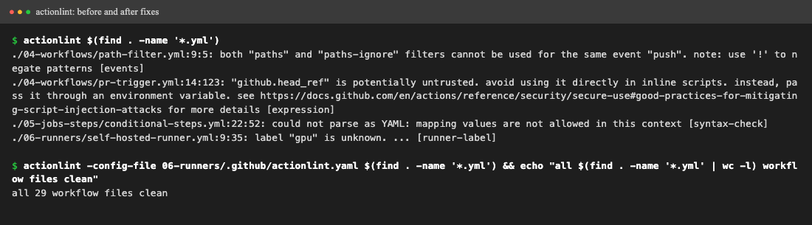

> **Note:** GitHub only reads workflows from `.github/workflows/` at the root of a repository.
> The `.github/` folders inside each module of this coursework repo will **not** trigger on
> GitHub. To run one there, copy the module into a repository of its own.

---

## 01: CI vs CD

```bash
bash ci_simulation.sh
bash cd_simulation.sh              # Continuous Delivery (default)
bash cd_simulation.sh deployment   # Continuous Deployment
```

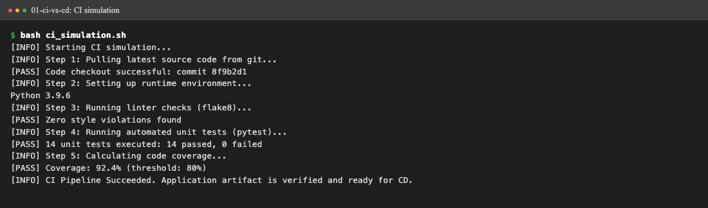

The CI script walks through checkout, runtime, lint, tests and coverage. Every result it prints is
hard-coded except `python3 --version`. The CD script shows the one real difference between the two
CDs: *delivery* stops at a manual approval gate, while *deployment* promotes to production on its
own.

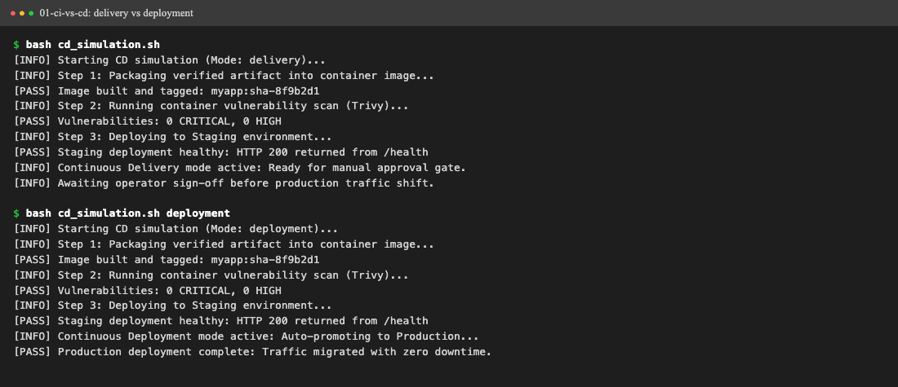

## 02: Pipeline Concepts

```bash
bash pipeline_stages.sh
```

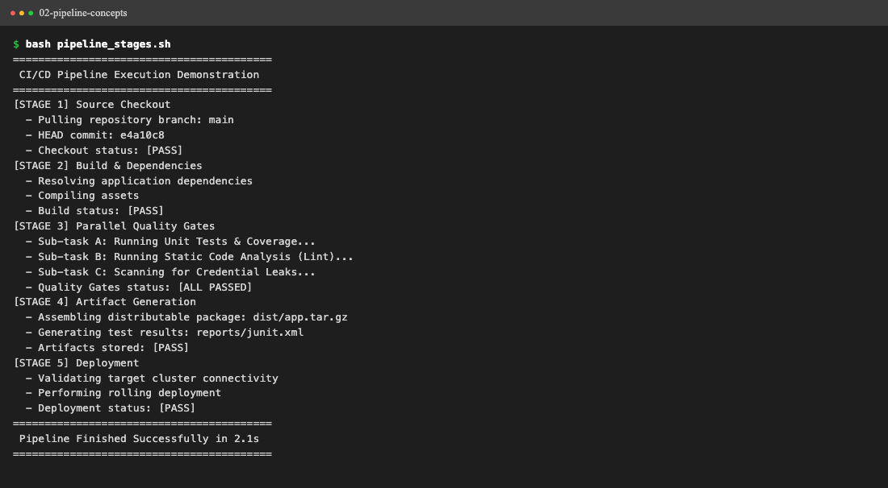

`pipeline.yaml` is a tool-neutral sketch of the same pipeline. Each stage `depends_on` the one
before it, and `verification` is the parallel stage (tests, lint and a security scan side by side).
The stages act as gates: a failure stops the stages after it.

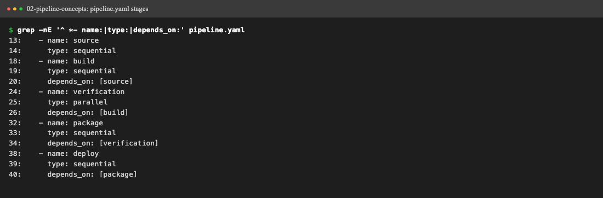

## 03: GitHub Actions Intro

```bash
act -l
act push
```

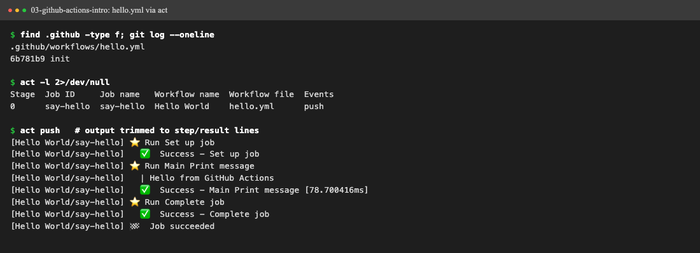

`act` found `.github/workflows/hello.yml`, matched it to the `push` event, started a runner
container and ran the step. The output is the same as the Actions tab would show:
`Hello from GitHub Actions`.

## 04: Workflows and Triggers

All seven workflow files in the module, with the `act` defaults used for every run:

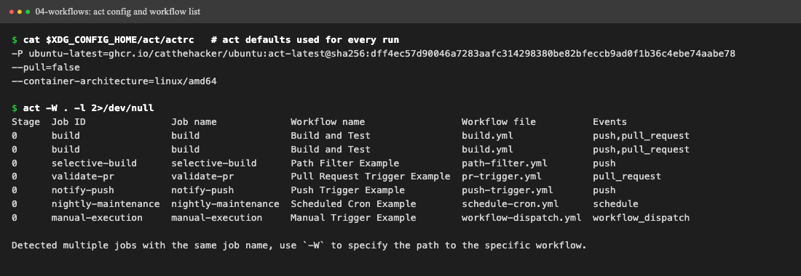

`build.yml`: checkout, `setup-python` 3.11, `pip install`, then pytest:

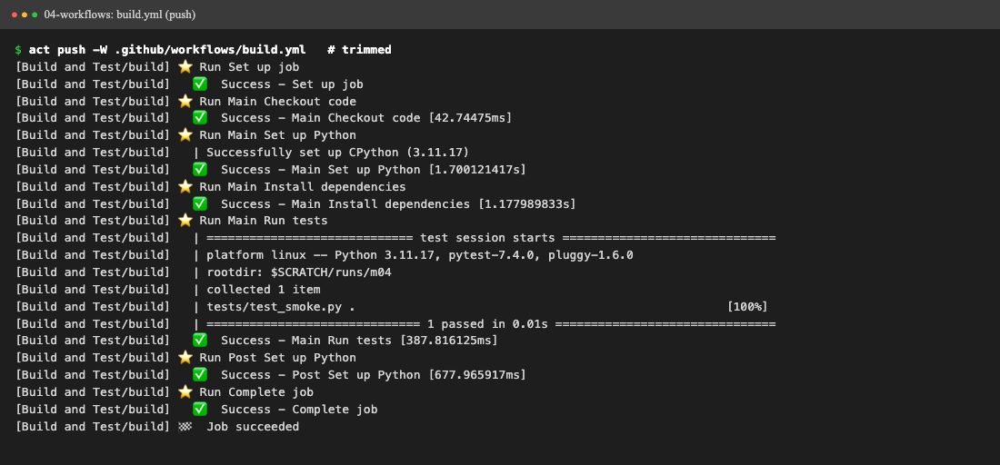

**push.** `github.ref_name` and `github.actor` come from the event. On `develop`, a real commit
was made first, because `act` derives the branch from the commit. The third run passes an event
file with `ref: refs/heads/feature/login`. On GitHub the `branches: [main, develop]` filter would
skip that run, but `act` ran it anyway. This is the filter limitation listed above.

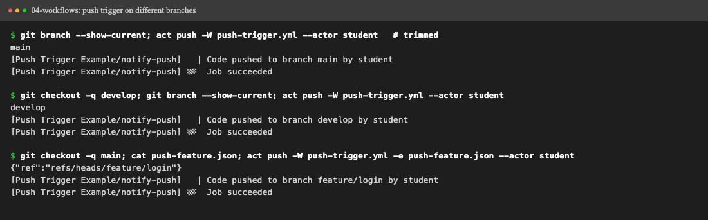

**pull_request.** `act` takes the PR payload from an event file. The fixed workflow reads the PR
number and branches through `env:`:

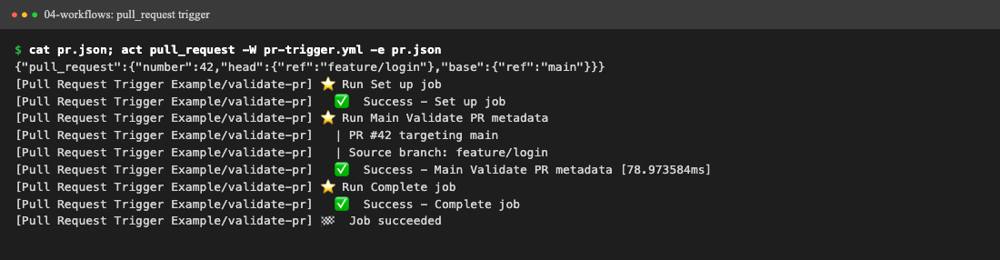

**schedule.** `act schedule` fires the event right away. `act` does not wait for the cron time.
On GitHub, `0 0 * * *` would run it daily at 00:00 UTC.

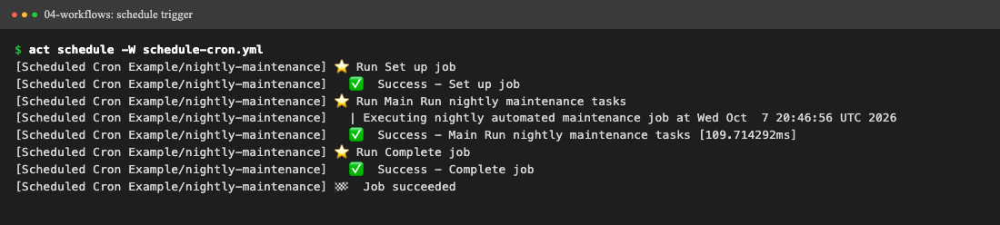

**workflow_dispatch.** With no inputs given, the declared defaults apply (`staging`, `true`).
`--input` overrides them, the same way the form on the Actions tab does:

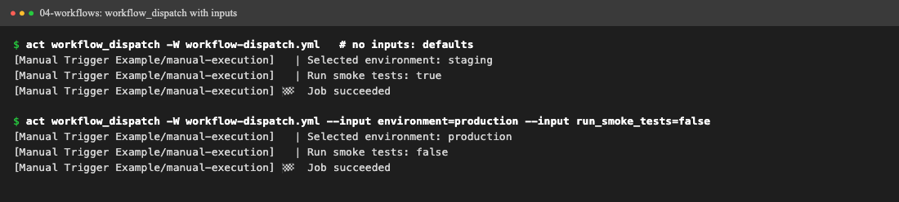

**Path filter.** The fixed `path-filter.yml` passes `actionlint`. `act` does not evaluate
`paths:`, so the job always runs locally. On GitHub, a push that only touched `docs/` or `*.md`
would not start it.

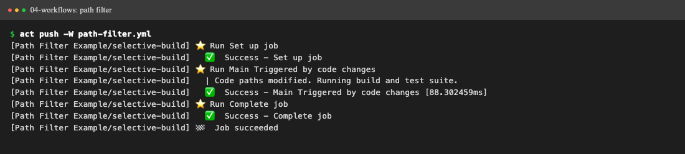

## 05: Jobs and Steps

The `Stage` column shows the job graph. Jobs without `needs:` all sit in stage 0, and jobs linked
by `needs:` are in stages 0 → 1 → 2:

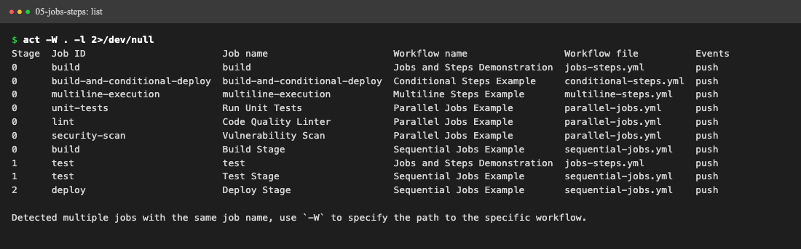

| Parallel (3 jobs interleave) | Sequential (`needs:` chain) |
|---|---|
| 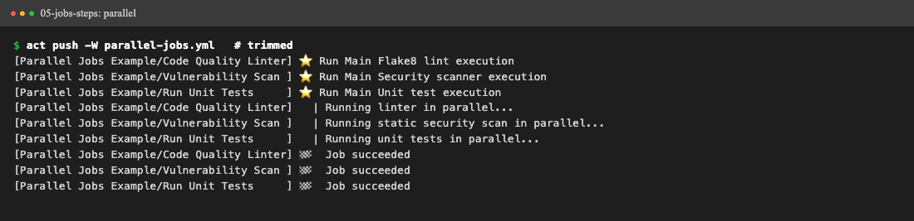 | 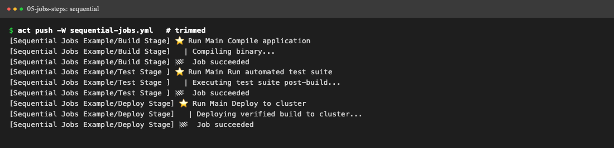 |

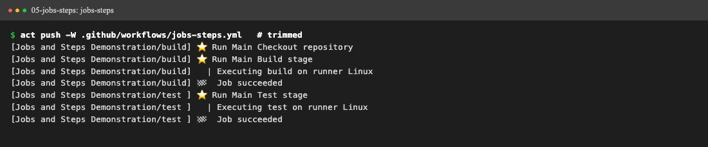

The multiline `run: |` block sees the job-level `GLOBAL_ENV` and the step-level `STEP_PARAM`:

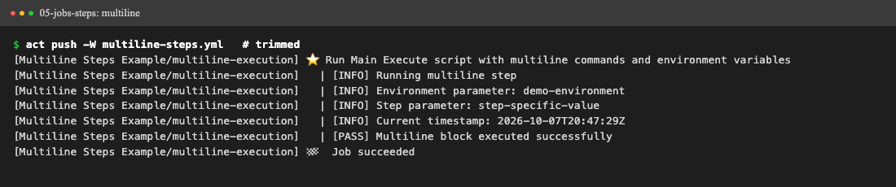

**Conditional steps.** On `main`, all three steps run. On `develop`, the
`if: github.ref == 'refs/heads/main'` deploy step is skipped, and the `if: always()` notification
still runs:

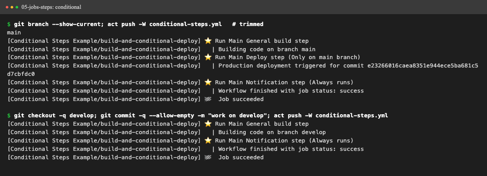

## 06: Runners

Python version matrices. Each leg got its own container and its own `setup-python` version. The
`.github` demo ran 3.10 and 3.11, and `matrix-build.yml` ran 3.9, 3.10 and 3.11 with
`fail-fast: false`:

| `matrix-demo.yml` | `matrix-build.yml` |
|---|---|
| 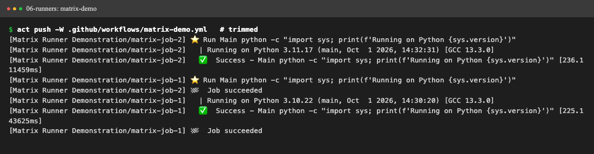 | 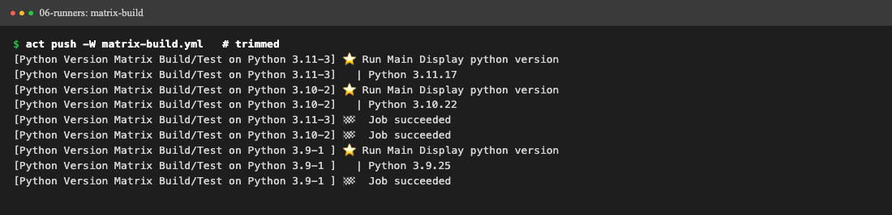 |

**Multi-OS matrix.** Only the Ubuntu leg was run (`--matrix os:ubuntu-latest`), and `uname`
shows the x86_64 Linux container. The macOS and Windows legs need GitHub's hosted VMs. Without the
filter, `act` handled `runs-on: ${{ matrix.os }}` inconsistently. In one run it skipped macOS and
Windows and then failed the Ubuntu leg with `invalid reference format`. In another it ran all
three legs in the Linux image. Neither result says anything real about macOS or Windows, so
neither is reported as a pass.

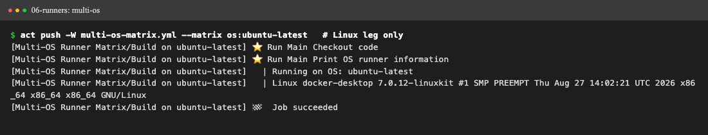

**Self-hosted runner.** It can't run without a registered runner that has the `gpu` label.
`actionlint` passes with the label declared, and the `act` dry run reports that no such platform
exists:

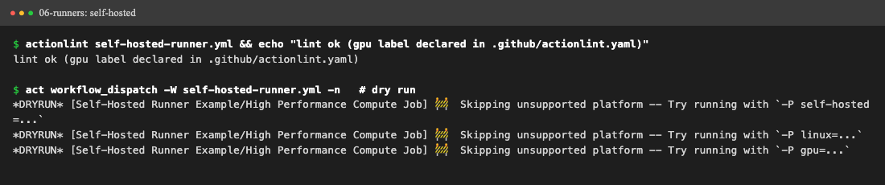

## 07: Secrets

All secret values below are obviously fake and were passed with `act -s NAME=value`.

`GITHUB_TOKEN` is created automatically on GitHub. With `act` it has to be passed in:

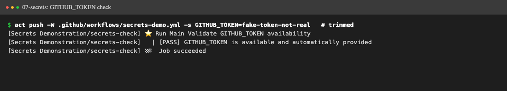

**Masking.** Without secrets, the workflow's fallback prints `mock_user`. With
`DOCKER_USERNAME=fake-user` set, the same line prints `***`. Even the verbose (`-v`) log contains
zero occurrences of the fake values:

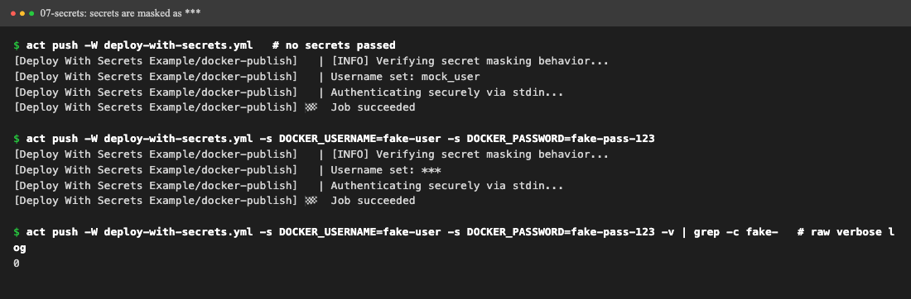

`environment: production` is accepted. On GitHub, this job could only read secrets stored on the
`production` environment, and it would wait for any protection rules (required reviewers) first.
`act` has no environments, so here the secret simply came from `-s`:

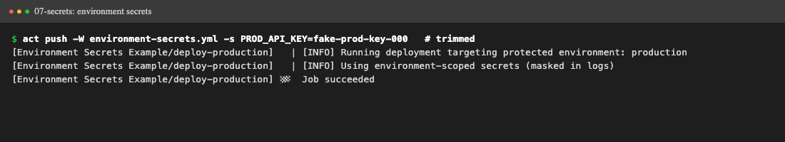

**GHCR push.** It triggers on `v*.*.*` tags and logs in to `ghcr.io` with `GITHUB_TOKEN`. That
needs a real token and a real registry, so only a dry run was made (with a tag event file). Note
that `permissions: packages: write` is what allows that token to push.

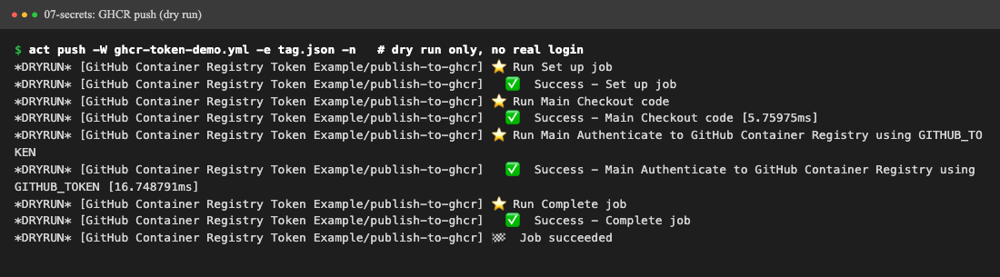

## 08: Artifacts

`act` was started with `--artifact-server-path`, which runs a local stand-in for GitHub's artifact
storage.

The build job uploaded `dist/`, and the next job (`needs: build-artifact`) downloaded it. The SHA256
digests match, and the job printed the file contents:

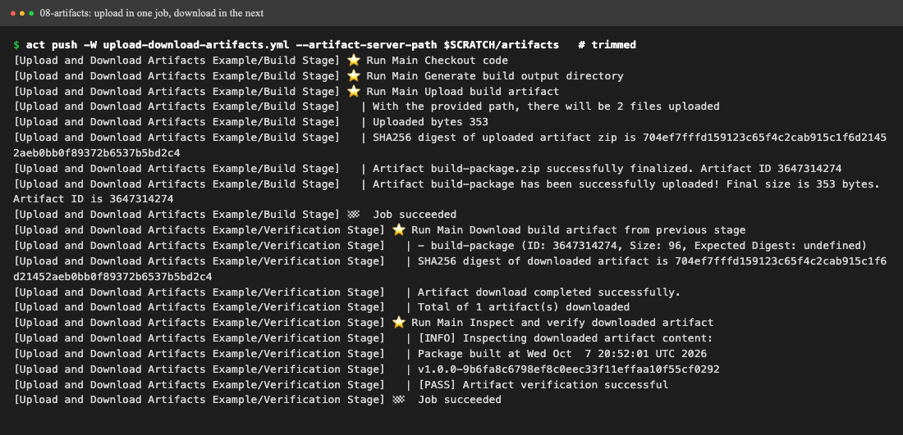

A JUnit test report and the module's sample artifact, then the stored zips on disk:

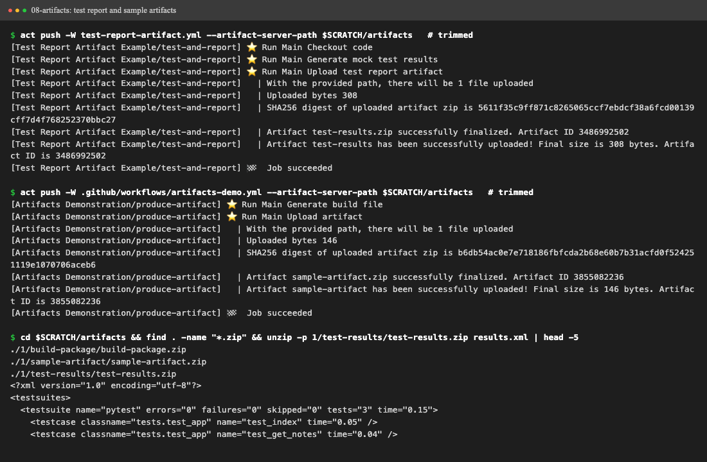

**Docker image as an artifact.** The job built `pipeline-demo:<sha>` through the Docker socket,
saved it with `docker save` and uploaded the 3.3 MB tar. Loading the downloaded tar with
`docker load` restored the same image tag. The image was deleted afterwards.

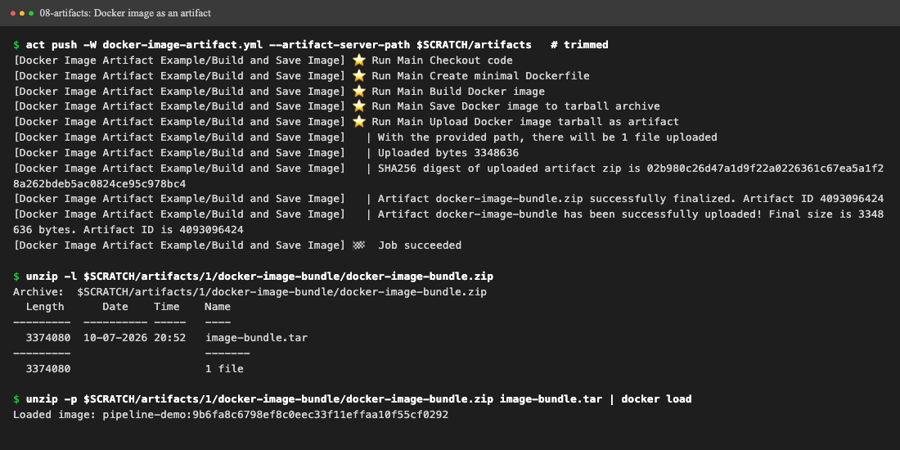

## 09: Build and Test Pipeline

**Run it locally first** (section 6). The result matches the README's expected output: 4 passed,
`app.py` 100% covered.

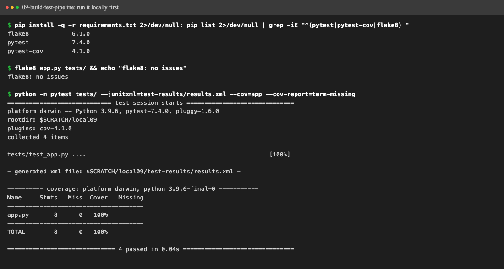

**Passing run.** `lint` → `test` (`needs: lint`), with both artifacts uploaded:

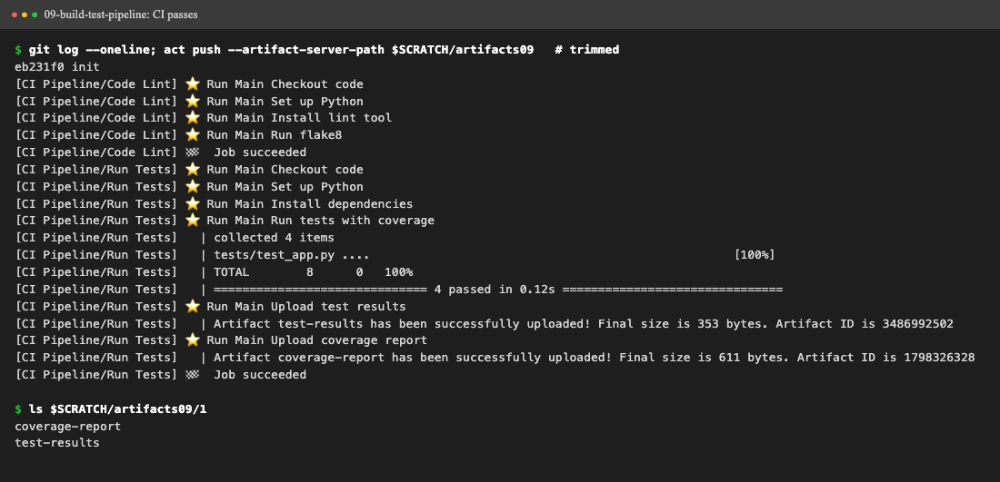

**Broken test.** Changing `add` to `return a - b` failed `test_add` (`assert -1 == 5`), and the
run ended with `Job 'Run Tests' failed` and exit code 1. Because of `if: always()`, the test
report and coverage were still uploaded, so the failure can be inspected:

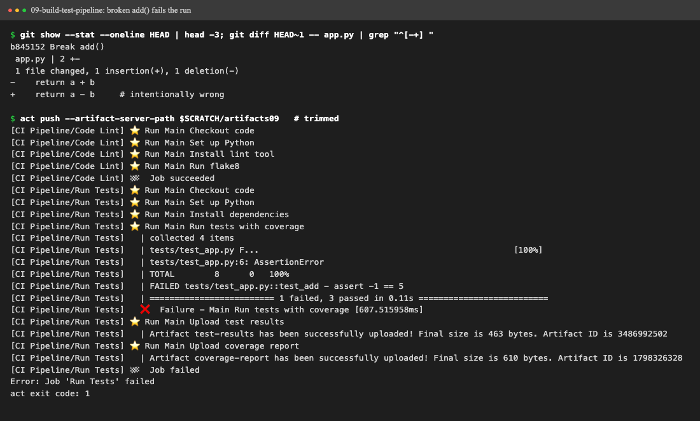

**Fixed.** The run is green again:

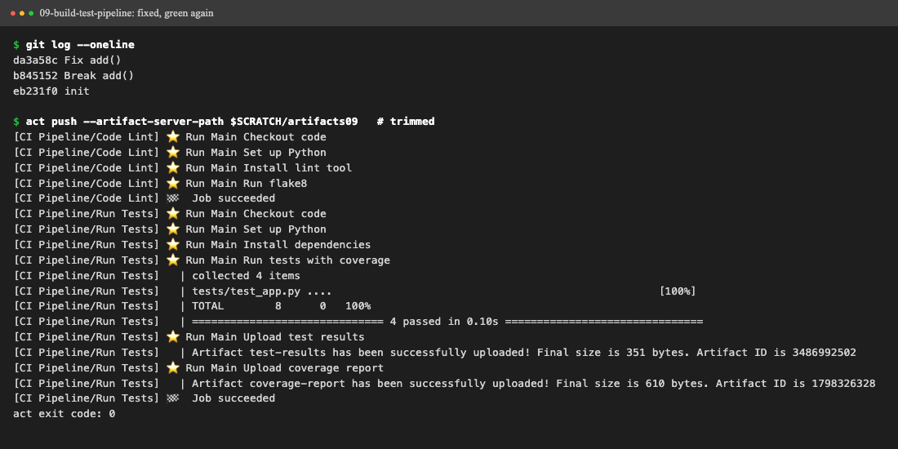

**Lint gate.** An unused `import os` fails `flake8` (F401, E302). Because `test` has
`needs: lint`, the test job never starts:

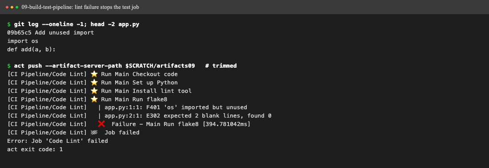

## Mini Project

A calculator app with a four-job pipeline: `lint` → (`test` ∥ `security-check`) → `build`. The
build packages the app and uploads it as `calculator-build`. Details are in
[`mini-project/README.md`](mini-project/README.md).

Run locally first:

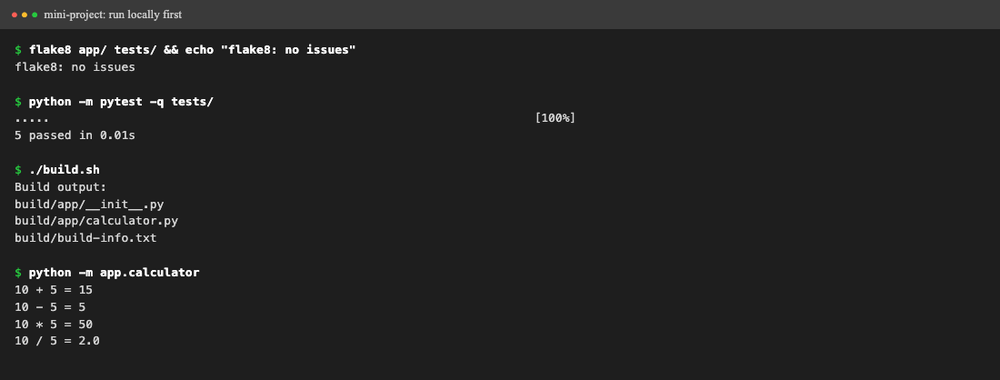

Full pipeline through `act push`. `Test` and `Security Check` run in parallel after `Lint`, and
`Build` waits for both:

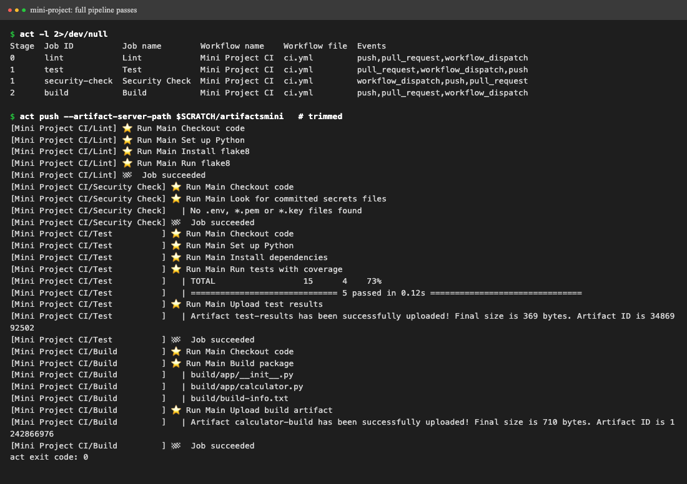

**Gate.** Changing `add` to `a + b + 1` failed `test_add` (`assert 16 == 15`). `Build` never
started, so no broken package was produced:

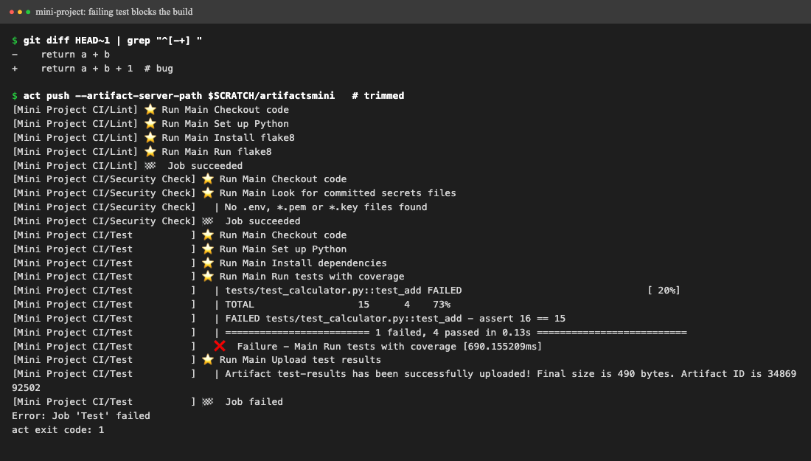

After the fix, a manual `workflow_dispatch` run is green, and the build artifact contains the
packaged app:

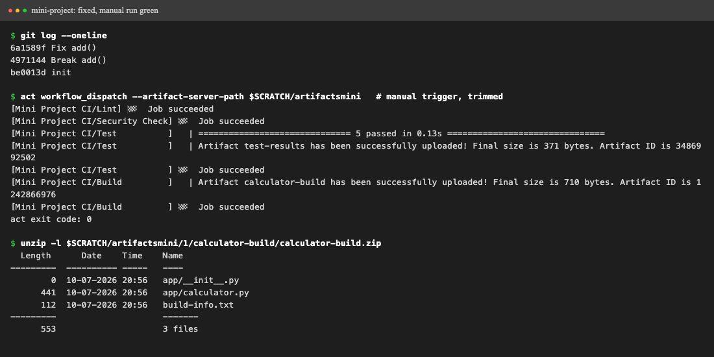

---

## Interview answers

1. **CI vs CD:** CI builds and tests every push automatically. Continuous Delivery also packages
   each passing build so it is always ready to release, with a human approving production.
   Continuous Deployment removes that approval, and every passing build goes to production
   (module 01's two modes).
2. **What is a workflow:** a YAML file in `.github/workflows/` at the repo root. It names its
   triggers (`on:`) and one or more jobs. Each job runs on a runner and holds ordered steps.
3. **`uses` vs `run`:** `uses:` runs a packaged action (such as `actions/checkout@v4` or
   `actions/setup-python@v5`), with parameters passed through `with:`. `run:` runs shell commands
   directly on the runner.
4. **Passing secrets:** store the secret under Settings → Secrets and variables → Actions (or on
   an environment), reference it as `${{ secrets.NAME }}`, and preferably map it to an `env:`
   variable for the step. The runner masks the value as `***` in logs, as module 07 showed. Never
   commit it to the YAML.
5. **45-minute workflow, 5 minutes of work:** cache dependencies (`actions/cache`, or
   `setup-python`'s `cache: 'pip'`, which module 09 uses; `act` restored that cache on the second
   run). Run independent jobs in parallel and use `needs:` only where there is a real dependency,
   as in the mini project, where test and security check run side by side. Pass build outputs as
   artifacts instead of rebuilding. Skip unrelated runs with `paths:` filters. Keep matrices to
   the combinations that matter.

## Trigger cheat-sheet (from the session README)

| Trigger | Fires when | Tried here |
|---|---|---|
| `push` | commits are pushed (optionally filtered by `branches`/`paths`) | `act push` |
| `pull_request` | a PR is opened or updated | `act pull_request -e pr.json` |
| `schedule` | a cron time arrives (UTC) | `act schedule` |
| `workflow_dispatch` | someone clicks *Run workflow* or calls the API, optionally with inputs | `act workflow_dispatch --input …` |
| `release` | a release is published | not used in this session |
