# Session 17: Complete CI/CD and DevSecOps

A Flask app ("hey-cicd") goes through a CI/CD pipeline with security checks at each layer:
unit tests, SAST, SCA, secret scanning, container image scanning, then a registry push and a
Kubernetes deployment. Security gates decide whether the pipeline may continue.

The source is the `session-17-devsecops` folder of
[Nency-Ravaliya/devops-heros](https://github.com/Nency-Ravaliya/devops-heros/tree/main/session-17-devsecops).
Each numbered folder keeps the course's own README with the instructions for that module, and
`demo/` is the app the modules work on. This file records what was run and what came out. Every
screenshot in `screenshots/` was taken automatically with Playwright: the app's web UI was
driven directly, and terminal output was rendered to an image from the exact command and its
output. Long scanner output is cut down to the summary and a few findings.

Environment: macOS on Apple Silicon (arm64), Docker Desktop, a single-node kind cluster named
`s17`. Python tools ran in `python:3.12` containers. Scanners ran from their Docker images:
`aquasec/trivy` 0.75.0, `ghcr.io/gitleaks/gitleaks` 8.30.1, `semgrep/semgrep`, and Bandit 1.9.4
and pip-audit 2.10.1 installed with pip. The workflow ran locally with `act` 0.2.89 and was
linted with actionlint 1.7.12.

## Differences from the course instructions

| Where | Course says | What was done, and why |
|---|---|---|
| `demo/.dockerignore` | The source file is named `.dockerignore  │`, with junk characters, and is empty | Copied as `demo/.dockerignore` and filled in, so `.git`, venvs, caches, tests and `k8s/` stay out of the build context. |
| `demo/app/app.py` | `app.run(host="0.0.0.0", port=5001, debug=True)` | Bandit (B201, HIGH) and Semgrep both flagged `debug=True`, which exposes the Werkzeug debugger, a remote code execution risk. Debug mode is now off unless `FLASK_DEBUG=1`. Binding to `0.0.0.0` is needed inside a container, so that line has `# nosec B104  # nosemgrep` and a comment explaining why. |
| `demo/app/app.py` | `datetime.datetime.utcnow()` | Deprecated in Python 3.12, so pytest printed 6 warnings. It is replaced by a `_utcnow()` helper, and the JSON output format is unchanged. |
| `demo/app/templates/index.html` | The hero's sample terminal says `Debug mode: on` | Changed to `off` to match the app. |
| `demo/requirements-dev.txt` | `pytest==8.4.2` | pip-audit found PYSEC-2026-1845 (CVE-2025-71176), fixed in 9.0.3, so it is bumped to `pytest==9.0.3`. All 8 tests still pass. |
| `demo/Dockerfile` | `FROM python:3.12-slim`, runs as root | Trivy found 44 HIGH CVEs in the slim (Debian 13) image, and none had a fixed version. Now: `python:3.12-alpine`, `apk upgrade`, pip uninstalled after installing the requirements (pip's vendored urllib3/msgpack/setuptools were flagged), a non-root user (uid 10001), and `STOPSIGNAL SIGINT`. Python as PID 1 ignored SIGTERM, so every `docker stop` and pod shutdown took the full 30 s grace period. Result: 0 vulnerabilities, and the image went from 226 MB to 97 MB. |
| `demo/k8s/deployment.yaml` | `image: nensiravaliya28/hey-cicd:__IMAGE_TAG__`, `imagePullPolicy: Always`, no probes | The image is now an `__IMAGE__` placeholder filled in with `sed`, so it works with any registry. `IfNotPresent` replaces `Always`, because tags are commit SHAs and images loaded into kind can't be pulled. Readiness and liveness probes on `/health` were added, as module 03 shows, plus resource requests/limits, `runAsNonRoot`, a read-only root filesystem and all capabilities dropped. |
| `demo/.github/workflows/devsecops.yml` | Trivy runs without `--exit-code`. The image is rebuilt in three jobs. It pushes to Docker Hub as `nensiravaliya28` with `DOCKERHUB_TOKEN`. The SCA job runs bare `pip-audit` without upgrading pip | Trivy now runs with `--exit-code 1`, a real gate. The image is built once and passed between jobs as an artifact, so the image that was scanned is the image that gets pushed. It pushes to GHCR with `GITHUB_TOKEN` and `packages: write`, as modules 02 and 08 describe, and only on a push to `main`. A blocking Bandit job was added next to CodeQL, because CodeQL reports findings but doesn't fail the job. SCA audits `requirements-dev.txt` after `pip install --upgrade pip`. Top-level `permissions: contents: read` was added. Deploy loads the image into the runner's throwaway kind cluster, because a new GHCR package is private by default. |
| `demo/README.md` | Docker Hub/GHCR mixed up, a `KUBECONFIG` secret, plain `kubectl apply` | Brought in line with the changes above. It also says that GitHub only runs workflows from `.github/workflows` at the repository root, so the workflow under `demo/` runs only when `demo/` is its own repository. |
| 02 Registry | Push to GHCR | No publishing from this machine, so a local `registry:2` ran on `localhost:18555`. The push, catalog, tags and pull work the same way. |
| 03 Kubernetes | Pull from GHCR, `port-forward ... 8080:5000` | The image was imported into the kind node with `docker save --platform linux/arm64 ... \| ctr -n k8s.io images import -` (`kind load docker-image` fails on this Docker). 8080 is taken on this machine, so the app was forwarded to `18502`. |
| 04 SAST | GitHub CodeQL | CodeQL needs GitHub's code-scanning service, so it can't run locally. Bandit and Semgrep did the local SAST runs. The CodeQL job stays in the workflow. |
| 08 Gates | A pipeline in GitHub Actions | Also written as a local script, `08-security-gates/security-gate.sh`, which runs the same five gates through Docker. |
| `demo/SECURITY.md` | GitHub's template text (versions 5.1.x / 4.0.x) | Left unchanged. It is placeholder text and doesn't describe this app. |

---

## Demo app (hey-cicd)

```bash
docker run --rm -v "$PWD":/src -w /src python:3.12-slim sh -c \
  "pip install -r requirements-dev.txt && python -m pytest -v --cov=app --cov-report=term-missing"
```

All 8 tests pass with 69% coverage, and there are no warnings after the `utcnow()` fix. Before
the fix, the same run printed 6 `DeprecationWarning`s.

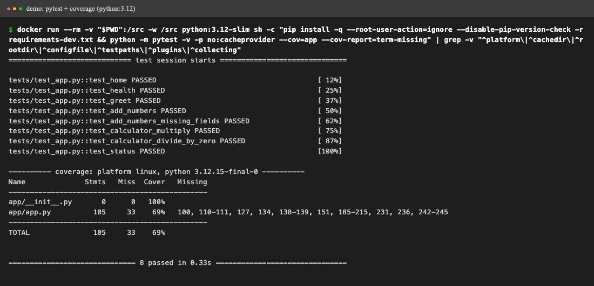

```bash
docker build -t hey-cicd:latest .
docker run -d --name s17-hey-cicd -p 18501:5001 hey-cicd:latest
```

The container reports `Debug mode: off` and runs as `appuser` (uid 10001):

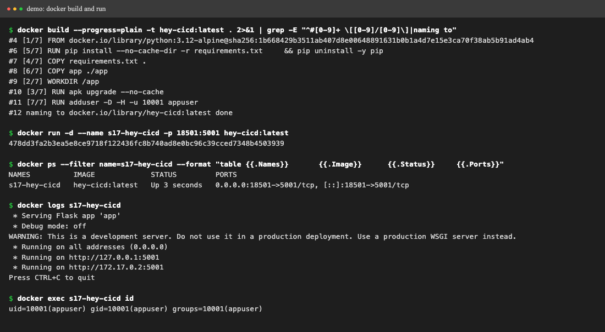

Every endpoint in the API table was called with curl. Divide by zero returns HTTP 400 and an
unknown route returns a JSON 404.

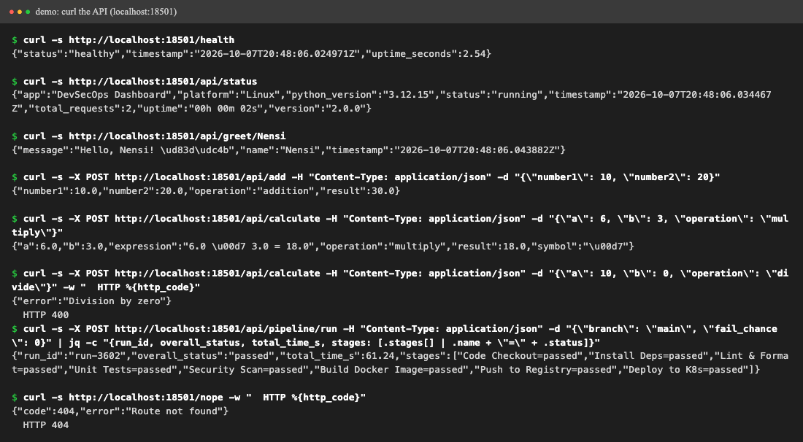

The dashboard. The health badge polls `/health`:


| System status | Greeting API |
|---|---|
| 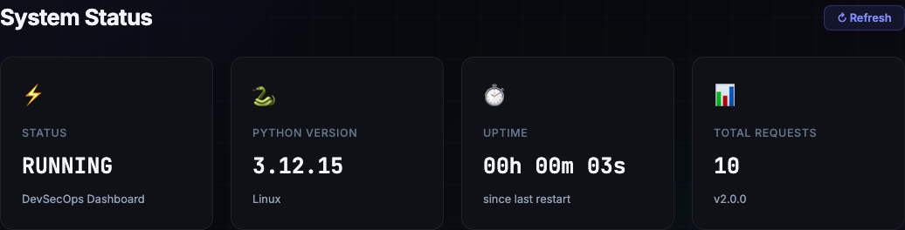 | 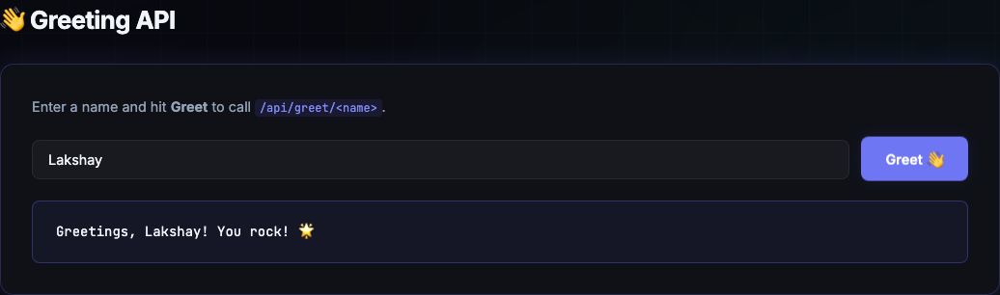 |

| Calculator (6 × 7) | Pipeline simulator (failure chance 0%) |
|---|---|
| 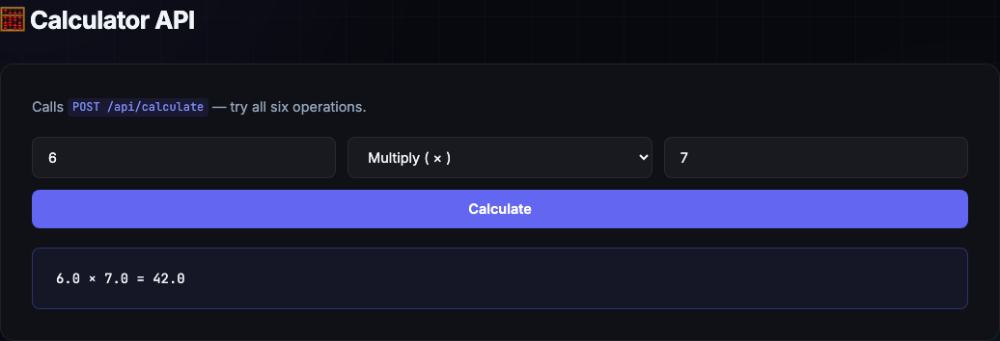 | 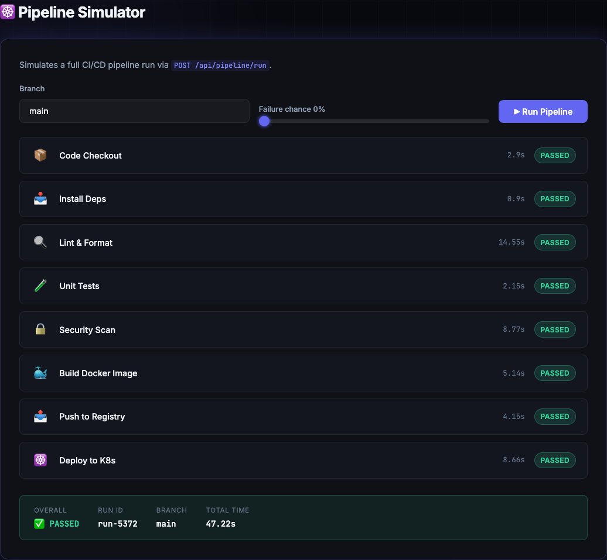 |

`docker stop` before and after adding `STOPSIGNAL SIGINT`. Before, Docker waited 30 s and then
killed the process (exit 137). After, it stopped cleanly in 0.14 s (exit 0).

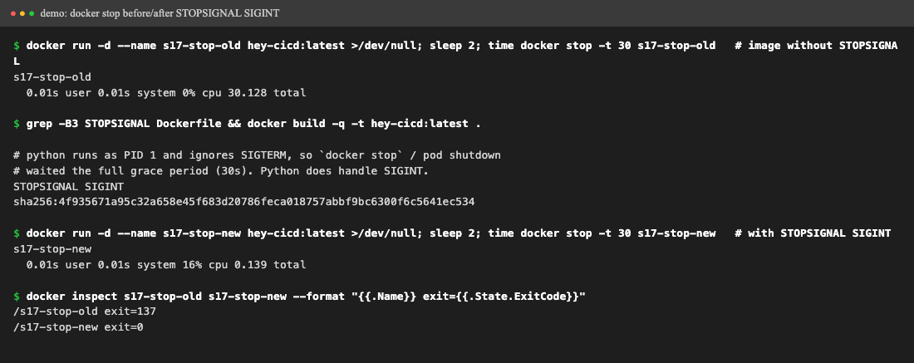

## 02: Container Registry

```bash
docker run -d --name s17-registry -p 18555:5000 registry:2
docker tag session17-python:1.1 localhost:18555/session17-devsecops-python:1.1
docker push localhost:18555/session17-devsecops-python:1.1
curl http://localhost:18555/v2/_catalog
curl http://localhost:18555/v2/session17-devsecops-python/tags/list
```

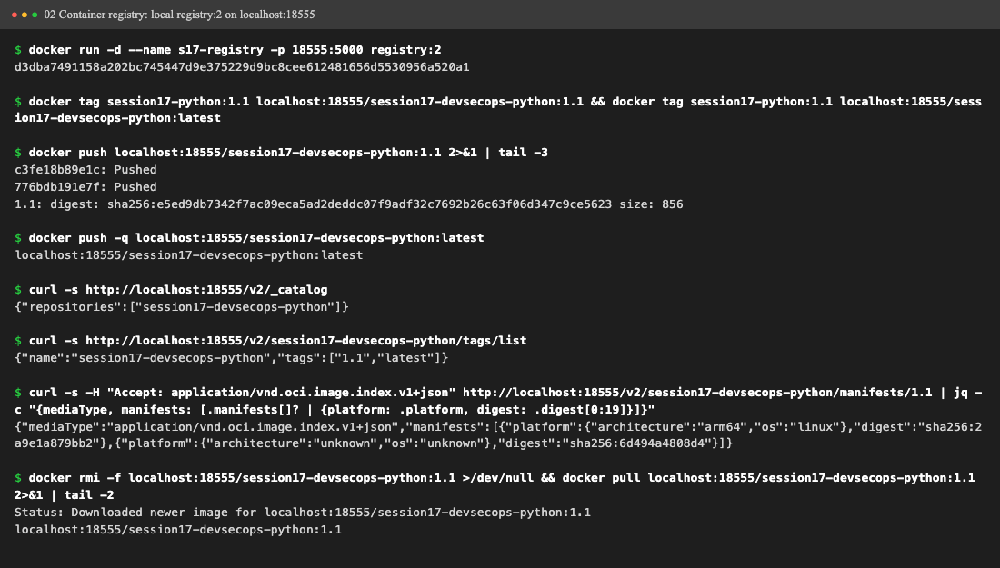

The image name follows the module's `REGISTRY/NAME:TAG` pattern. The manifest is an OCI index
with a `linux/arm64` image and an attestation entry. The image was deleted locally and pulled
back to show the registry really serves it.

**Practice answers.** In GitHub Actions the push is the `push` job in
`demo/.github/workflows/devsecops.yml`. It logs in with `docker/login-action` and
`GITHUB_TOKEN` (needs `packages: write`) and pushes `ghcr.io/<owner>/<repo>:<sha>` plus
`:latest`. The package then appears under the repository's **Packages**. It was not pushed to
GHCR from here. The exact name and tag used locally was
`localhost:18555/session17-devsecops-python:1.1`.

## 03: Kubernetes Deployment

```bash
kind create cluster --name s17
docker save --platform linux/arm64 localhost:18555/session17-devsecops-python:1.1 \
  | docker exec -i s17-control-plane ctr -n k8s.io images import -
sed "s|__IMAGE__|localhost:18555/session17-devsecops-python:1.1|" k8s/deployment.yaml | kubectl apply -f -
kubectl apply -f k8s/service.yaml
kubectl rollout status deployment/session17-python
kubectl port-forward svc/session17-python 18502:80
```

Both replicas became Ready once the `/health` readiness probe passed. The pods run as uid 10001
with a read-only root filesystem.

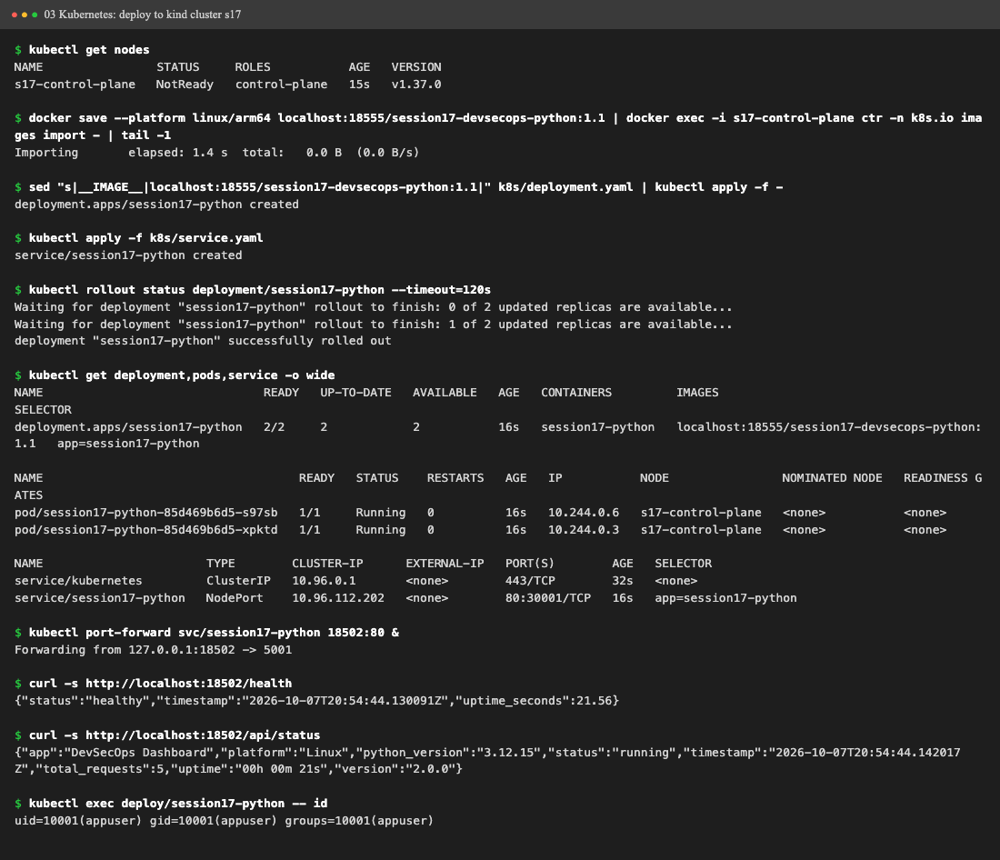

| App through the port-forward | Status cards |
|---|---|
| 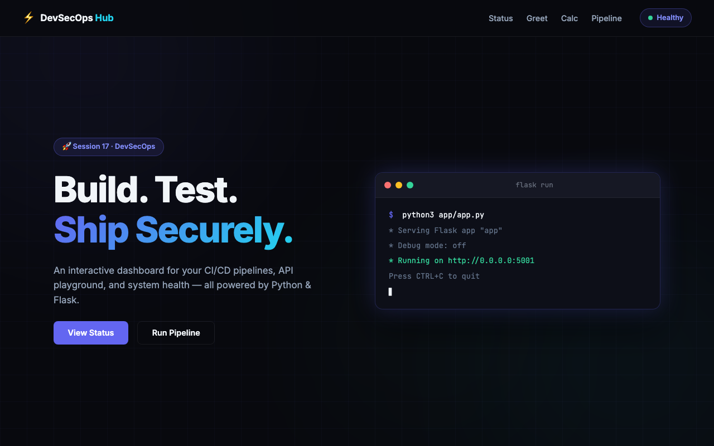 | 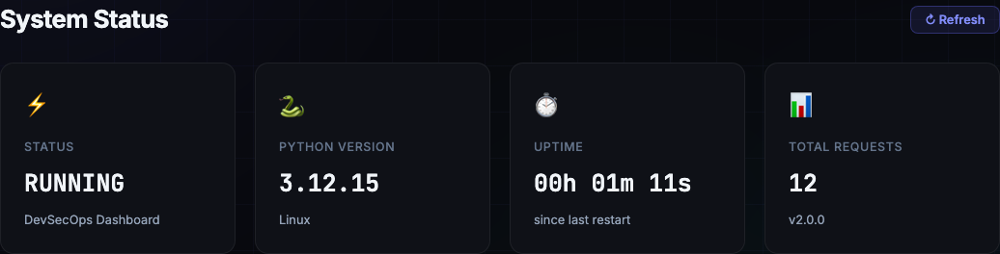 |

The practice steps: change the tag, `kubectl set image`, watch the rollout, check the new pods.
Tag `1.2` holds the same content as `1.1`, but changing the tag changes the pod template, so
Kubernetes did a rolling update. A new ReplicaSet scaled to 2 while the old one went to 0.

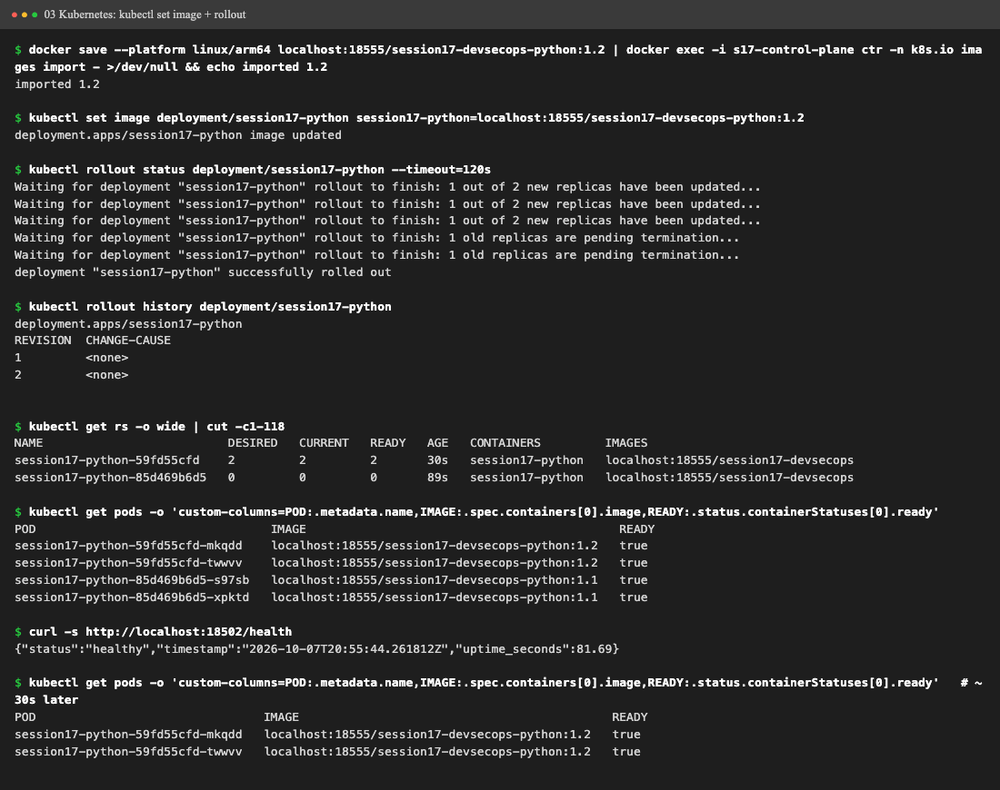

The old pods (built before the `STOPSIGNAL` fix) stayed `Terminating` for about 30 s. After
rolling out `1.3`, which has `STOPSIGNAL SIGINT`, deleting a pod took 0.6 s:

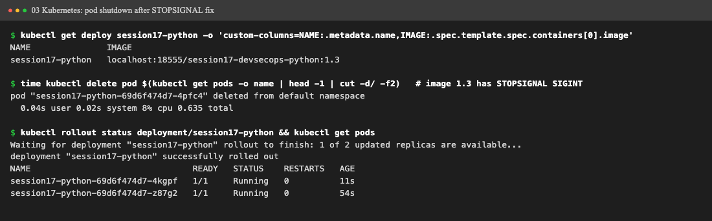

The module's classroom note matters here. A GitHub-hosted runner can't reach a kind cluster on
a laptop, so the workflow's deploy job proves the rollout on a throwaway kind cluster inside the
runner. It does not deploy to this cluster.

## 04: SAST

```bash
bandit -r app
semgrep scan --config p/python --config p/flask --error app
```

On the original code, Bandit found 1 HIGH (B201 `debug=True`), 1 MEDIUM (B104 bind to
`0.0.0.0`) and 5 LOW (B311 `random`). Semgrep flagged the same `app.run(...)` line twice. Both
tools exited 1.

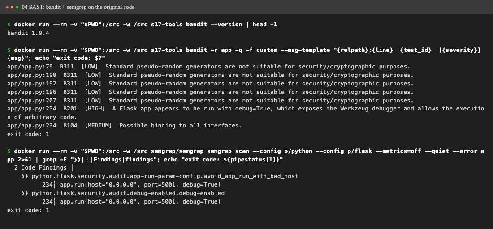

After the fix, the 5 LOW `random` findings remain. They are greetings and fake pipeline timings,
not security values, so the gate is set to MEDIUM and above, and it passes. Semgrep reports 0
findings.

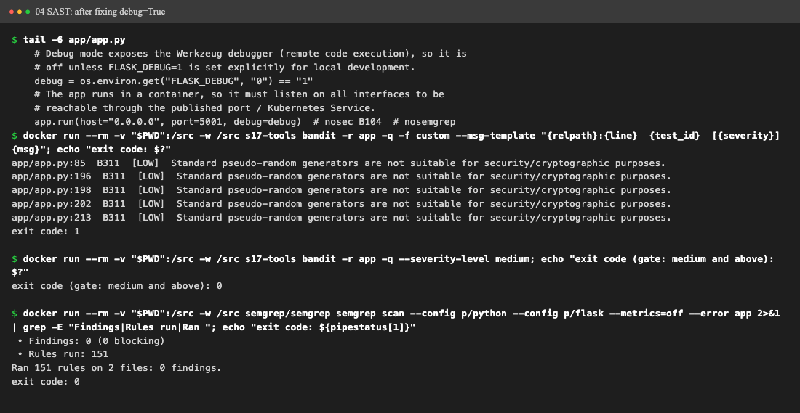

The real problem was the Flask debugger. It was shipped in the container image and reachable on
the published port. SAST found it without running the app. A clean SAST result still says
nothing about dependencies, secrets or the base image, which is what the next modules check.

## 05: SCA

```bash
pip-audit -r requirements.txt
pip-audit -r requirements-dev.txt
```

`Flask==3.1.3` is clean. `pytest==8.4.2` has PYSEC-2026-1845 (GHSA-6w46-j5rx-g56g,
CVE-2025-71176), which is predictable `/tmp/pytest-of-{user}` directories. A local user can
cause denial of service or possibly gain privileges. It is fixed in 9.0.3. pip-audit printed
the row twice.

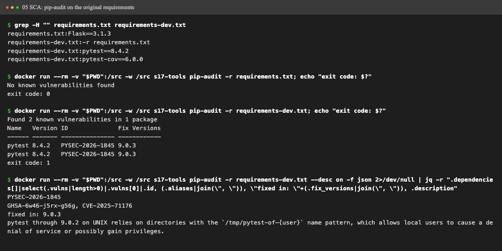

After the bump, pip-audit finds nothing. Running plain `pip-audit` the way the module shows
audits the whole environment, including the base image's pip 25.0.1 (12 rows, 6 advisories).
After `python -m pip install --upgrade pip`, which the module's workflow does and the demo
workflow skipped, that is clean too.

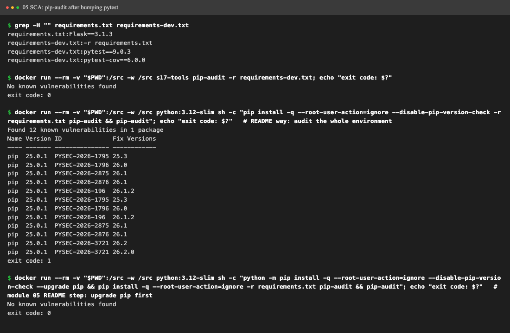

**Practice answers.** The output gives the package (`pytest`), the installed version (`8.4.2`),
the advisory ID and the fix version (`9.0.3`). To fix it: check the advisory, bump the pin to
the fixed version, run the tests (still 8 passed), then run pip-audit again (clean). If no fix
exists yet, record an accepted risk with an expiry date, or replace the package.

## 06: Secret Scanning

This ran in a throwaway git repository in the scratch directory, never in this repository.
The planted value is a randomly generated string in GitHub-token format, not a real token, and
it is masked in the screenshot.

```bash
gitleaks git /repo            # scan every commit
gitleaks dir /repo            # scan only the working tree
```

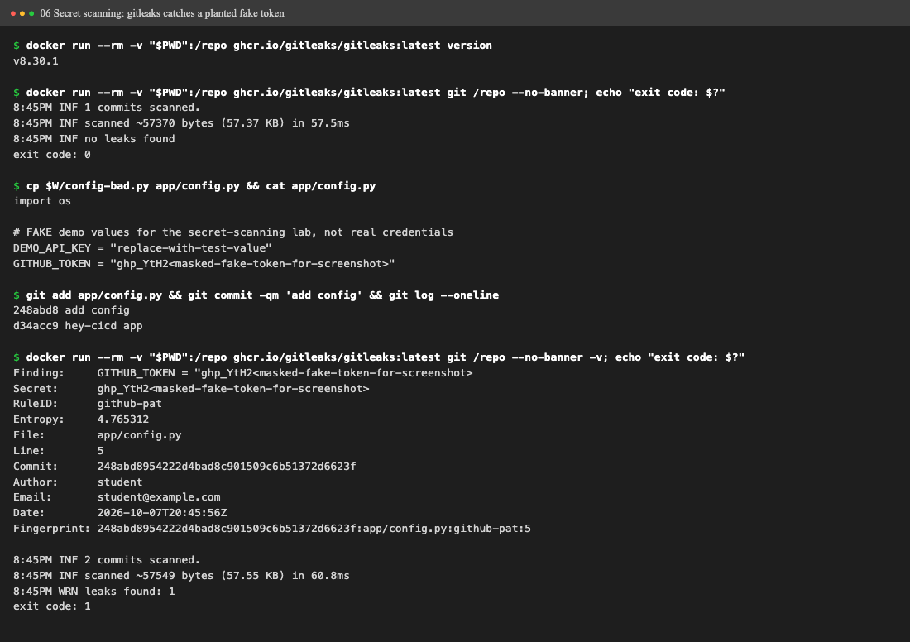

Gitleaks caught the `ghp_...` token (rule `github-pat`), with its commit, file and line, and
exited 1. It did **not** flag `DEMO_API_KEY = "replace-with-test-value"`. Pattern- and
entropy-based scanners only catch values that look like credentials, so a weak or custom secret
can still get through.

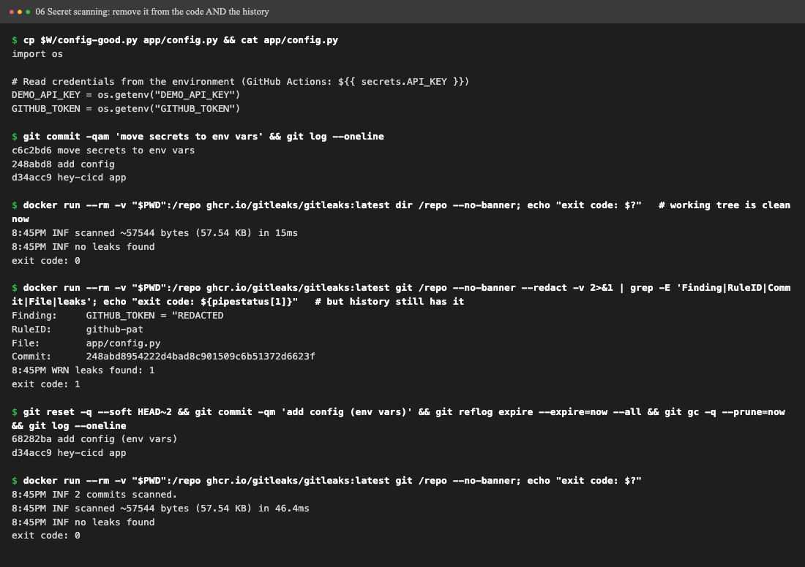

Moving the value to `os.getenv()` made the working tree clean, but `gitleaks git` still found
the token in the earlier commit. The scan only passed after the history was rewritten (the two
commits squashed, the reflog expired, and `gc` run).

**Practice answers.**
1. Anyone with read access to the repository, its forks, clones or CI logs can read and use a
   secret in source code, and it stays in git history even after the line is deleted.
2. A GitHub Actions secret is stored encrypted by GitHub. It is injected only at runtime as
   `${{ secrets.NAME }}` and masked in logs. A source-code secret is plain text in the files and
   history for everyone who can read the repo.
3. Treat the key as compromised. Revoke or rotate it immediately, remove it from the code and
   history, check the cloud audit logs for unauthorised use, and store the replacement in a
   secret manager or Actions secret.

## 07: Container Image Scanning

```bash
docker build -t session17-python:1.0 .
trivy image session17-python:1.0
trivy image --severity HIGH,CRITICAL session17-python:1.0
trivy image --severity HIGH,CRITICAL --exit-code 1 session17-python:1.0
```

The original `python:3.12-slim` image had 165 OS findings (44 HIGH, 0 CRITICAL) and 6 in pip.
The 44 HIGH come from 8 distinct CVEs in util-linux, ncurses, systemd, acl and perl. None had a
fix: 7 are `affected` and 1 is `fix_deferred`. `--exit-code 1` returned 1.

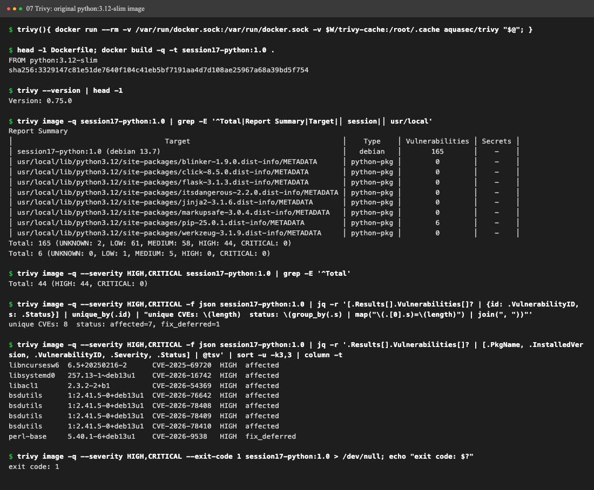

The SAST and SCA scans were clean at this point, but the image still failed. Upgrading packages
couldn't fix it, because there were no fixed versions. Switching to Alpine and removing pip from
the runtime image did fix it: 0 vulnerabilities, and the gate exits 0.

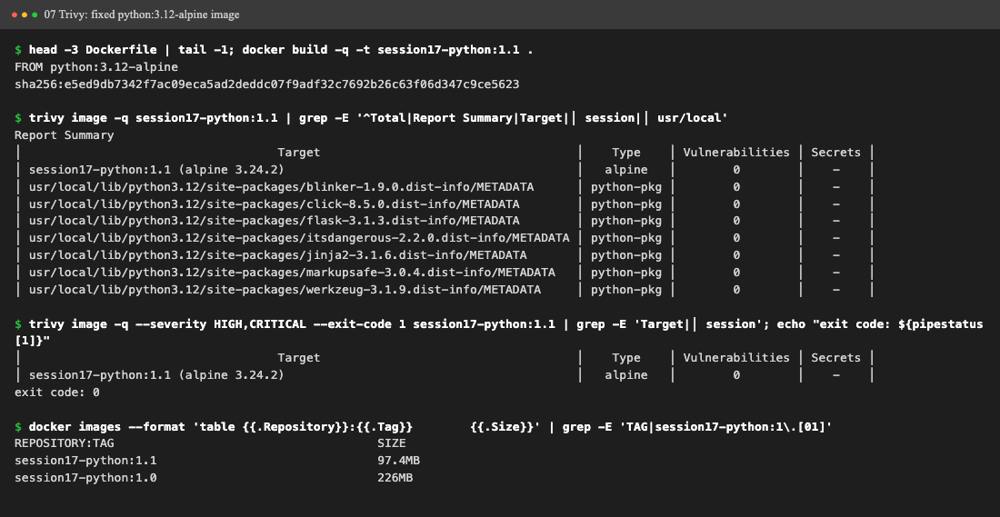

**Practice answer.** `--exit-code 1` makes Trivy return exit status 1 when a finding matches the
`--severity` filter, and 0 otherwise. The CI step then fails and every job that `needs` it is
skipped. Without the flag, Trivy prints the findings and exits 0, so the pipeline continues.
The original workflow did exactly that (see the `act` run below).

## 08: Security Gates

`08-security-gates/security-gate.sh` runs the five gates in order (tests, Bandit, pip-audit,
build, Trivy) and stops at the first failure:

```bash
./security-gate.sh <app-dir> <image-tag>
```

| Original code: stops at SAST | Fixed code, old base image: stops at the image scan |
|---|---|
| 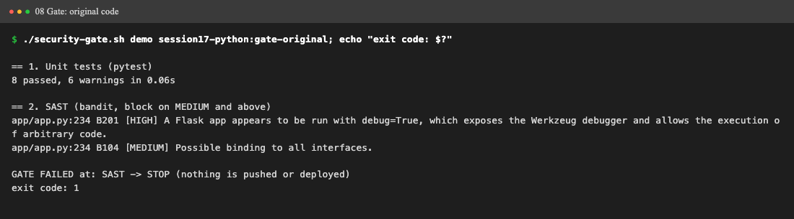 | 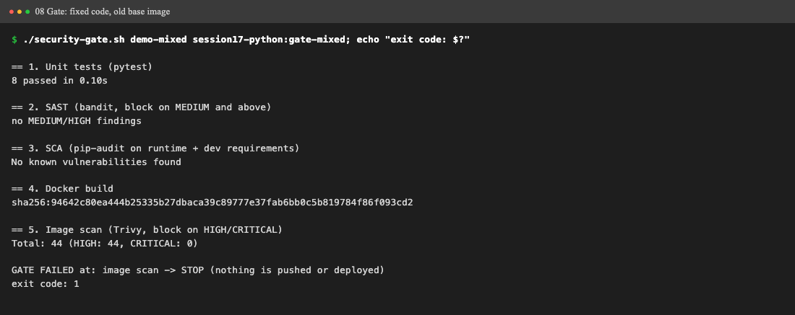 |

With everything fixed, all gates pass and the image may be pushed:

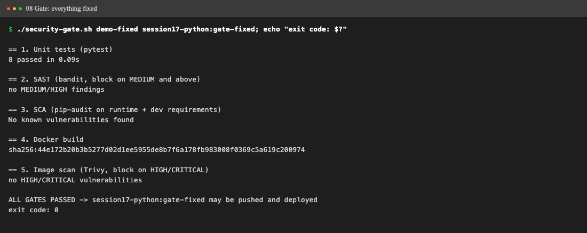

### The GitHub Actions workflow, run locally with act

actionlint, with shellcheck installed, reports nothing for either the original or the fixed
workflow. Both are valid YAML and Actions syntax. The problems in the original were about
behaviour, not syntax.

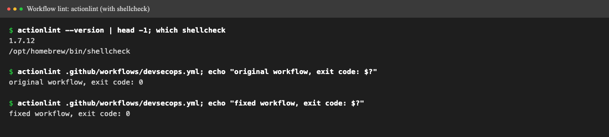

The job graph is tests, SAST (CodeQL + Bandit) and SCA, then build, scan, push, deploy. Each
stage `needs` the one before:

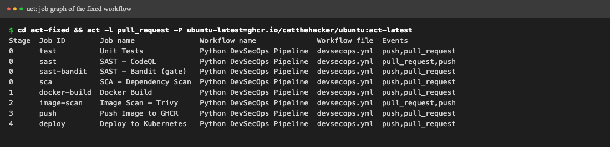

The workflow ran with
`act pull_request -P ubuntu-latest=ghcr.io/catthehacker/ubuntu:act-latest` in scratch git
copies of `demo/`. What could not run under act:

- **CodeQL**: it needs GitHub's code-scanning API. In the scratch copies its two steps were
  replaced by an `echo`.
- **Push to GHCR and Deploy**: these need a real `GITHUB_TOKEN` and GHCR. A `pull_request` event
  was used, so `push` was skipped by its `if:`, and `deploy`, which needs `push`, was skipped
  too. In the original workflow's scratch copy, the Docker Hub push job got the same `if:`,
  because it has no condition and needs `DOCKERHUB_TOKEN`.
- `--concurrent-jobs 1` was needed. The first run let three jobs extract Python into act's
  shared tool cache at the same time, and one job failed with `No module named 'struct'`.

Original code with the original workflow: the SCA job fails on pytest 8.4.2. (Under act, the
jobs share one Python install, so the `test` job's pytest was visible to the SCA job's bare
`pip-audit`. On GitHub each job gets a fresh runner.)

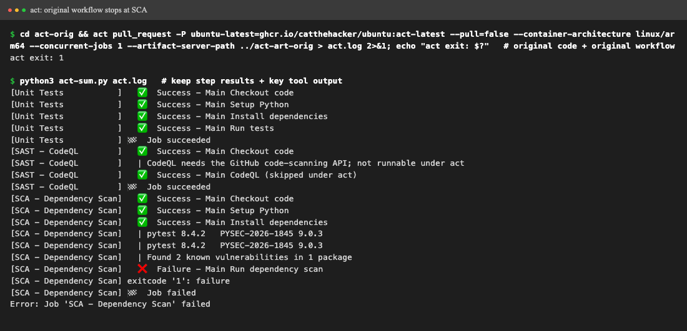

The original image-scan job, run on its own, reports `Total: 44 (HIGH: 44)` and still **passes**.
That is the missing gate:

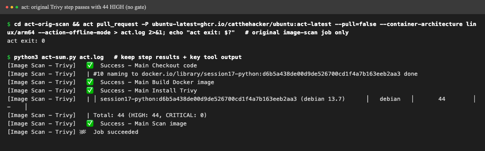

The fixed workflow with the Dockerfile reverted to `python:3.12-slim`: everything up to the build
passes, then the Trivy gate fails the job. Push and deploy never start.

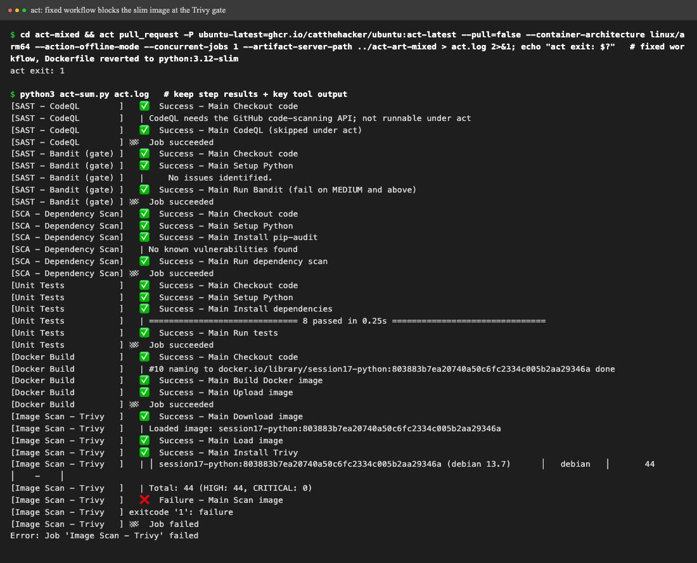

The fixed workflow on the fixed code: all gates pass (8 tests, Bandit clean, pip-audit clean,
Trivy 0 on Alpine):

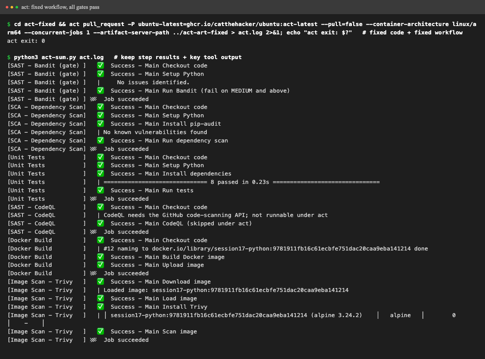

**Practice answers.** The fixed `demo/.github/workflows/devsecops.yml` covers all 9 points:
1. `test` runs the unit tests.
2. `sast` (CodeQL) and `sast-bandit` run SAST.
3. `sca` runs pip-audit.
4. `docker-build` needs all of those.
5. `image-scan` scans the exact built image.
6. The gates are enforced through exit codes (Bandit `--severity-level medium`, pip-audit,
   Trivy `--exit-code 1`) and `needs`.
7. `push` to GHCR needs `image-scan` and only runs on a push to `main`.
8. `deploy` needs `push`.
9. `deploy` waits with `kubectl rollout status --timeout=120s`.
