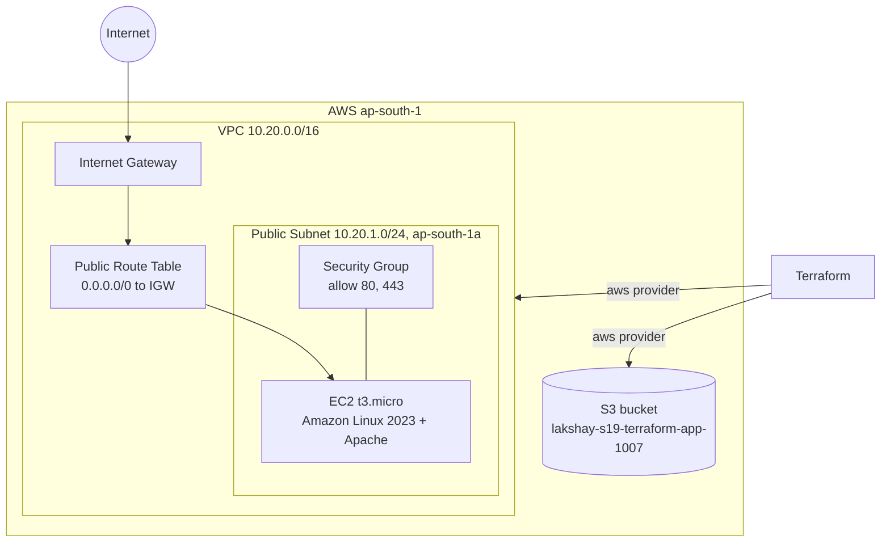
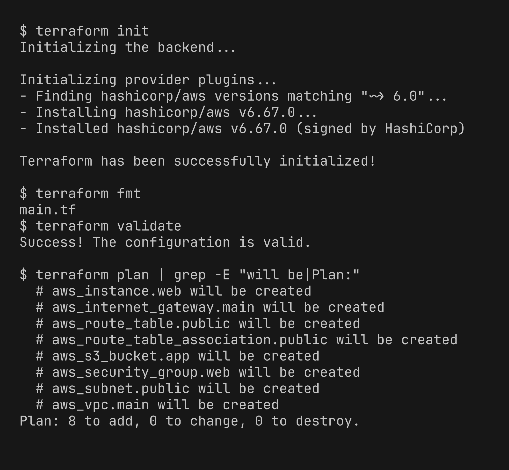
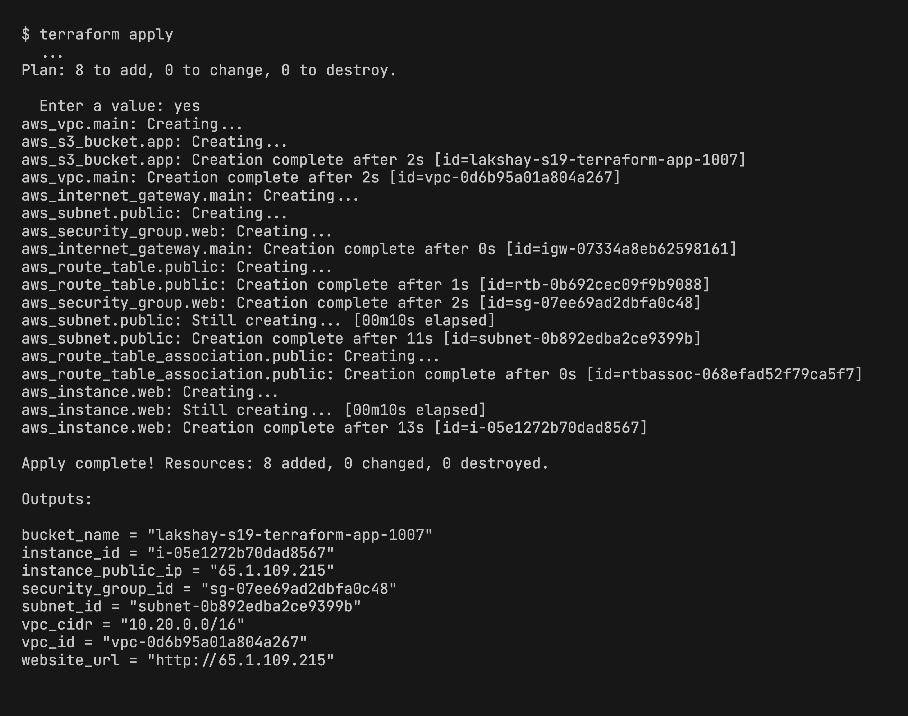
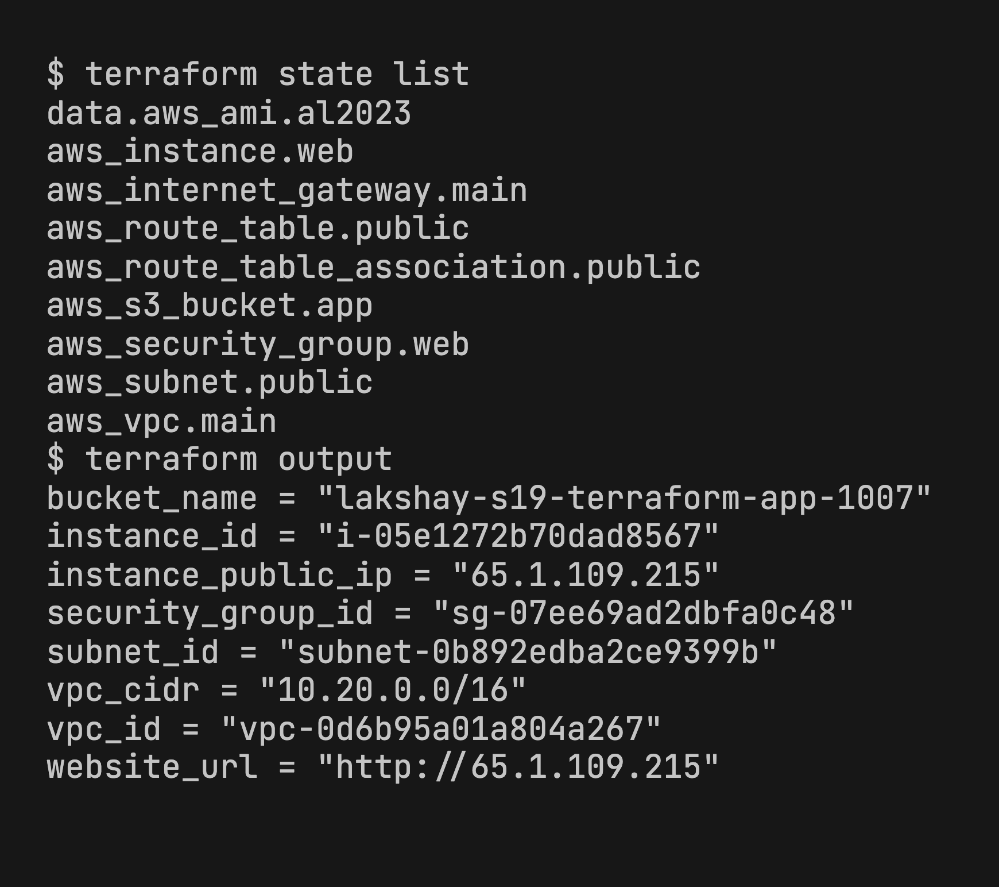
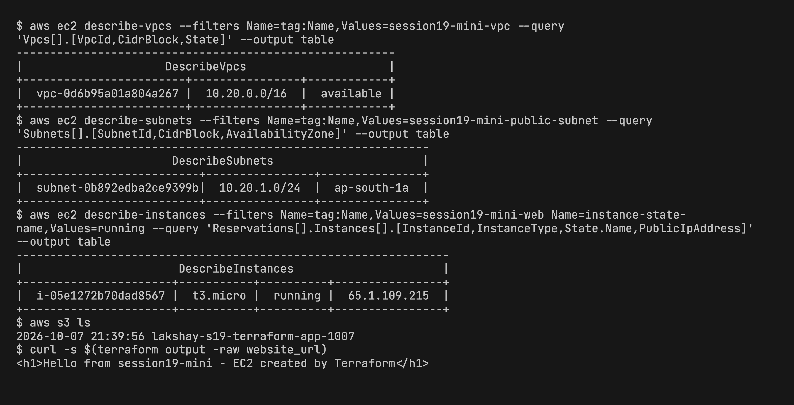
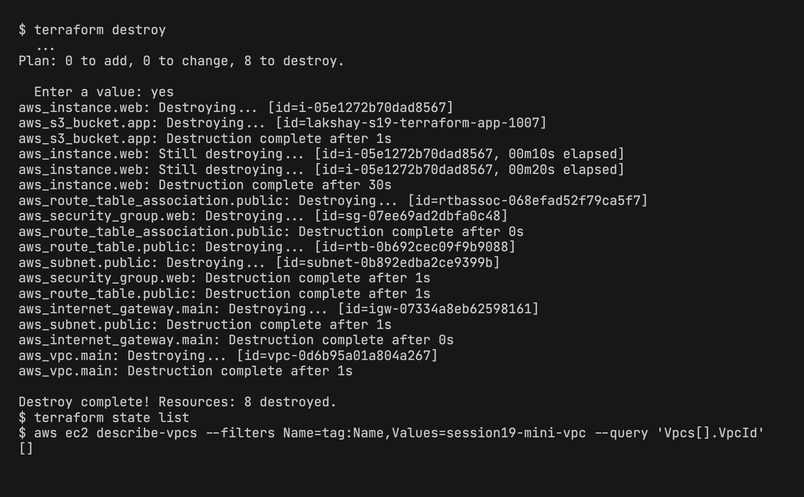

# Session 19 - Cloud & Terraform in Action Homework

Project: [08-mini-project/](08-mini-project/)

I started from the given mini project (VPC, subnet, IGW, route table, security group) and added an **EC2** instance and an **S3** bucket so it matches the suggested architecture. Region is `ap-south-1`.

## Architecture



## Project files

| File | What it has |
|---|---|
| [versions.tf](08-mini-project/versions.tf) | **provider** - required aws provider `~> 6.0`, region from variable |
| [variables.tf](08-mini-project/variables.tf) | **variables** - region, project, vpc_cidr, subnet cidr, instance_type, bucket_name |
| [terraform.tfvars.example](08-mini-project/terraform.tfvars.example) | my values, copied to `terraform.tfvars` |
| [main.tf](08-mini-project/main.tf) | **resources** - VPC, subnet, IGW, route table + association, SG, EC2, S3, and a `data` source for the latest AL2023 AMI |
| [outputs.tf](08-mini-project/outputs.tf) | **outputs** - vpc_id, subnet_id, sg id, instance id, public ip, website_url, bucket_name |

What I added to the given code:
- Hardcoded CIDRs moved to variables.
- `aws_instance.web` in the public subnet with the web SG. `user_data` installs Apache and puts a hello page.
- `aws_s3_bucket.app`.
- New outputs for EC2 and S3.

**Dependencies**
- Implicit: most resources reference each other, e.g. subnet uses `aws_vpc.main.id`, EC2 uses `aws_subnet.public.id` and `aws_security_group.web.id`. Terraform builds the graph from these and creates the VPC first.
- Explicit: EC2 has `depends_on = [aws_route_table_association.public]`. The instance doesn't reference the IGW or route table, but without the route it can't reach the internet to install Apache.
- S3 has no dependency, so it was created in parallel with the VPC (see apply output).

## Terraform commands

```bash
cd 08-mini-project
cp terraform.tfvars.example terraform.tfvars
terraform init
terraform fmt
terraform validate
terraform plan
terraform apply
terraform state list
terraform output
terraform destroy
```

**init, fmt, validate, plan** - `fmt` fixed one alignment issue in `main.tf` from the given code. Plan shows 8 resources to add.



**apply** - the order follows the dependencies: VPC -> subnet/IGW/SG -> route table -> association -> EC2 at the end.



**Terraform state** - `terraform.tfstate` stores the real IDs of everything created. `state list` shows what Terraform is managing now, and outputs are read from it.



**AWS resources** - checked with the AWS CLI. VPC, subnet, running EC2 and the bucket exist, and `curl` to the public IP returns the page, so IGW + route table + SG are working.



**destroy** - deleted in reverse order (EC2 first, VPC last). After that the state is empty and the VPC is not found.


